# 9.状态管理-持久化

​	redux给我们做的状态管理--是保存在内存中的，当页面来回切换这个状态是可以保存住的，但是如果页面刷新后状态就被清除了--这个时候我们就想能不能将redux的状态持久化的保存在我们的系统中。

我们找一下redux持久化相关的

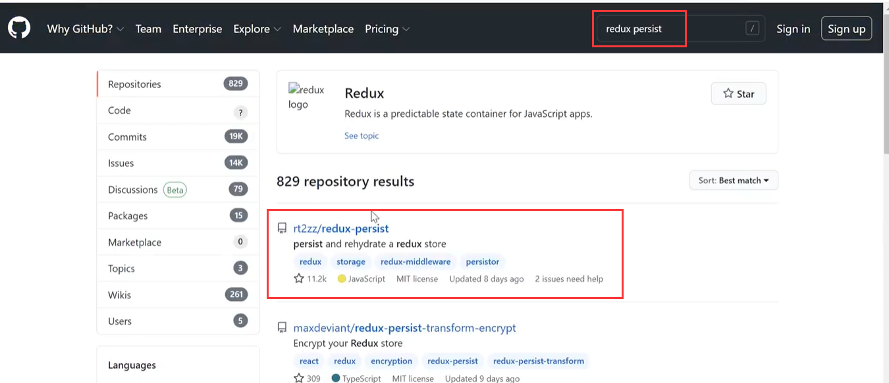

需要下载个redux-persist这个小模块

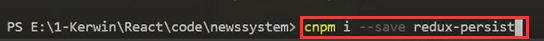

如何使用：

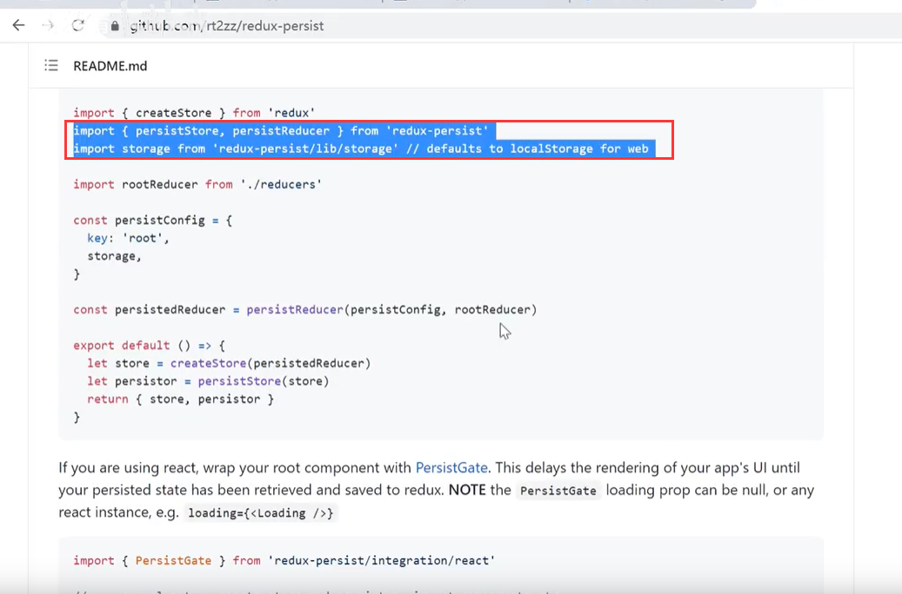

这个意思就是---我要把我普通的reducer进行持久化，persistConfig就是我在storage中配置存放的key是什么

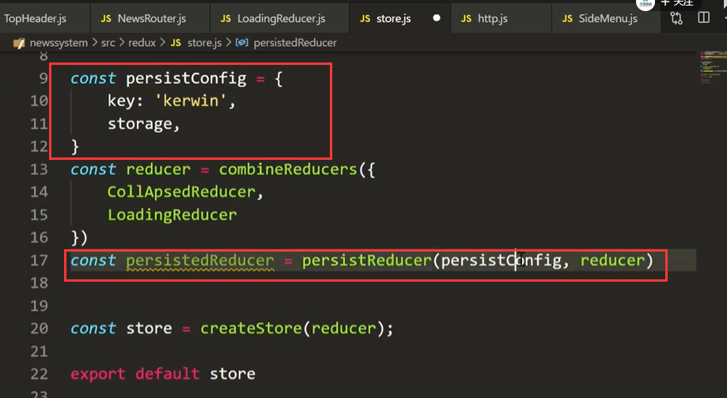

导出2个store

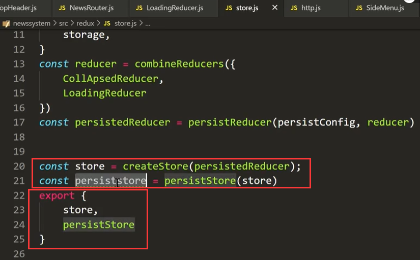

注意导出store的改变--导入的地方得改为结构的方式

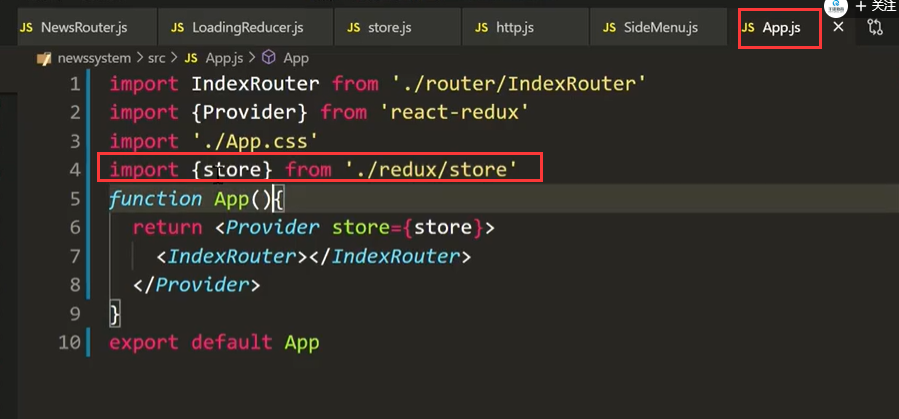

刷新页面--功能实现了

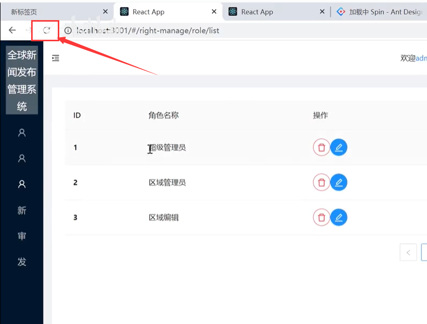

在刷新的时候还是会动一下--继续优化

​	persistor是store导出的持久化store

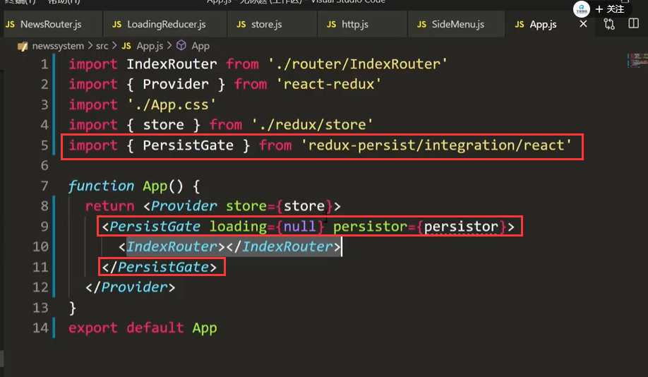

查看效果：没有了闪动展开折叠的效果了

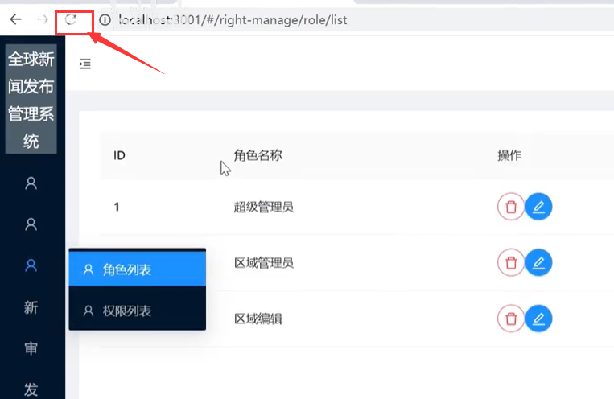

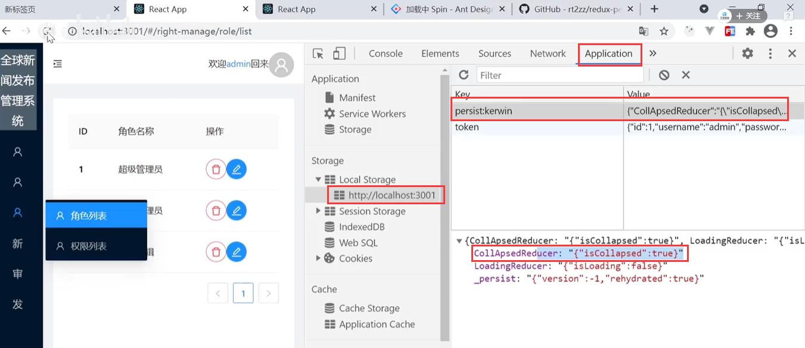

我们发现redux的值全部给持久化了--有些我们需要持久化有些我们不需要持久化

我们看一下persist的白名单和黑名单是如何使用的：

​		放在白名单里的就是被持久化的，放在黑名单里的就是不被持久化的

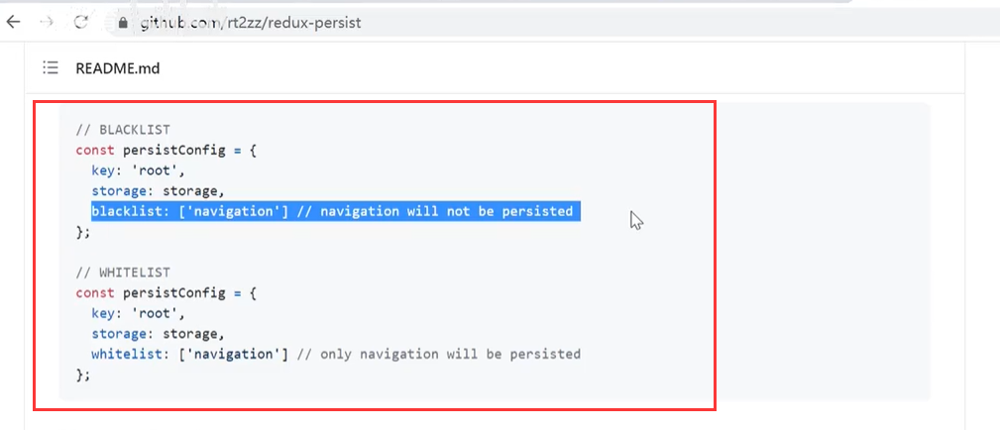

我们使用一下这个黑名单：这个LoadingReducer你不用给我管理了，他不需要持久化

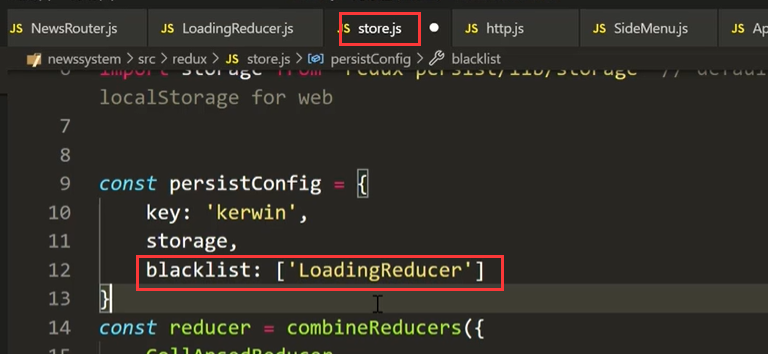

现在我们查看一下storage的内容--已经没有了LoadingReducer了

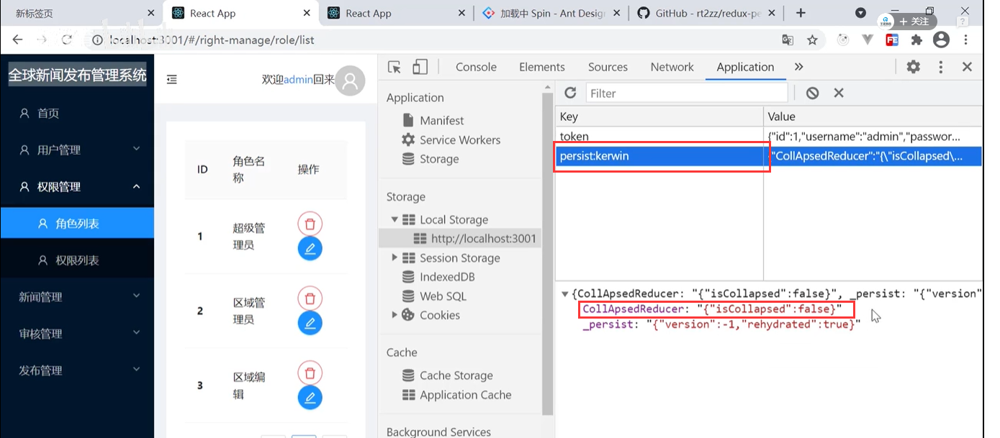

