# 1.登录页面-登录表单

我们先由这个退出的按钮触发事件到登录页面

​		我们将token清除掉--然后路由到登录页面

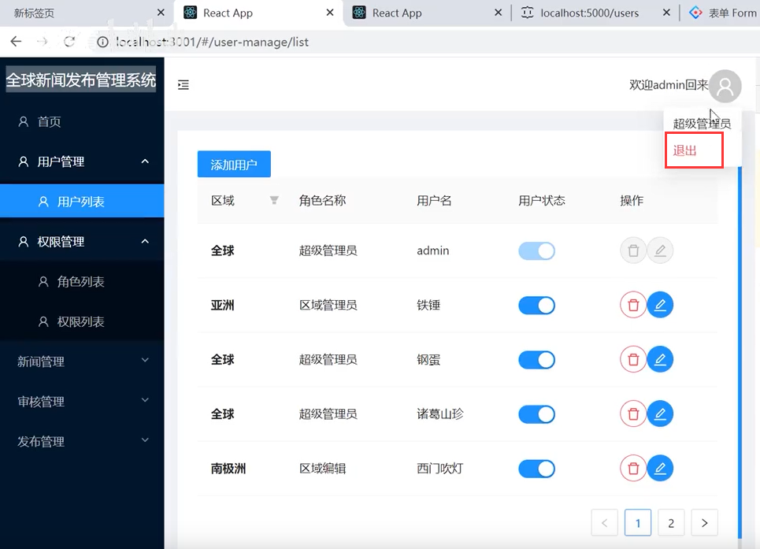

我们给退出添加一个事件，然后清除token，然后重定向到login路由下

​		注意props可能是undefined哦，需要用WithRouter包裹一下

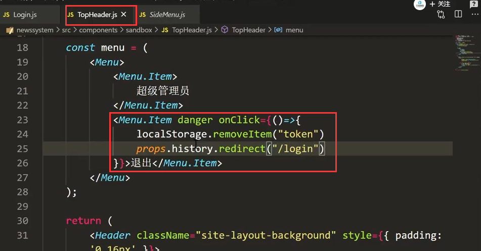

页面报错：注意使用的是replace进行重定向的

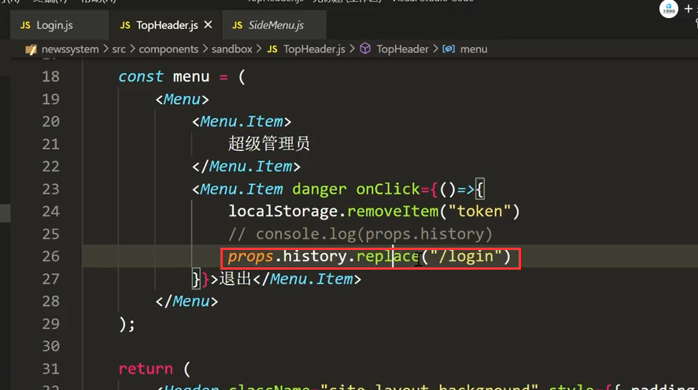

然后跳转到login页面了

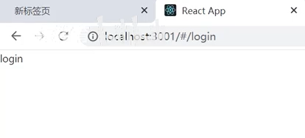

#### 1、构建表单登录框

引入Form组件

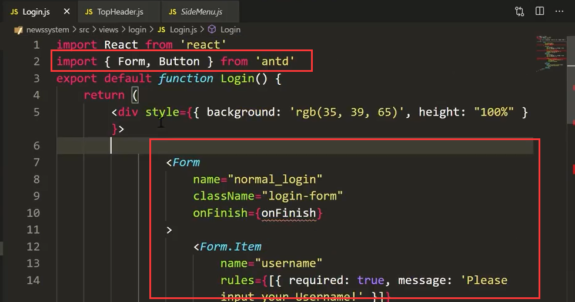

定义好方法，准备接收将来输入的值--这里我们可以使用onFinish属性来获取到表单的内容

​		我们之前获取表单的内容是通过ref的方式，因为并不在表单内部获取使用-当时是模态框中获取的，现在直接获取就可以

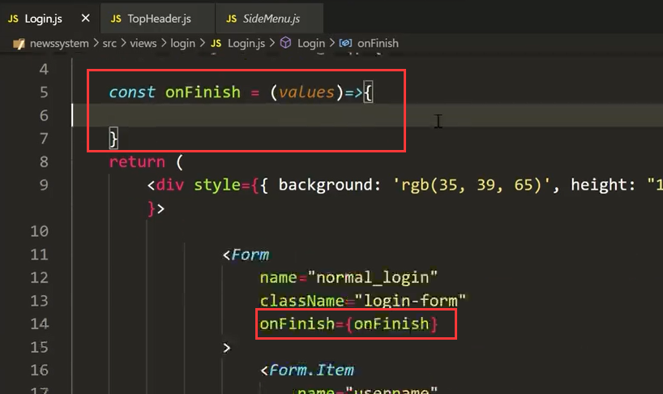

注意这个按钮直接就是submit就提交了

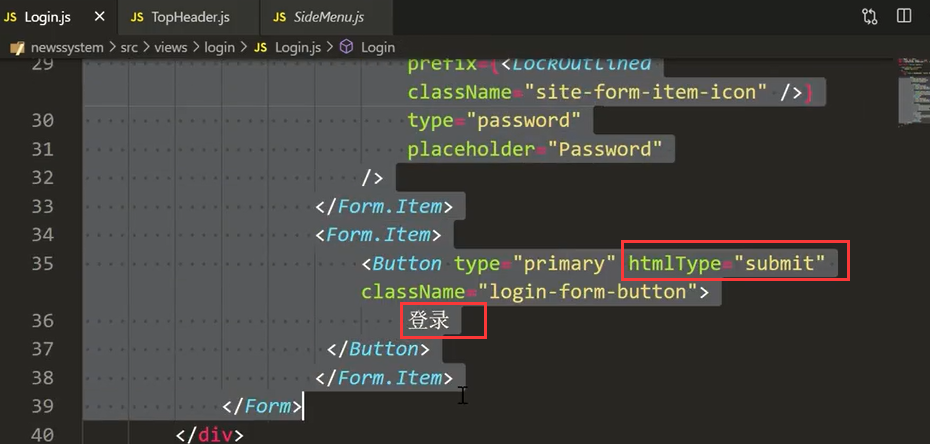

点击登录--查看效果：可以获取到表单数据信息

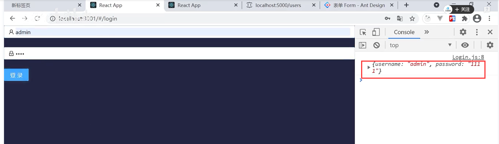

#### 2、添加样式处理登录页面

外层加个div 然后引入一个css样式--我们来操作这个css样式进行页面的样式处理

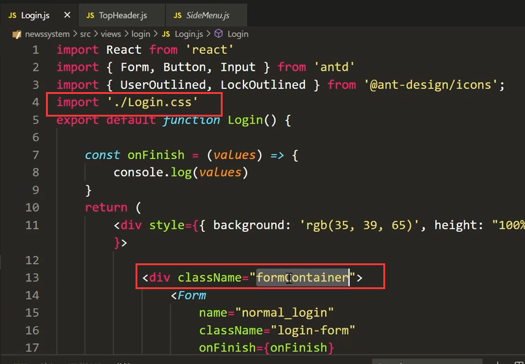

css编辑

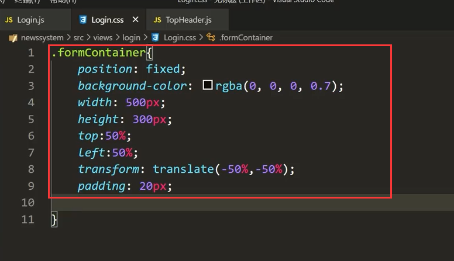

查看效果：

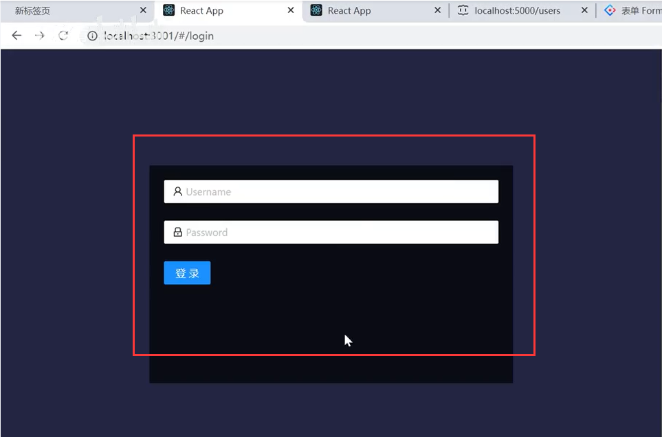

再设置一下字体内容及样式

查看效果：

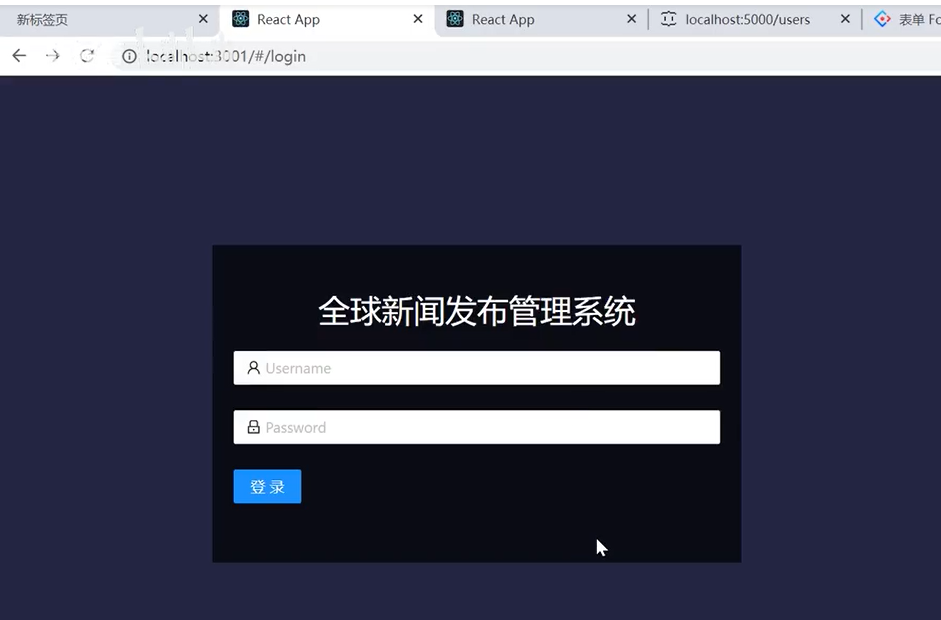

如果什么都不输入--会触发校验

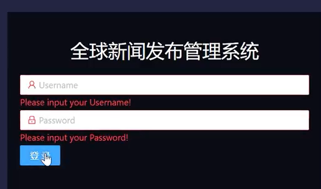

