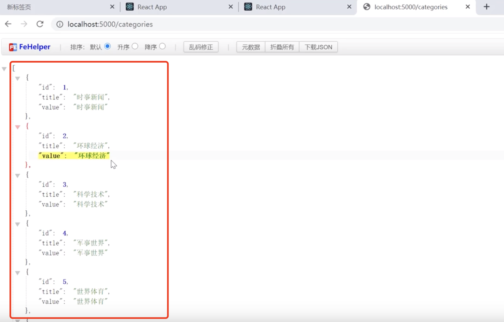
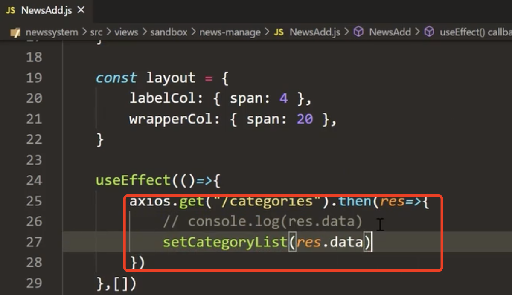
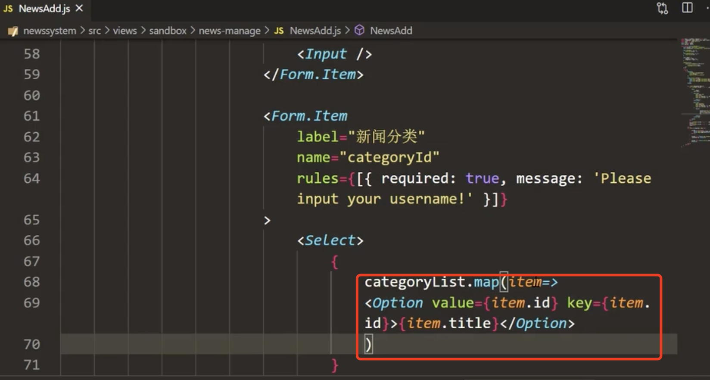
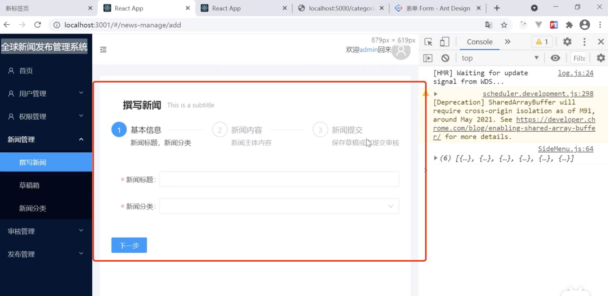
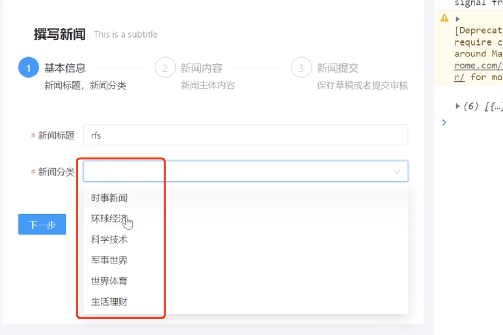
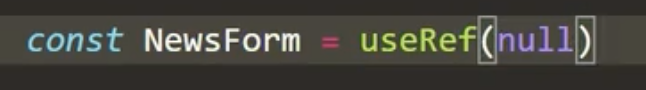
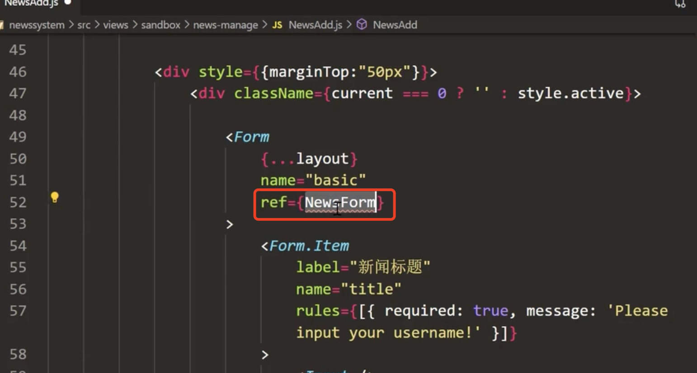
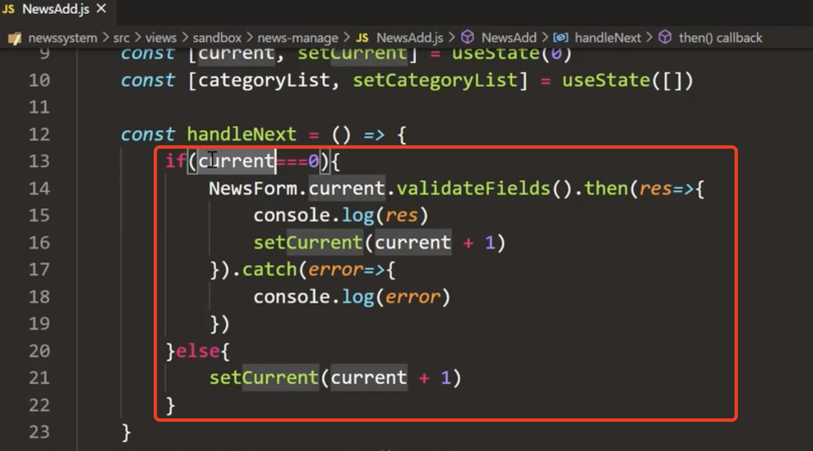
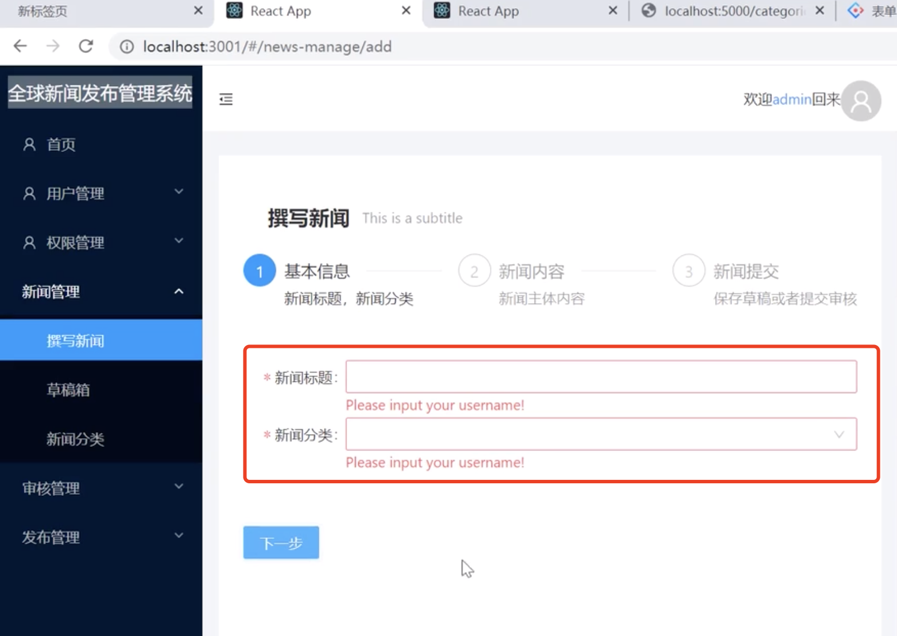
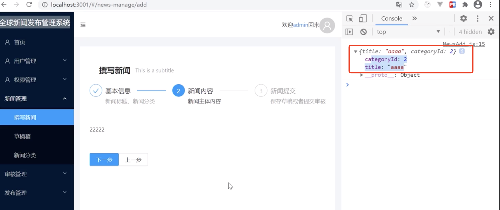

# 10.撰写新闻-表单

先看一下新闻接口的数据

获取分类数据：

循环Select下拉选择

​			循环出新闻分类，value存的是id，key也设置为id保证唯一

页面查看效果：

下拉选项也是好使的

在点击下一步的时候--进行表单的校验：

​		先创建个NewForm函数--使用useRef可以设置个null值--现在我们给这个表单绑定好这个ref事件了，接下来就来开始校验了，可以通过ref拿到form的实例，然后.validate校验通过then，不通过就提示错误信息

所以说我们在next下一步的时候-就不能轻易的放行，我们先设置校验，校验通过后再放行 

​		这部分代码的意思是：如果是第一步先校验一下表单，如果通过放行设置current+1进度条走到第二步，如果不是第一步点击下一步现在先直接放行

查看页面效果：校验是生效的-而且进度条也没有进入第二个步骤

然后我们输入内容后再看效果--控制台中也可以看到数据也是可以获取到的

------

