# 12、撰写新闻-提交

目前我们把富文本框也弄好了--然后也可以收集到富文本框的内容

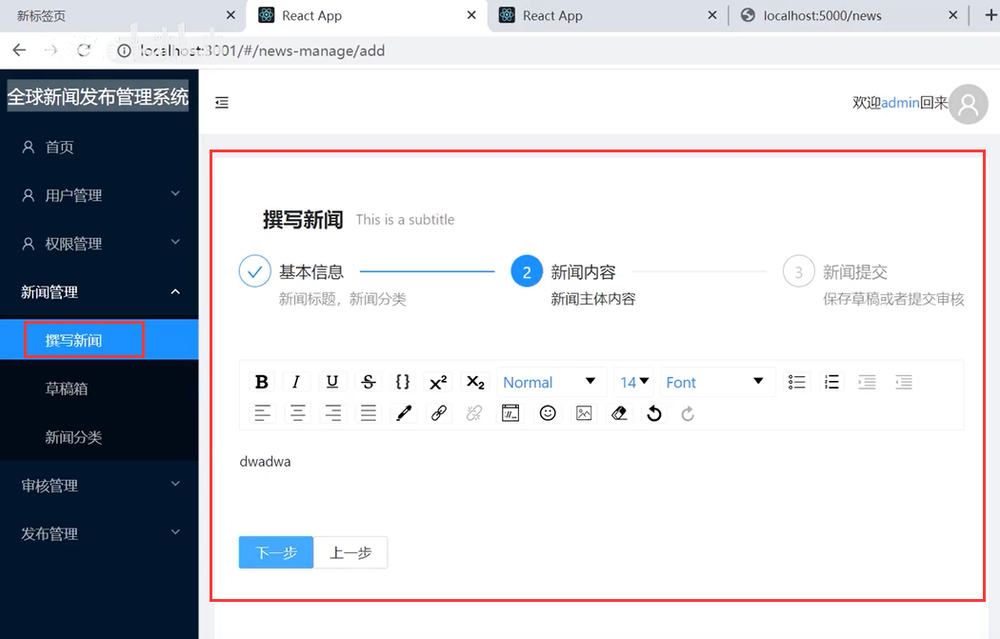

我们现在定义俩个变量来 收集表单的数据和 富文本框的数据

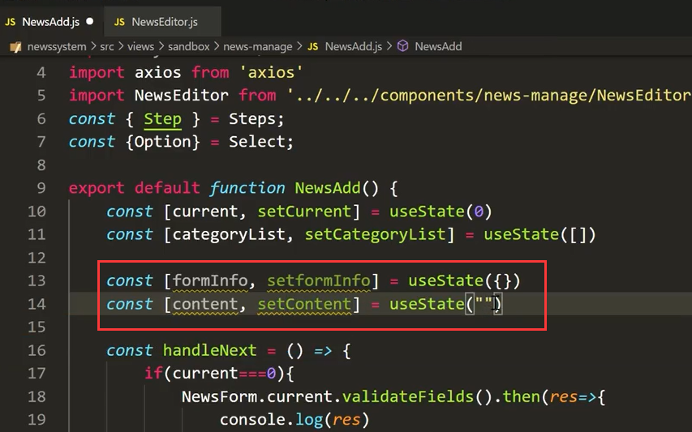

收集表单数据：

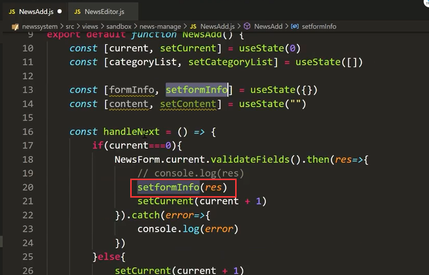

获取收集的文本框内容

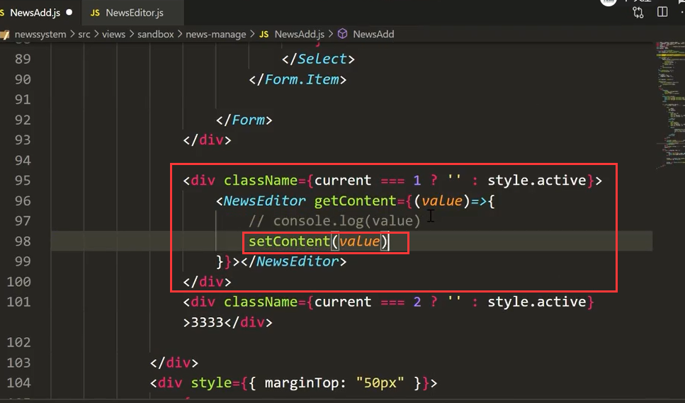

在我们点击下一步的时候-我们获取一下收集的form信息和content信息

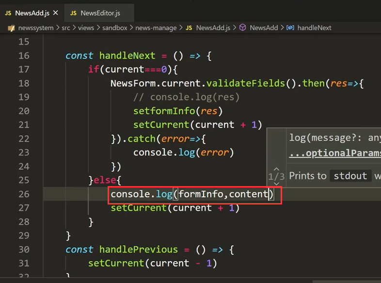

运行查看一下效果：内容都是可以获取的到的

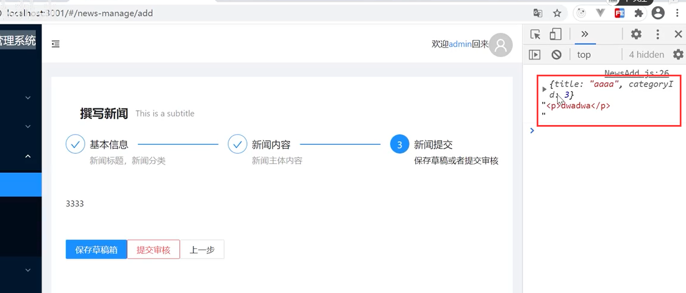

如果富文本框什么都不输入也是可以获取到数据的--这个可能得处理一下

​		比如点过富文本框输入-然后又删除了内容就是**

**了

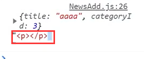

如果为空--我们校验一下添加个判断

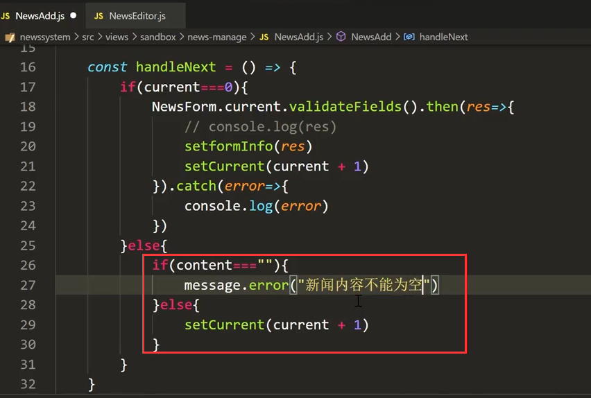

查看效果：

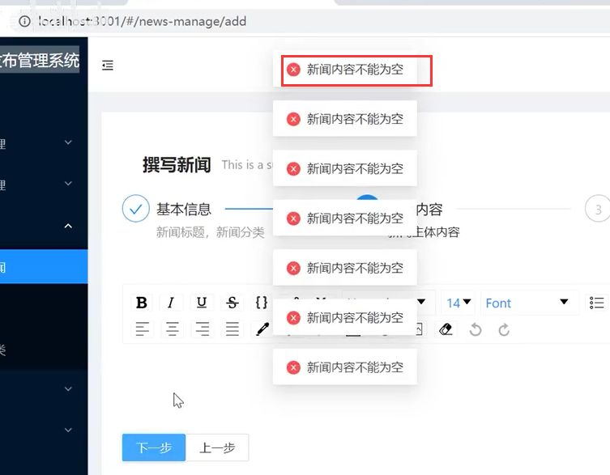

多加个判断-因为可能为空的p标签

​		先trim一下去掉首尾的空格然后再判断--然后页面校验没有问题

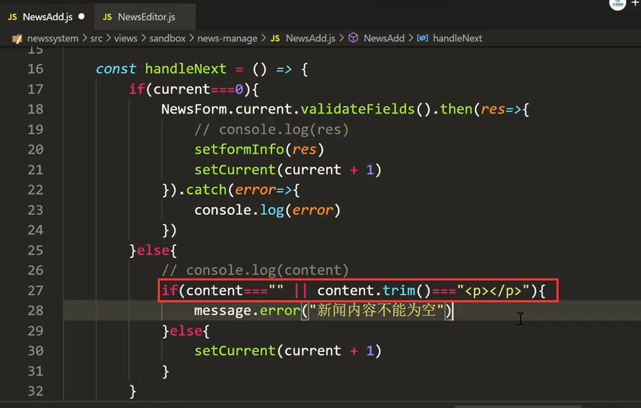

#### 2、提交审核

​			这个保存草稿箱和提交审核的思路就是：点击按钮传入的状态不一致就可以了

​	如果状态传0就是草稿箱，如果是1就是提交

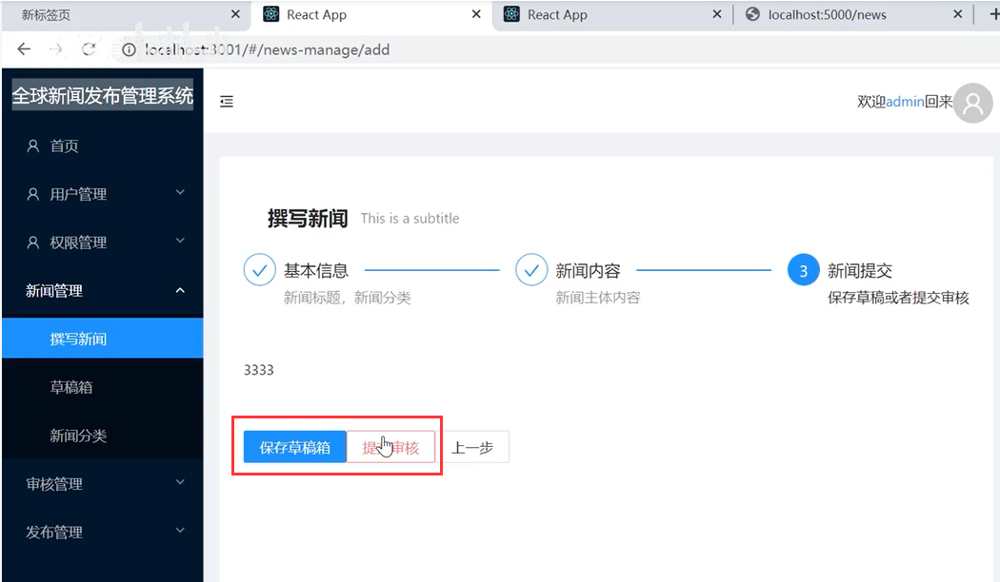

我们查看一下News接口需要的数据字段

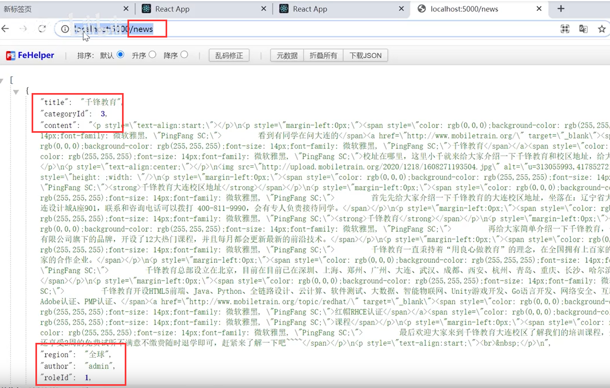

给按钮添加事件--并传入状态值 0 为草稿箱，1是提交

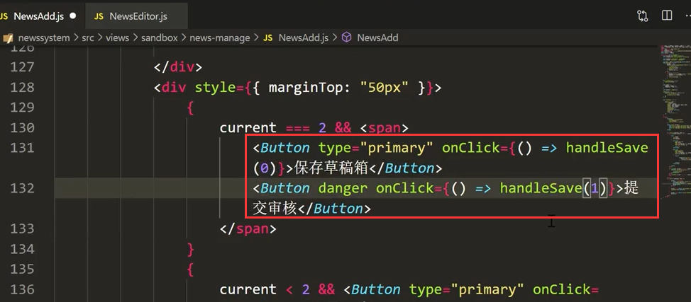

需要的数据字段就是这些：

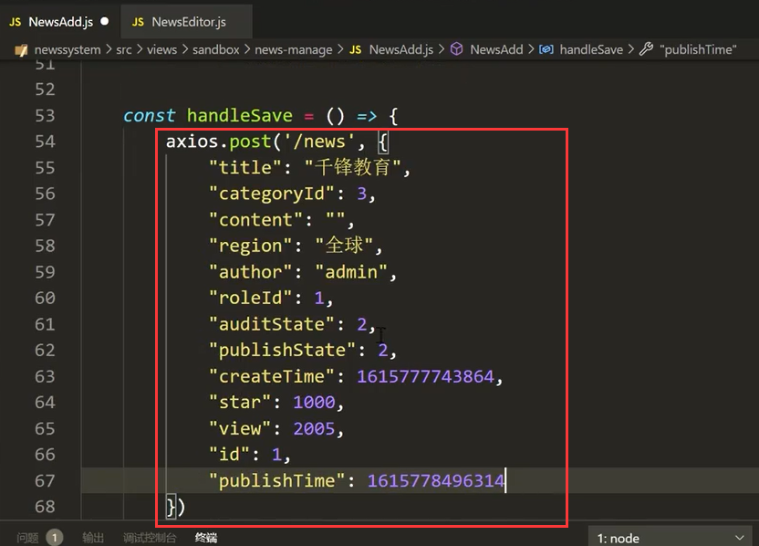

我们设置一下值-填充一下数据：发布时间字段可以先去掉-因为现在还没有发布

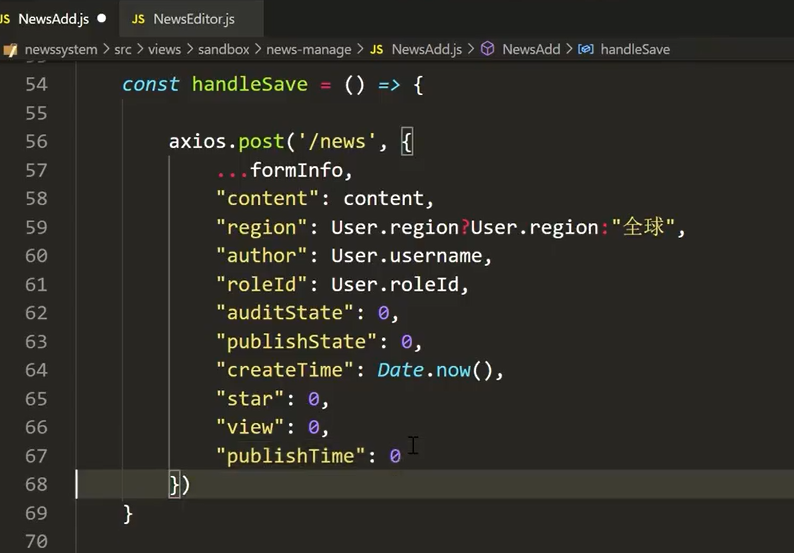

接收设置一下状态的值 0草稿箱，1提交，2审核 

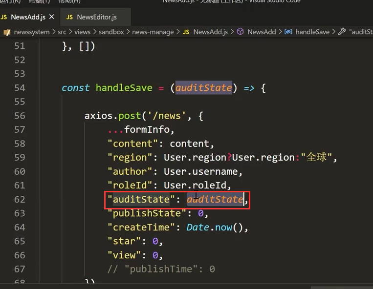

请求完成--页面进行跳转

​		如果是0草稿箱就跳到撰写新闻中，如果不是0就跳到审核新闻中

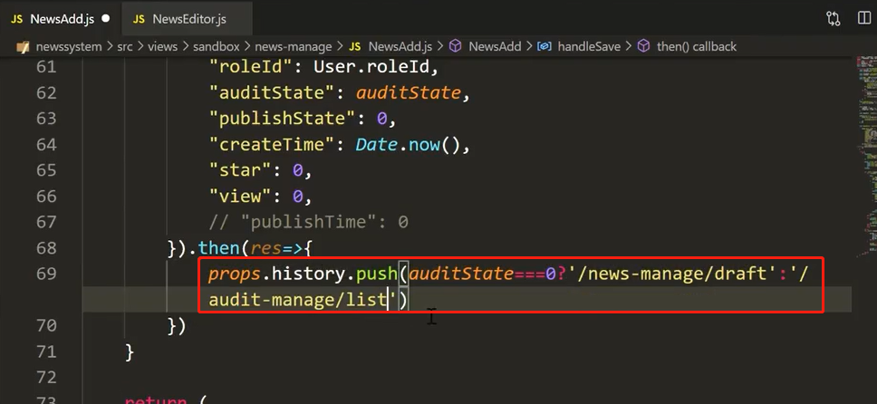

#### 3、设置提醒框

我们在保存完之后-再进行一个通知的提醒

​	到组件库中先找一个提醒的组件

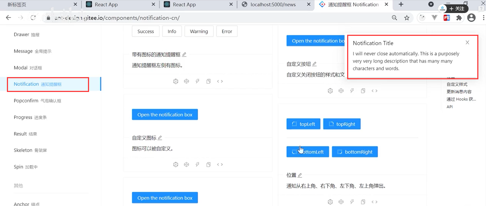

右下角的提示--使用方式

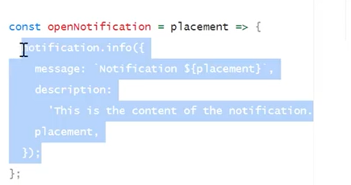

代码实现：

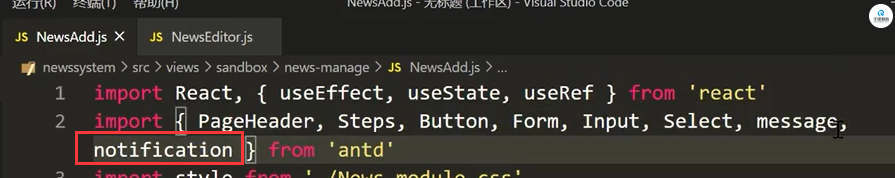

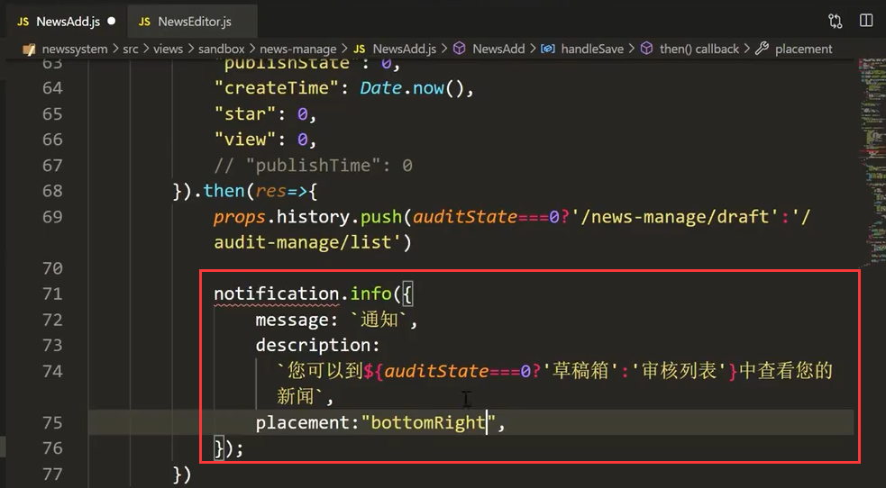

页面查看效果：没问题

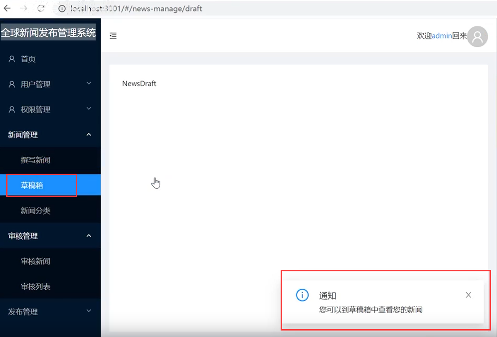

