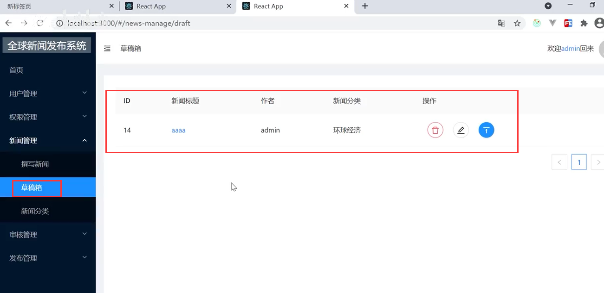
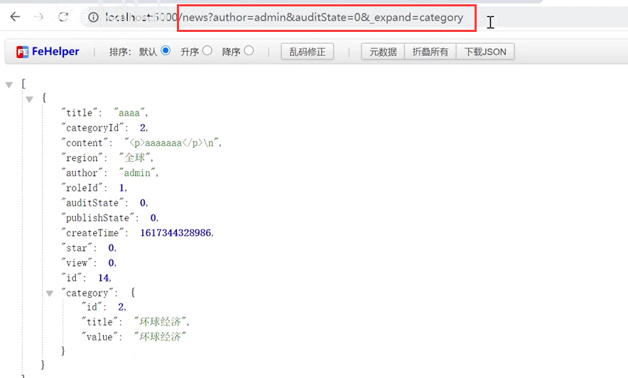
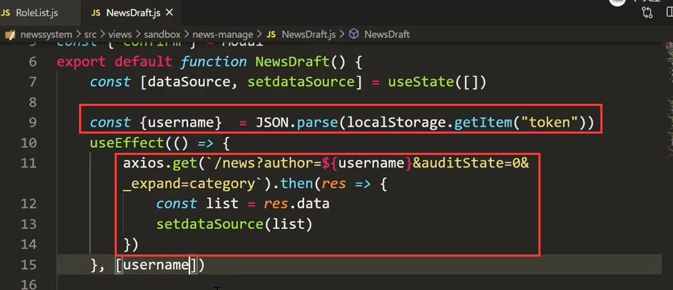
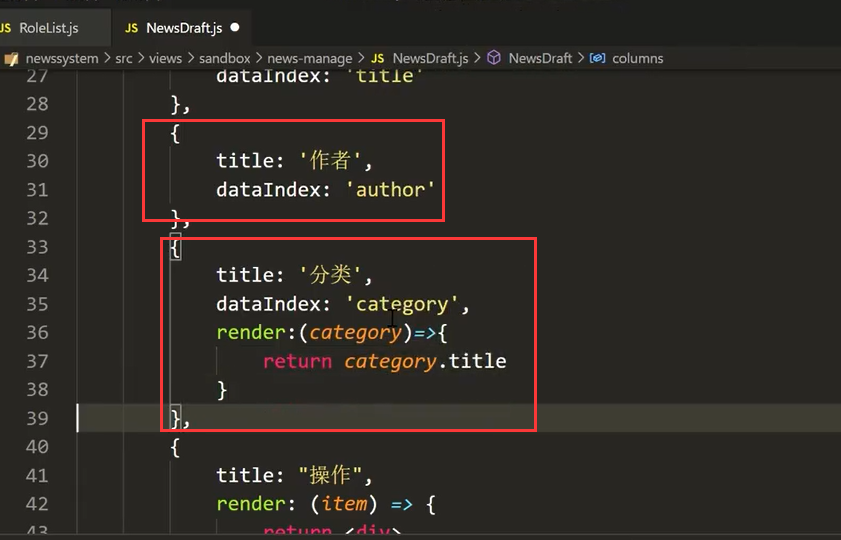
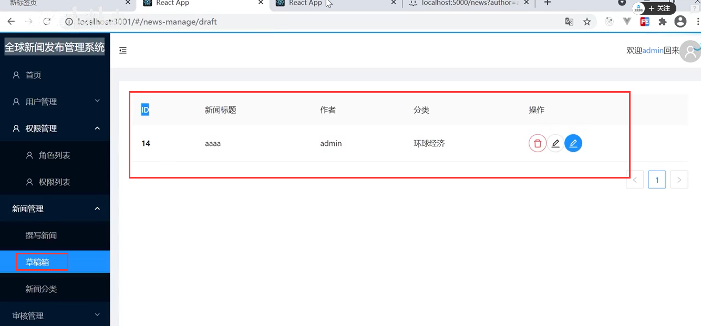
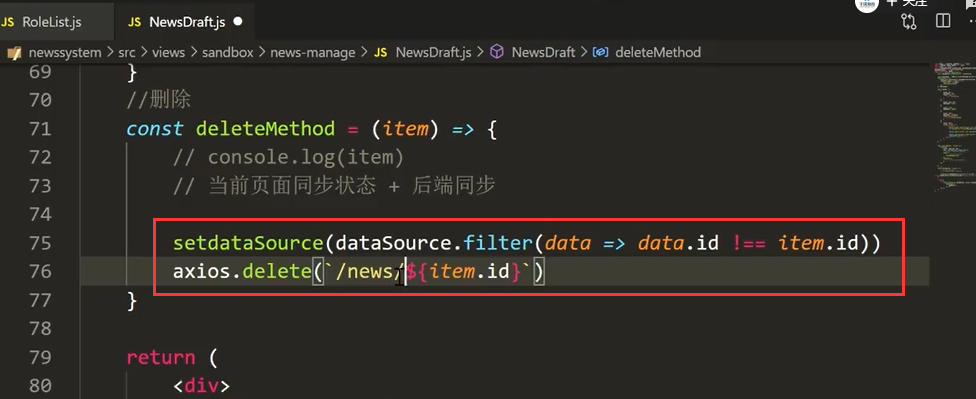
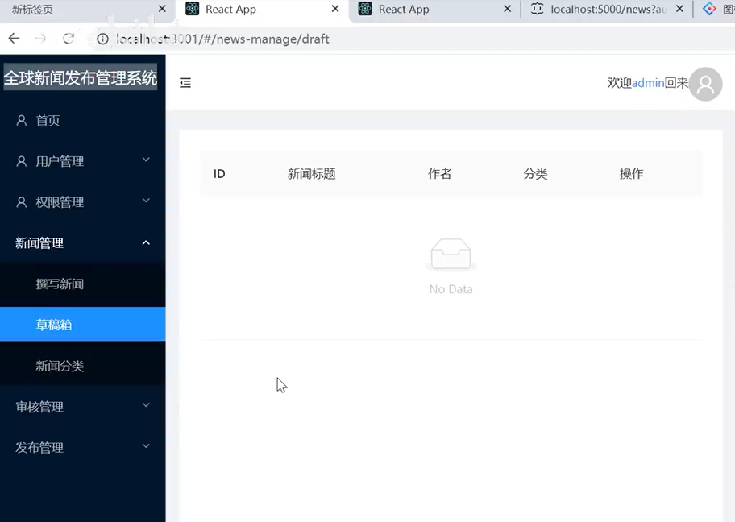

# 13.草稿箱-列表

在草稿箱中-我们增删改查新闻都是可以的，最后还可以提交审核

想要达到的效果就是这样的

​		每人只能看到自己的草稿箱，草稿箱的数据状态都是为0的

接口的条件应该是这样的 有作者、有状态、还有表关联分类 

​		这样的数据就是我们草稿箱列表需要的数据

代码编写：

配置表格的列

查看一下效果：和我们预期的很接近了

先把删除做一下--因为删除的逻辑基本都一样

删除也是没有问题的

