# 14.草稿箱-预览路由

我们想在点击新闻标题的时候--实现预览的功能

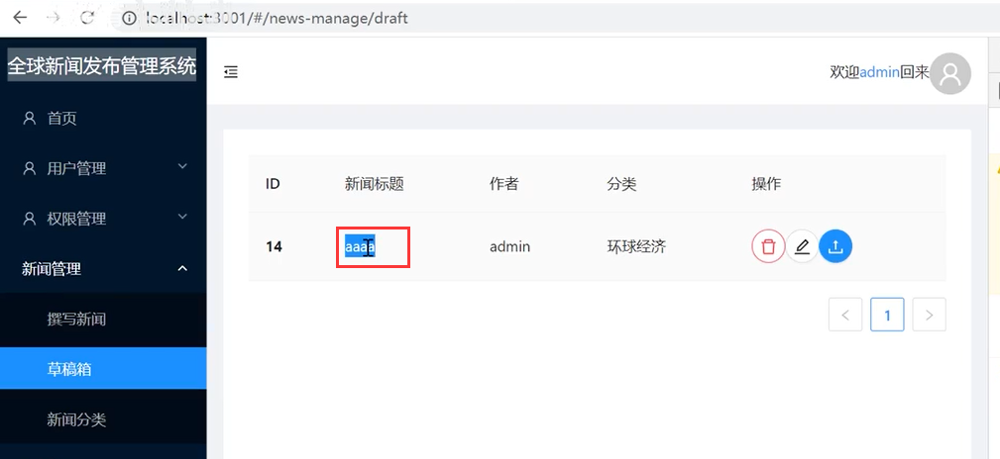

点击预览功能后--效果应该是这样的

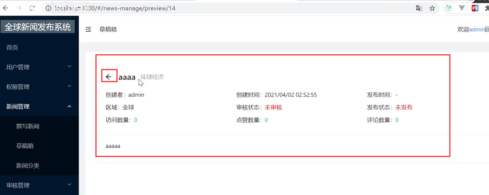

思考：1、如何在点击的时候跳转到这个新的路径来，2、这个UI需要用什么组件来实现，3需要把数据都取过来

我们本地测试一下先请求一下这个路径--发现我们根本没有这个路径，那就需要整一个这样的路由

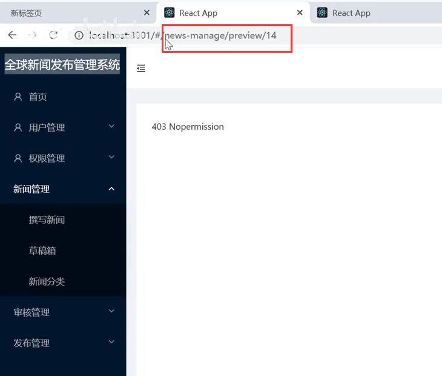

我们新加一个路由和组件：

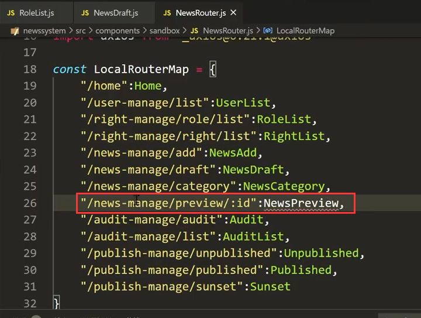

在路由判断中还需要加入一个 routepermisson  

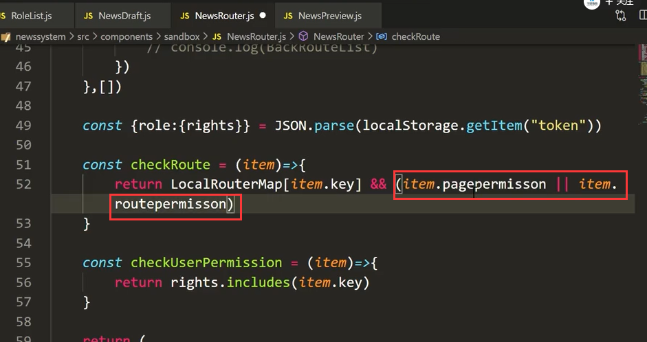

现在我们可以请求到这个路由了

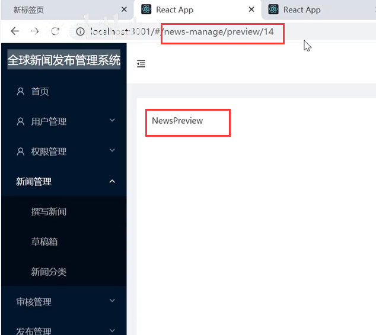

我们需要的是通过连接的方式跳转过去

#### 2、设置超链接跳转

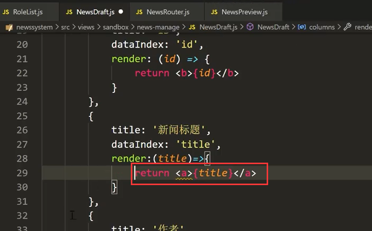

查看效果：

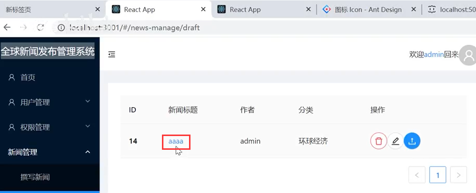

我们加入跳转的href地址

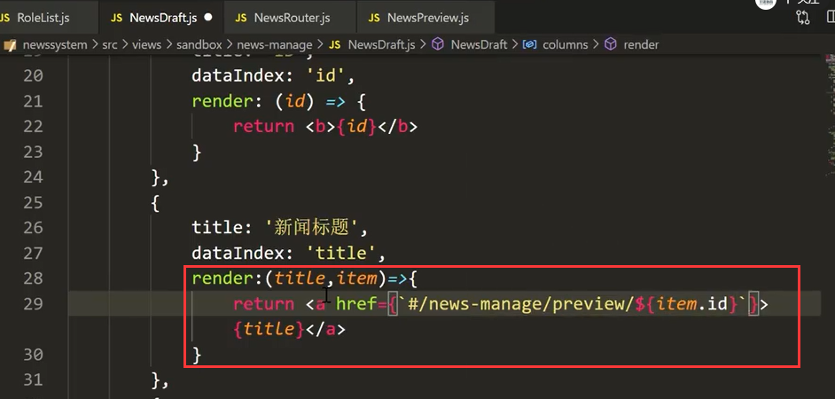

#### 3、设置详情页面显示

我们考虑使用PageHeader的组件来进行详情页面的显示

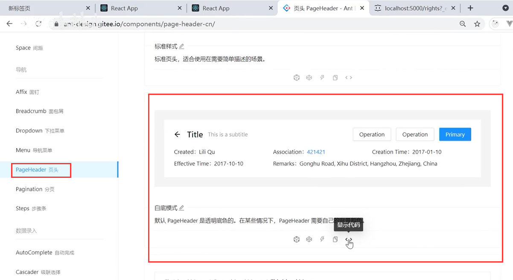

代码引入：

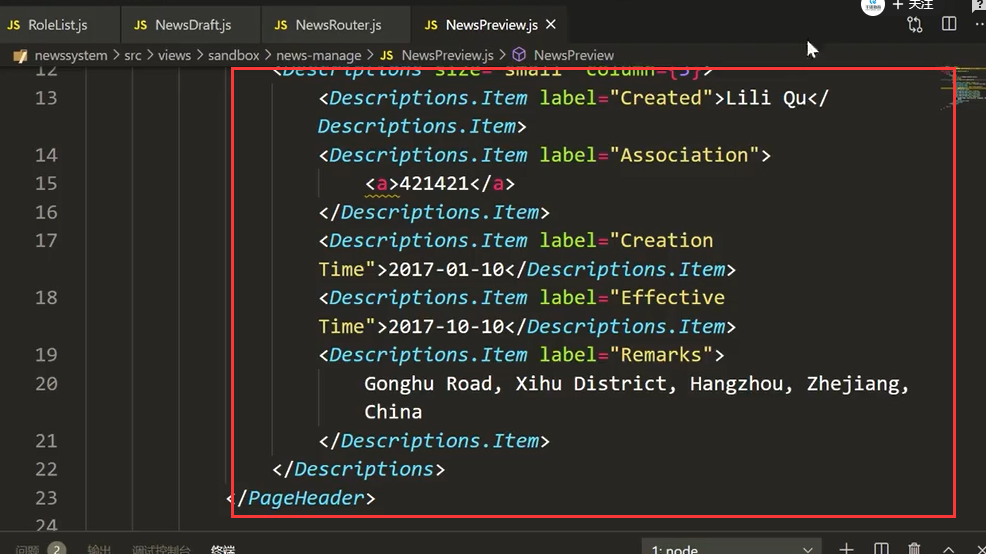

查看一下效果：

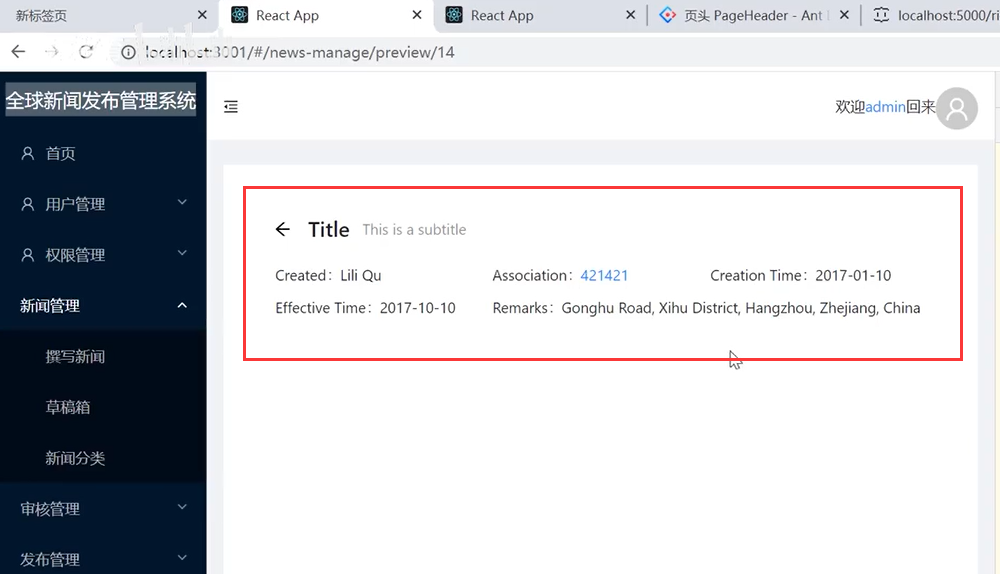

我们需要取一下数据：我们可以通过props拿到路径上的id值

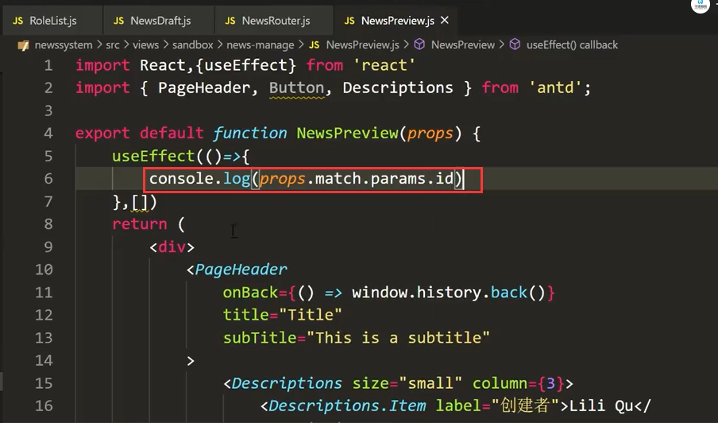

发起请求，并设置状态值--后续就用这个newsInfo来给页面渲染值就可以了

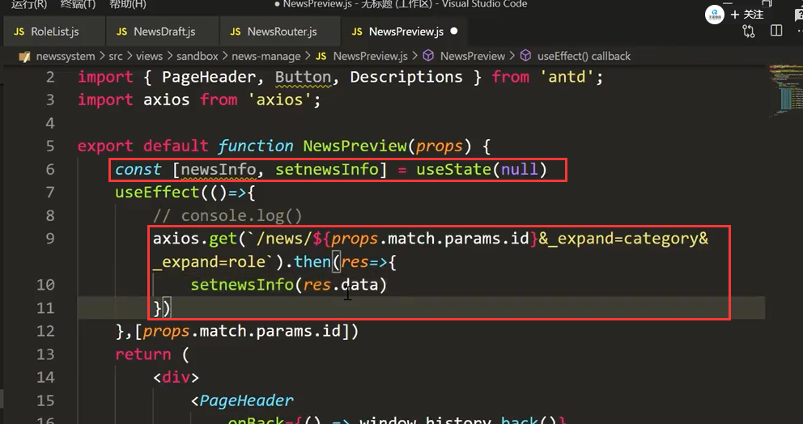

页面报错--这个请求写的有问题

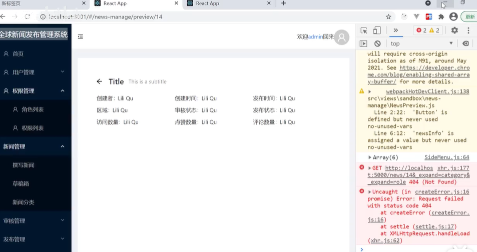

url的参数后面改为？进行连接才对

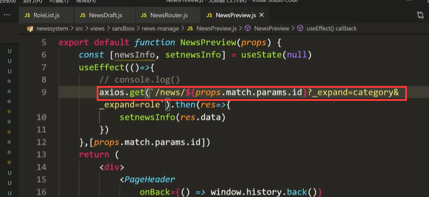

