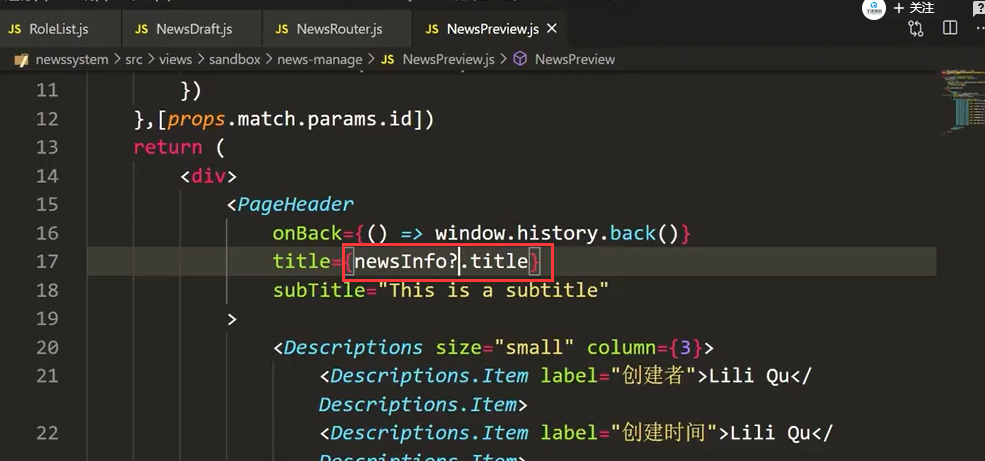
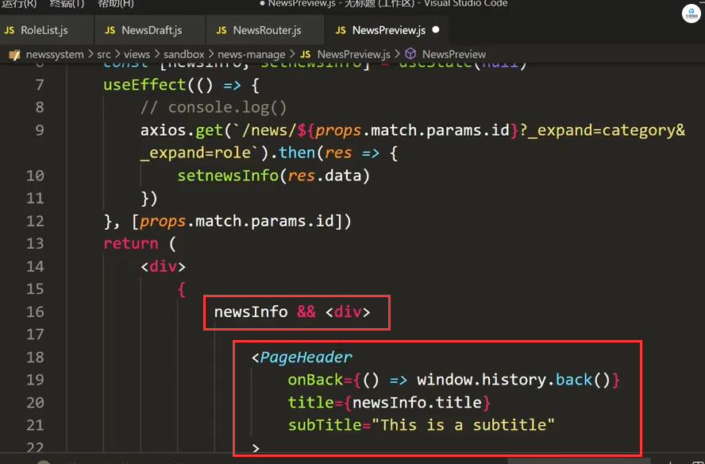
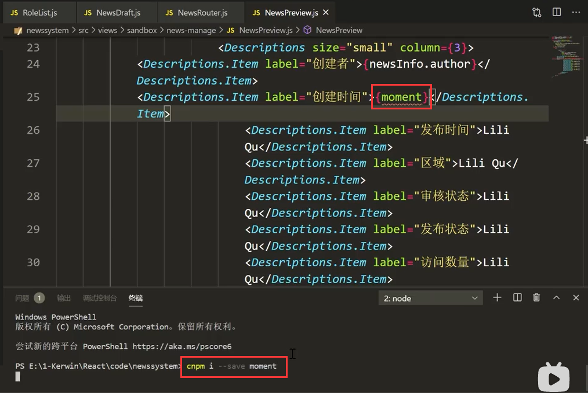
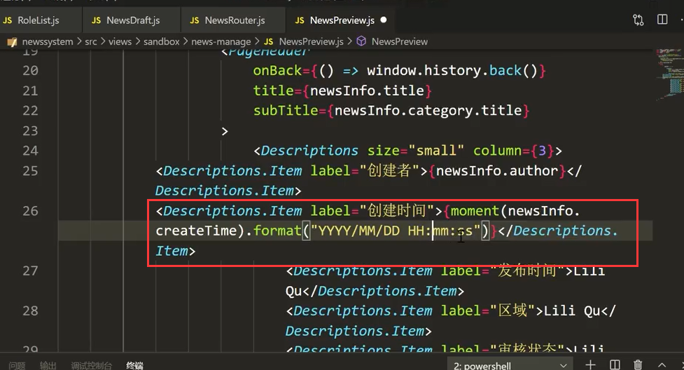
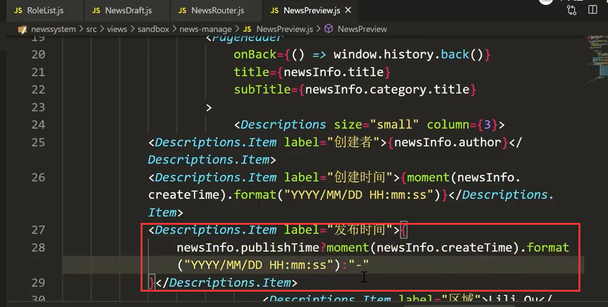
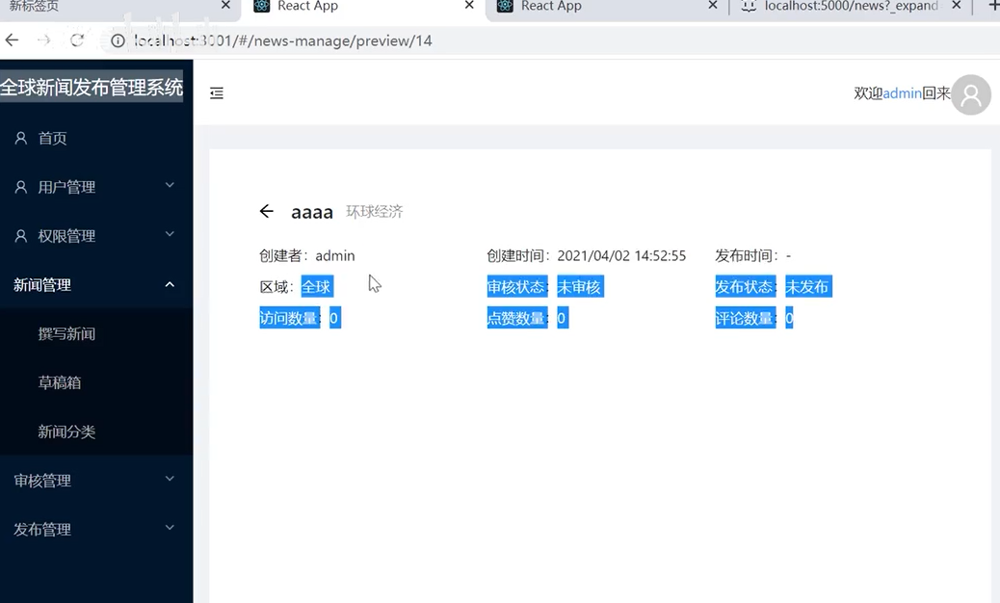
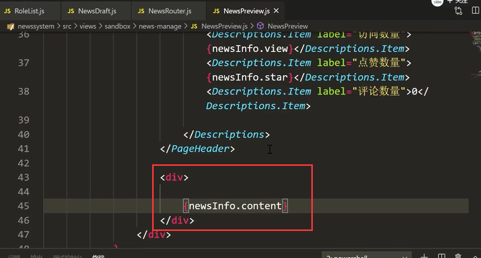
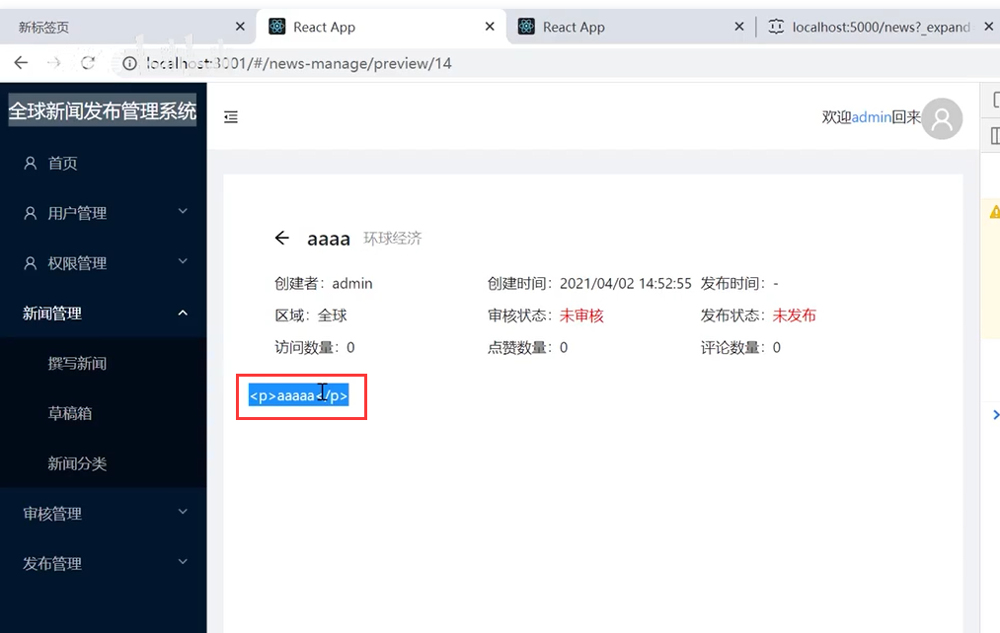
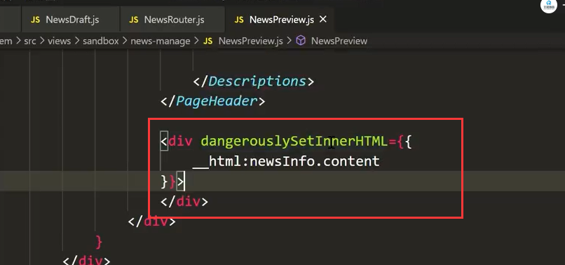
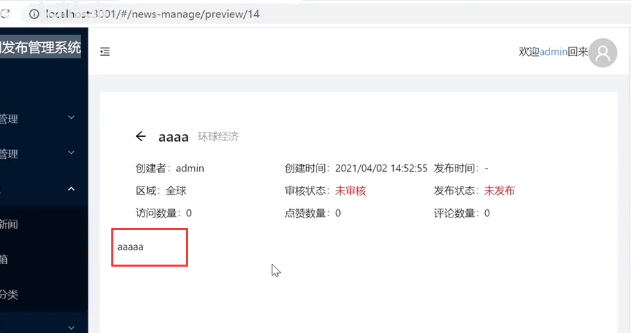

# 15.草稿箱-预览新闻

 

我们在进行预览页面的填充内容的时候--可能刷新页面会导致报错，原因是最开始我们将数据设置为空，等请求回来后设置值，但是还没请求回来的时候页面渲染就已经发生了错误

​		解决方案--1.可以给初始值设置默认值，但是如果多级的话也是会报错的

​						 2.加？问号，如果 初始值有就往下点内容，如果没有就空下，我们有很多属性，每一个都加也怪烦人的

​						 3.我们可以将内容先判断一下







内容的填充：

​		时间的处理使用moment 需要下载一下




时间搓的处理 




注意这个发布时间需要判断一下：

​	如果有就格式化转化---如果没有就显示为-




代码：

```
import React, { useEffect, useState } from 'react'
import { PageHeader, Descriptions } from 'antd';
import moment from 'moment'
import axios from 'axios';

export default function NewsPreview(props) {
    const [newsInfo, setnewsInfo] = useState(null)
    useEffect(() => {
        // console.log()
        axios.get(`/news/${props.match.params.id}?_expand=category&_expand=role`).then(res => {
            setnewsInfo(res.data)
        })
    }, [props.match.params.id])

    const auditList = ["未审核", '审核中', '已通过', '未通过']
    const publishList = ["未发布", '待发布', '已上线', '已下线']
    return (
        <div>
            {
                newsInfo && <div>

                    <PageHeader
                        onBack={() => window.history.back()}
                        title={newsInfo.title}
                        subTitle={newsInfo.category.title}
                    >
                        <Descriptions size="small" column={3}>
                            <Descriptions.Item label="创建者">{newsInfo.author}</Descriptions.Item>
                            <Descriptions.Item label="创建时间">{moment(newsInfo.createTime).format("YYYY/MM/DD HH:mm:ss")}</Descriptions.Item>
                            <Descriptions.Item label="发布时间">{
                                newsInfo.publishTime ? moment(newsInfo.publishTime).format("YYYY/MM/DD HH:mm:ss") : "-"
                            }</Descriptions.Item>
                            <Descriptions.Item label="区域">{newsInfo.region}</Descriptions.Item>
                            <Descriptions.Item label="审核状态" ><span style={{ color: "red" }}>{auditList[newsInfo.auditState]}</span></Descriptions.Item>
                            <Descriptions.Item label="发布状态" ><span style={{ color: "red" }}>{publishList[newsInfo.publishState]}</span></Descriptions.Item>
                            <Descriptions.Item label="访问数量">{newsInfo.view}</Descriptions.Item>
                            <Descriptions.Item label="点赞数量">{newsInfo.star}</Descriptions.Item>
                            <Descriptions.Item label="评论数量">0</Descriptions.Item>

                        </Descriptions>
                    </PageHeader>

                    <div dangerouslySetInnerHTML={{
                        __html:newsInfo.content
                    }} style={{
                        margin:"0 24px",
                        border:"1px solid gray"
                    }}>
                    </div>
                </div>
            }
        </div>
    )
}

```


页面查看效果：




最终的内容显示：




这个内容稍微得调整一下，得让他渲染出来，没有进行html的DOM解析




这样处理一下：




好了这回显示没有问题了




