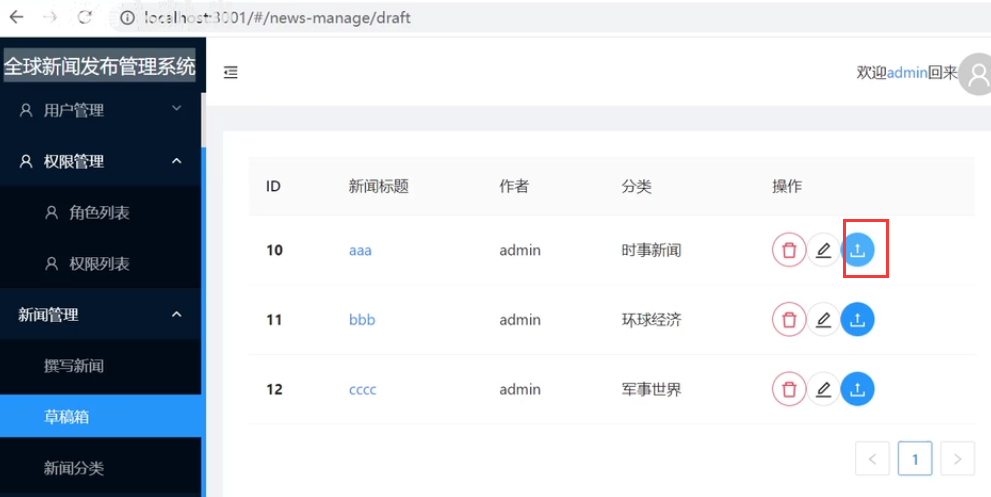
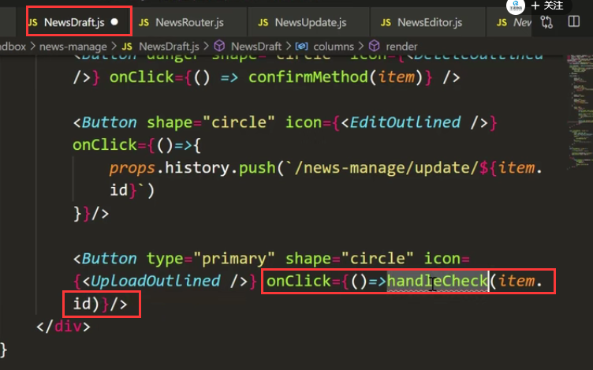
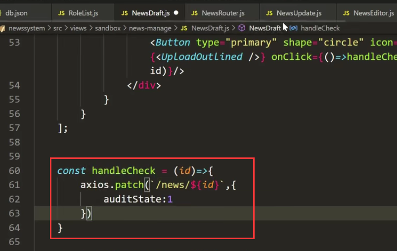
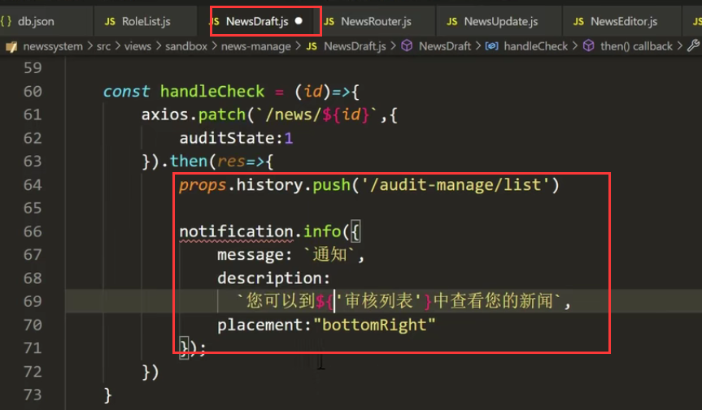
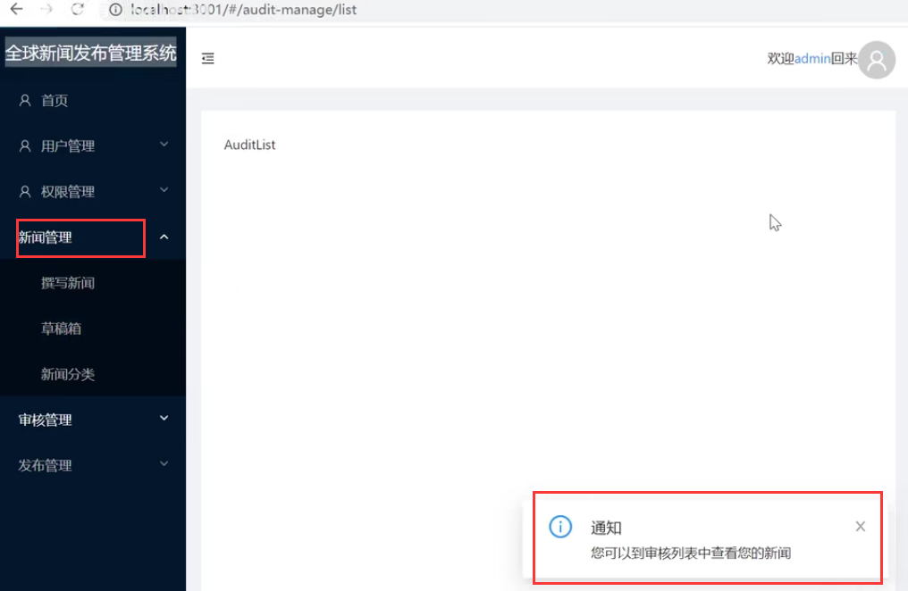
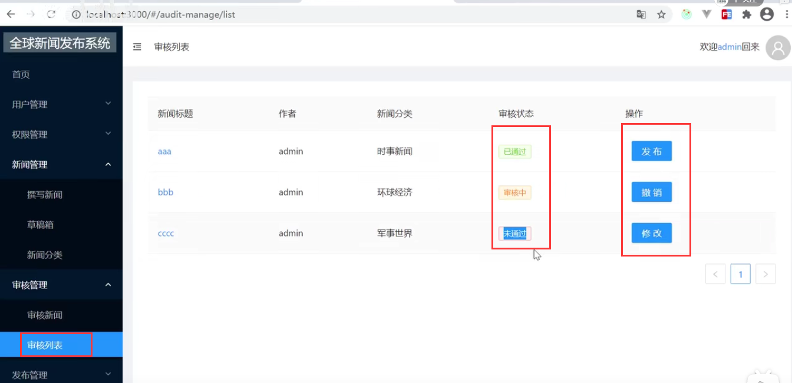

# 17.草稿箱-提交审核

点击审核按钮--进入到审核列表中

审核列表中可能有多个状态显示---可以显示审核中的，未通过的等等这些状态

给这个按钮绑定一个事件--  然后传入id

我们需要把草稿箱的状态0 修改 为1

然后成功之后-需要页面的跳转到审核新闻页面

请求成功后有个提醒

页面查看效果：

审核列表会根据相应的不同状态值进行不同的显示，操作也是会根据不同的状态显示不同的操作

