# 18.审核管理-审核列表

​	所有未发布的新闻都将在审核列表展示，如果是已发布的新闻，将不在这里显示

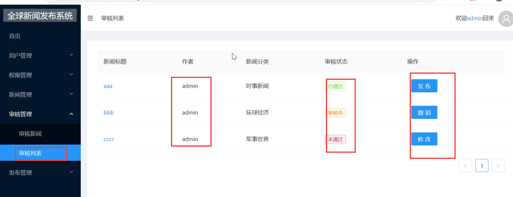

#### 1、设置列表数据

我们看一下这个接口数据

​		这个状态的值在审核列表中肯定是需要查询出不等于0的数据，因为0是草稿箱的

​	还有publishState 0 是未发布，1是待发布，2已发布，3已下线

​	在审核列表应该是查询 publishState 小于等于 1 的状态显示

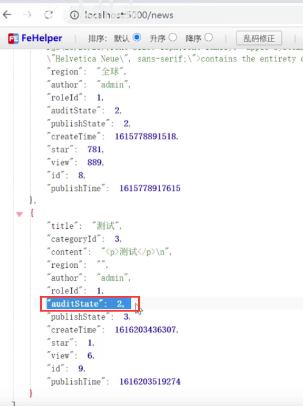

​	我们发起请求--判断作者是当前用户，并且 ne是不等于 ne=0 不等于0的 并且 lte =1是发布状态小于等于1 的

这个ne和lte这种用法都是JsonServer的用法

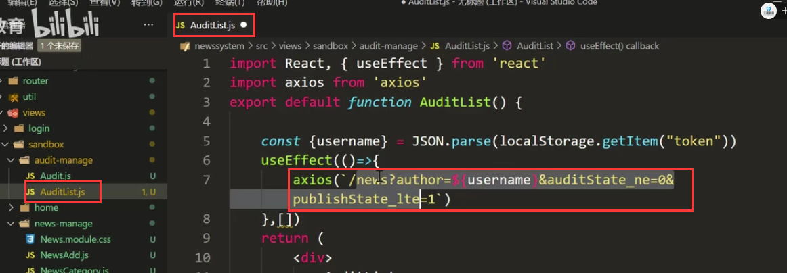

还得需要连一张表category新闻分类---然后我们打印一下这个数据

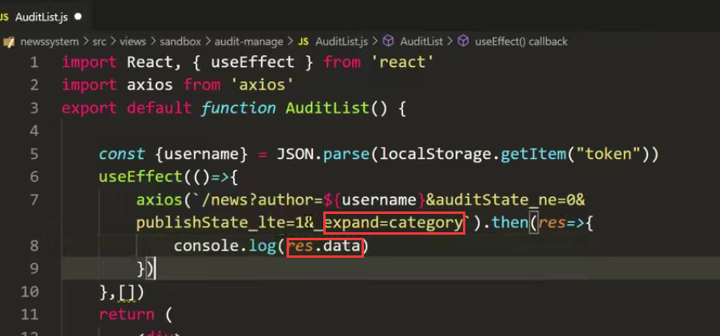

查看一下获取到的数据：没有问题

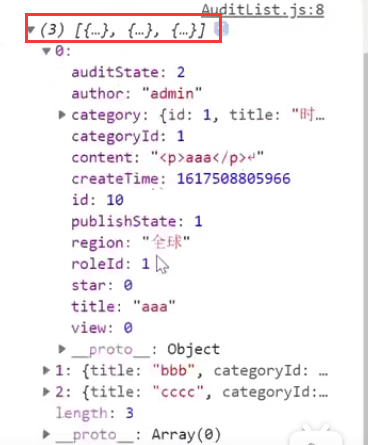

#### 2、设置table表格

​	

设置列：

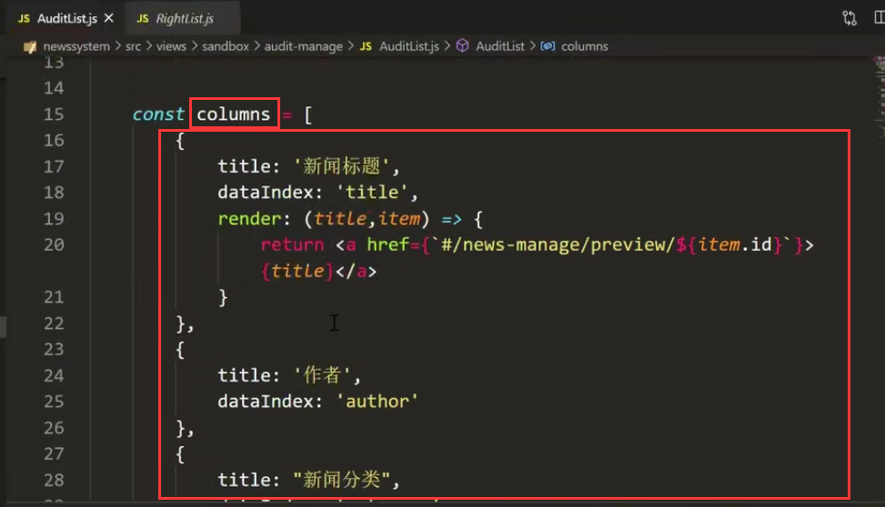

页面初步实现效果：

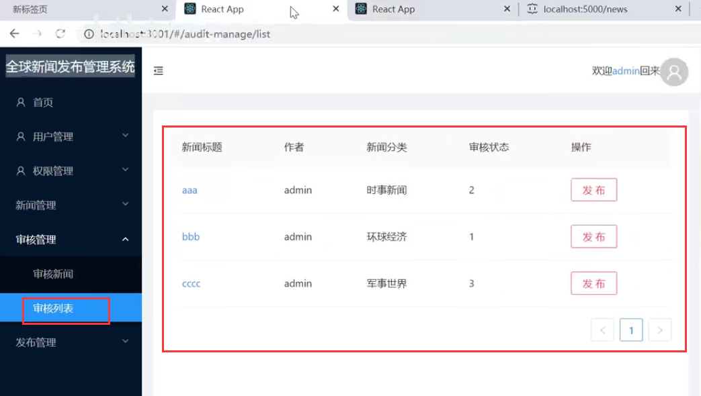

在表格里面使用tag标签组件 tag组件也是在antd组件库中的

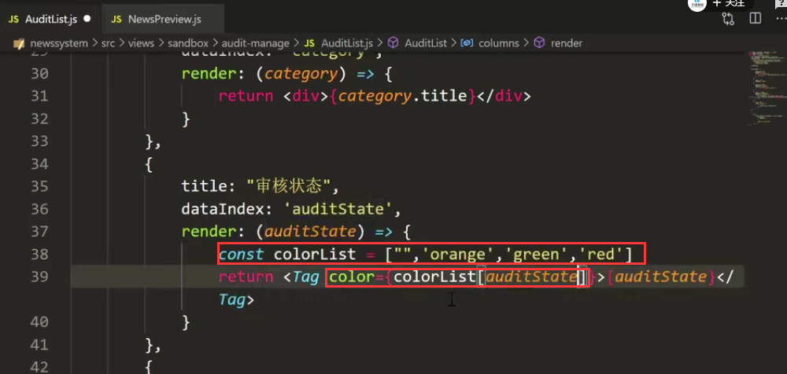

效果：

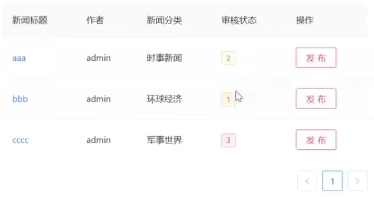

将内容显示也按这种方式处理：

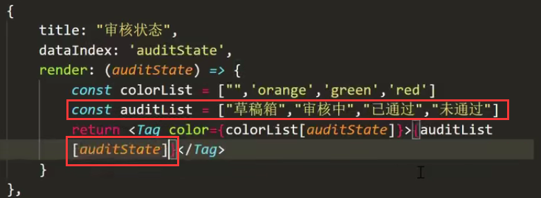

操作按钮的实现：

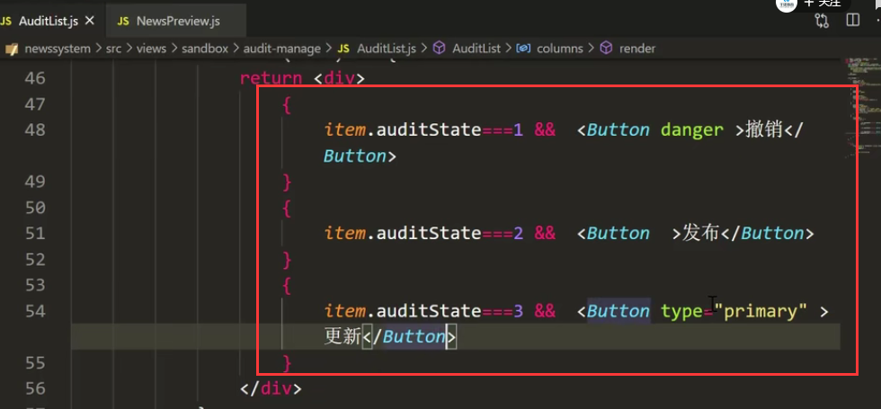

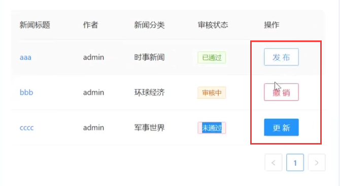

https://www.bilibili.com/video/BV13v411H74b?p=48&spm_id_from=pageDriver

