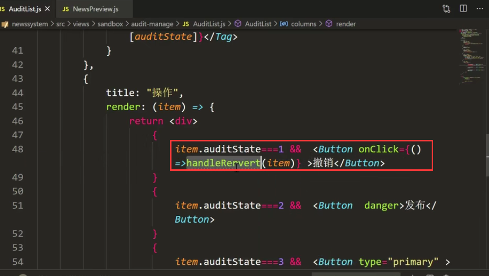
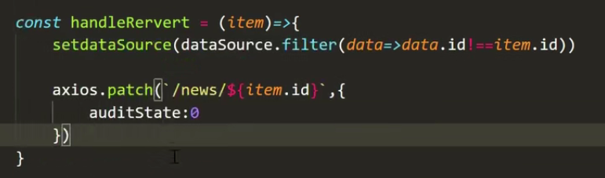
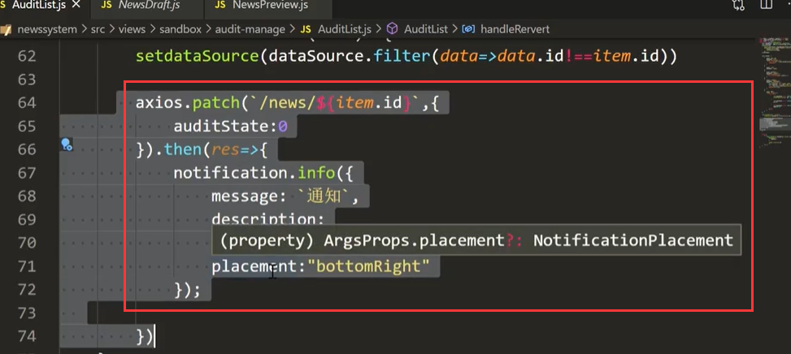
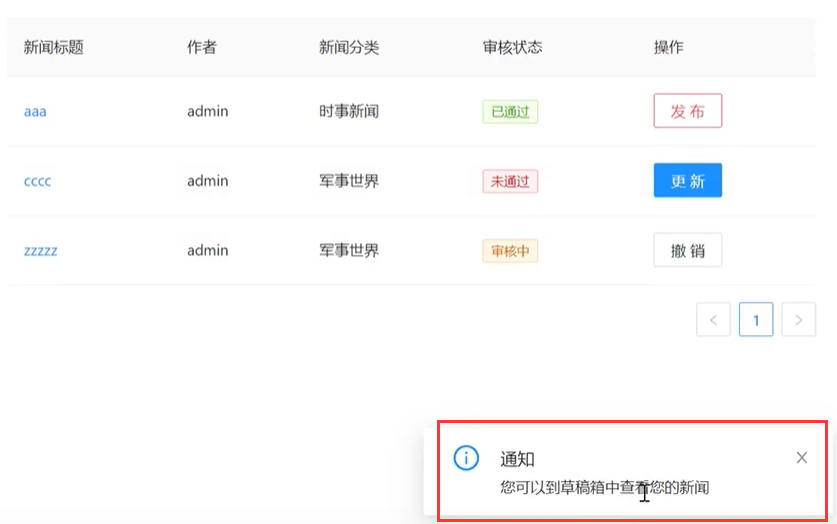
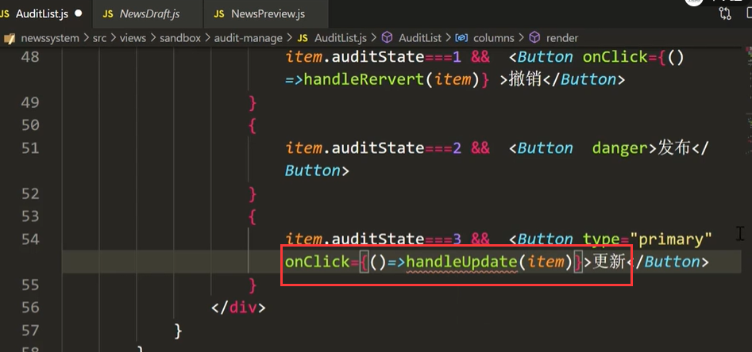
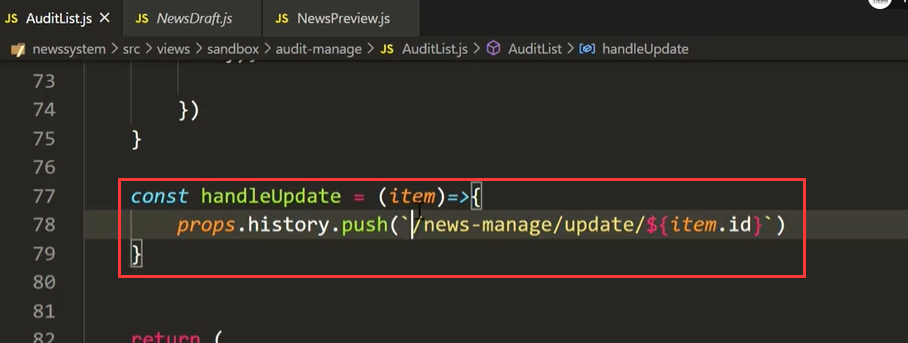
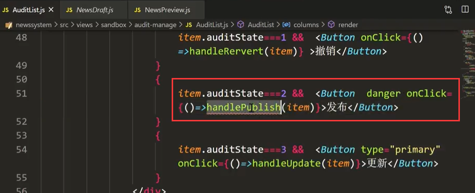
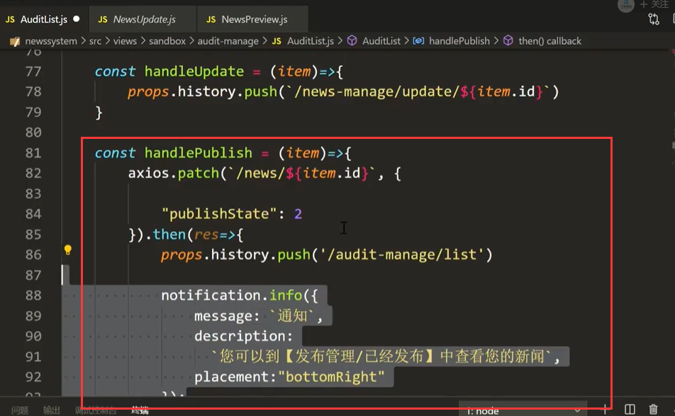
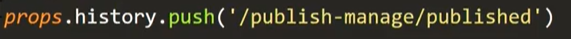

# 19.审核管理-列表功能

#### 1、撤销按钮

点击撤销按钮--传入对象

撤销需要的操作就是-先把当前的数据移除掉，然后将设置状态的值为0

撤销完然后也可以提醒一下： 有考虑到 提示可以进行跳转吗--可以的需要进行更多的配置

查看效果：

#### 2、更新按钮

​		更新也是很简单的主要是实现跳转就可以了

​		设置跳转---然后就ok了

#### 3、发布按钮

​	设置事件

​	事件处理：

跳转地址修改一下：

https://www.bilibili.com/video/BV13v411H74b?p=49&spm_id_from=pageDriver

