# 2.登录页面-粒子效果

让我们写这个粒子的效果--我们可以找一个现成的来使用

​	比如我们去github上找一下 搜索React particle

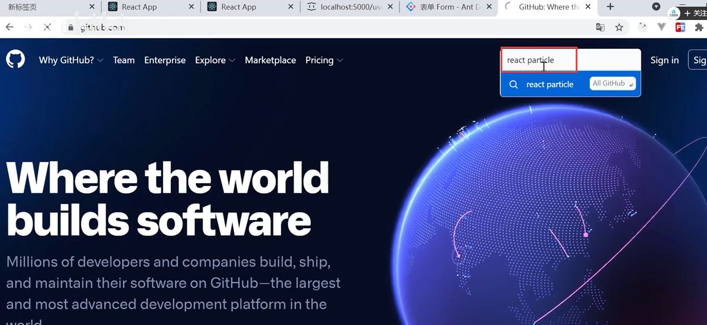

找到一个

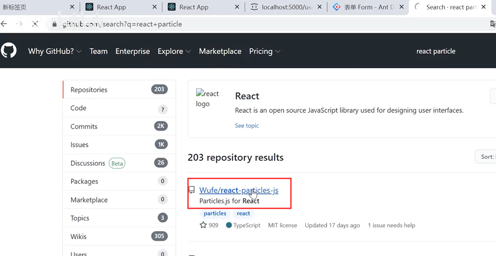

使用方式：

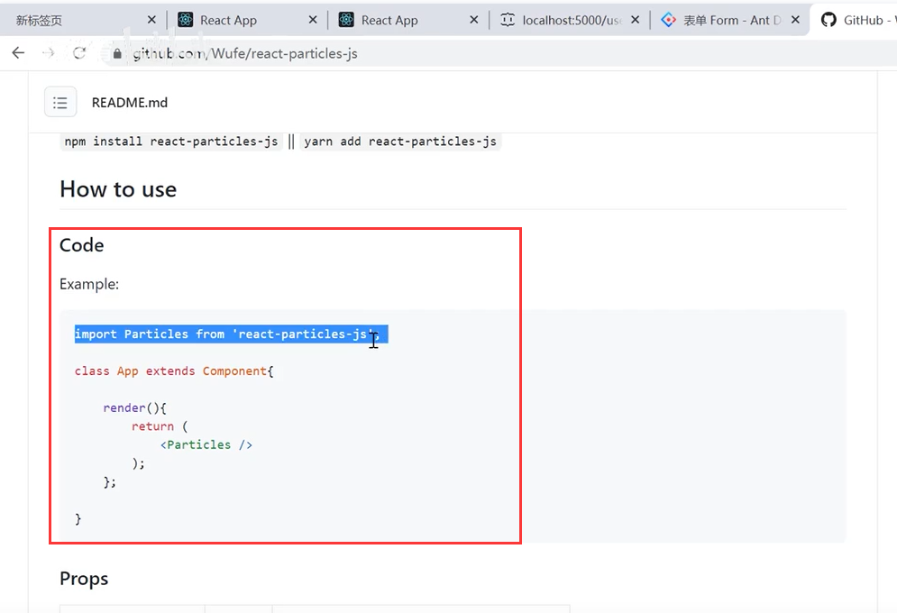

安装一下：

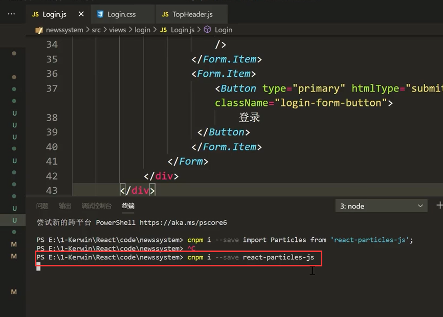

引入及使用粒子效果

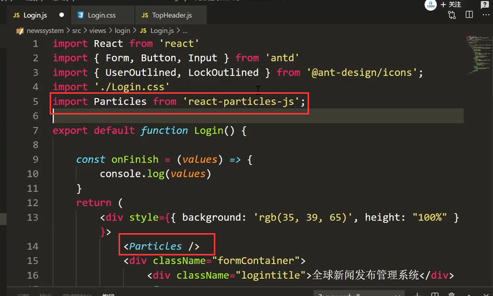

页面查看效果：

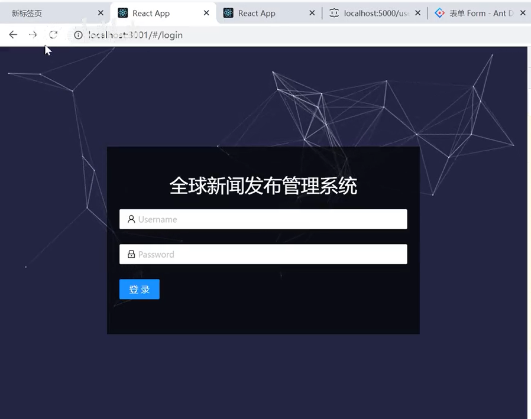

想要调整粒子效果--可以传入参数--比如高度设置height

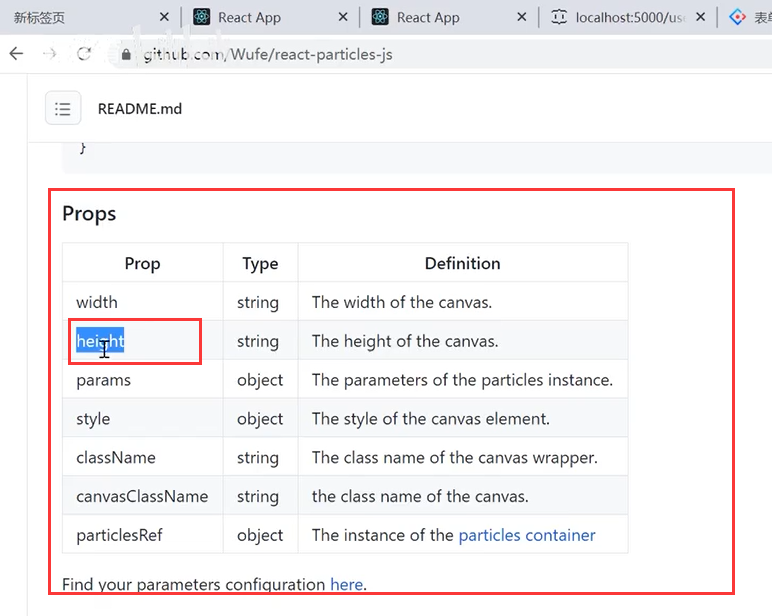

我们将粒子效果设置为整个dom的高度

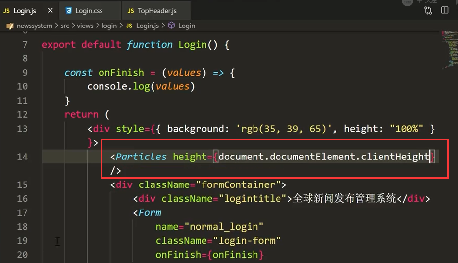

查看效果：

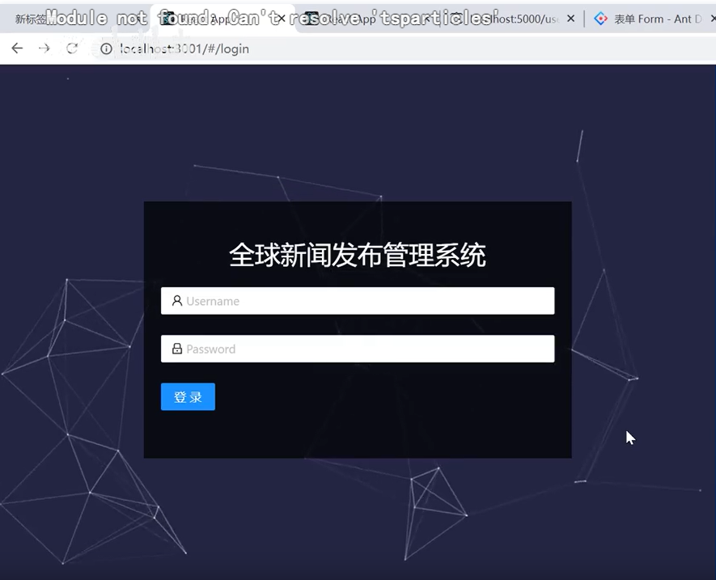

感觉样式还是不怎么样--我们去官网查看一下样式--传入prarm参数

​	预览一下样式

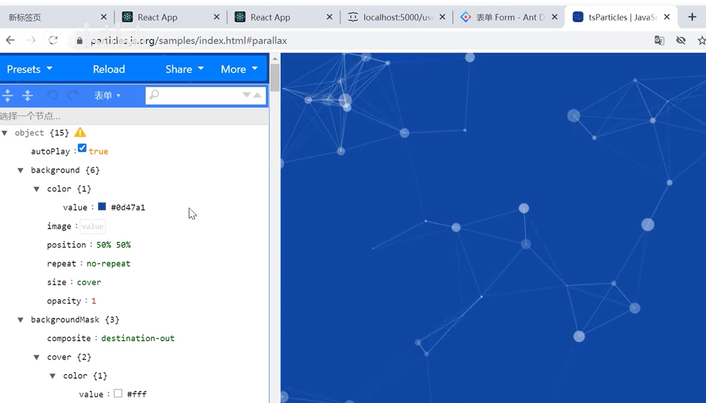

我们预览选择好了以后呢--然后选择more--然后Export Config

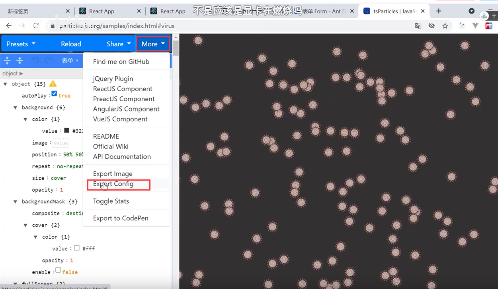

然后就可以获取到这个参数对象的整体配置了

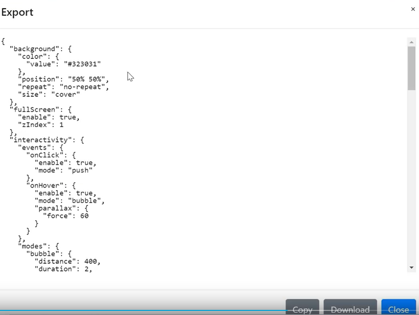

然后copy到我们的代码中使用--用params参数

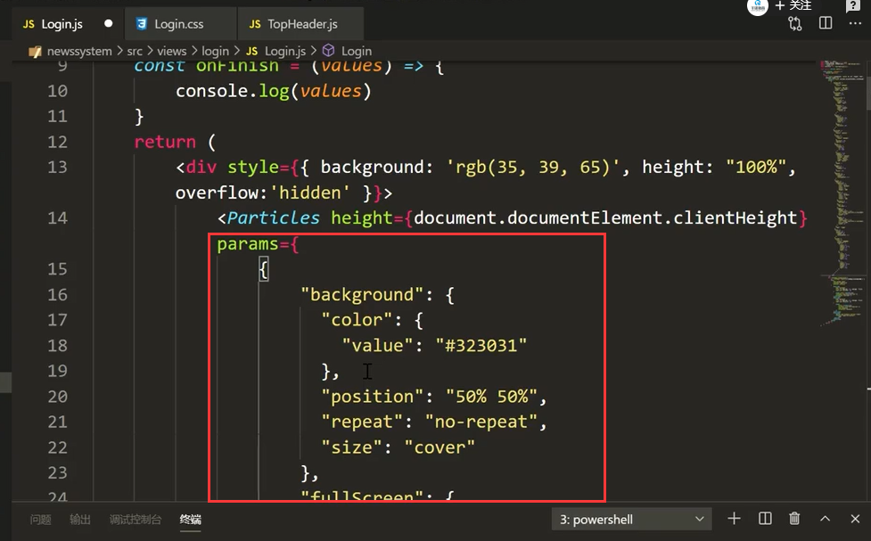

这个可能导致页面的覆盖效果--我们需要提升一下层级的等级效果

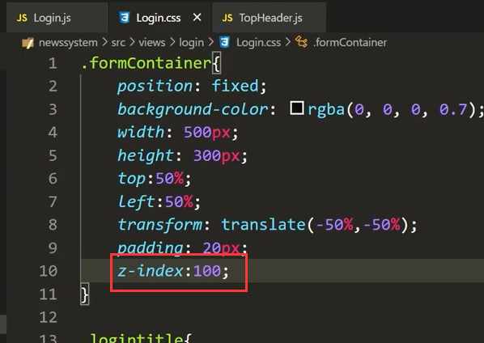

查看一下效果：

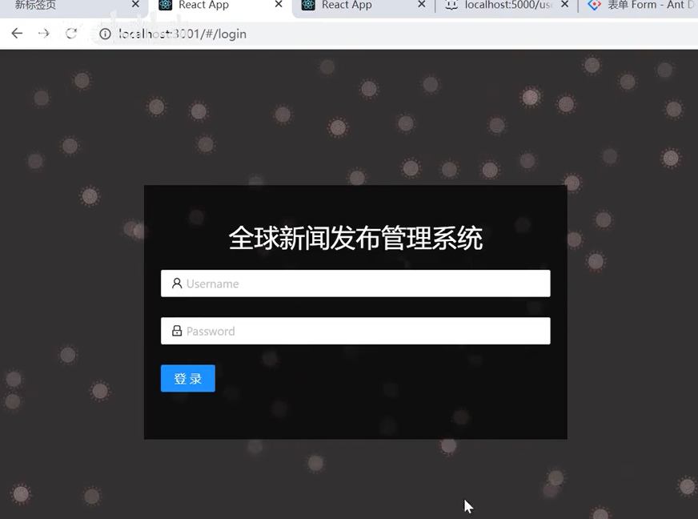

我们更换一下飘的图标---替换为本地的图标

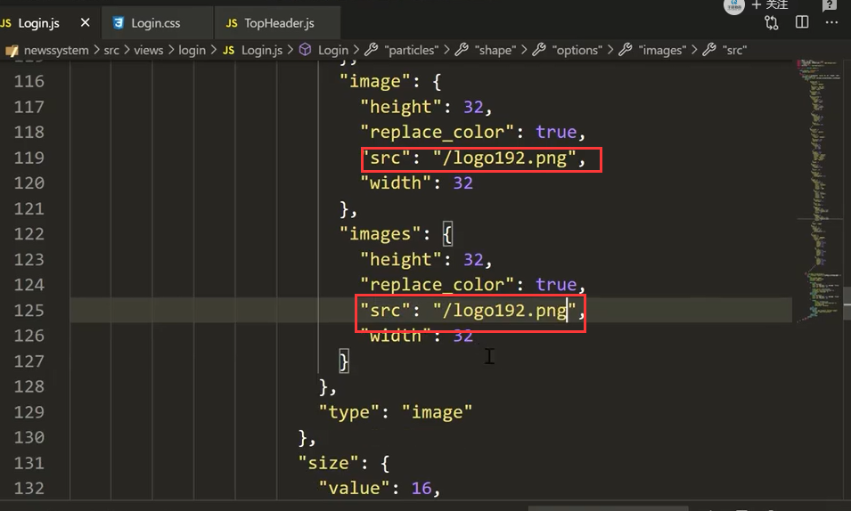

效果：已经实现了

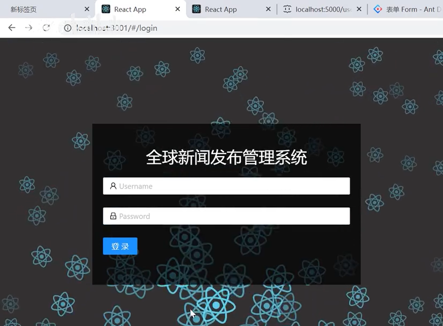

