# 20.审核管理-审核新闻

​		首先这个功能有的人有--有的人没有，是根据权限来划分的

​		

我们获取一下新闻数据--这个新闻数据的Audistate 必须是=1 待审核的新闻--然后关联一下分类

​		然后进行过滤一下，如果不是超级管理员就过滤为当前的用户，而且是当前的区域，并且角色是这个区域下的编辑角色

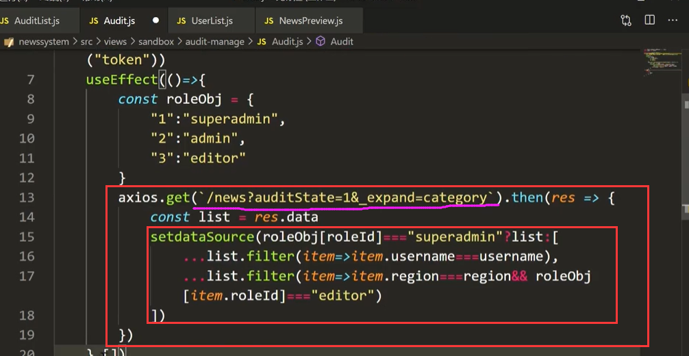

然后写一下table组件

​	设置列

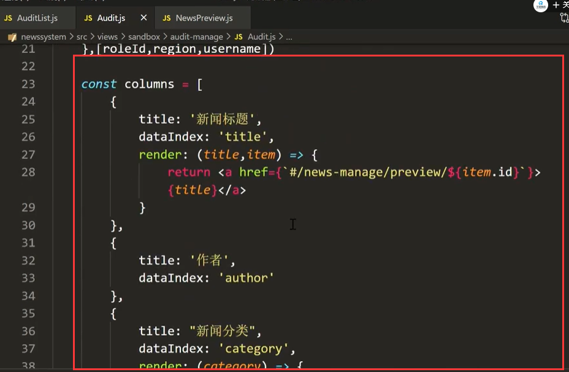

设置操作按钮和 Table组件

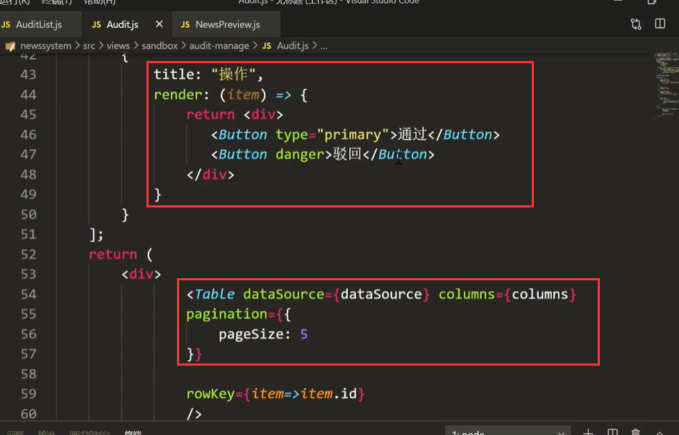

查看页面效果：

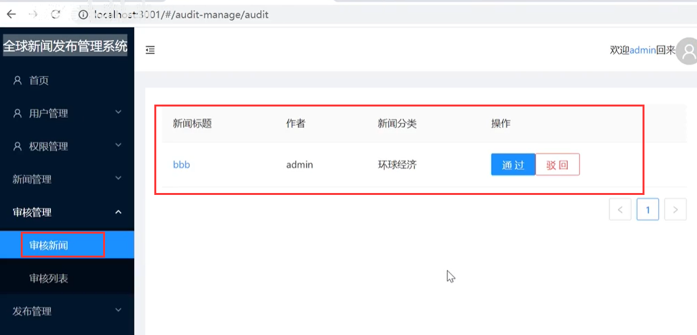

我们从草稿箱提交到审核列表--试一下

​	发现列表是空的：原因是表字段是author作者 而不是username

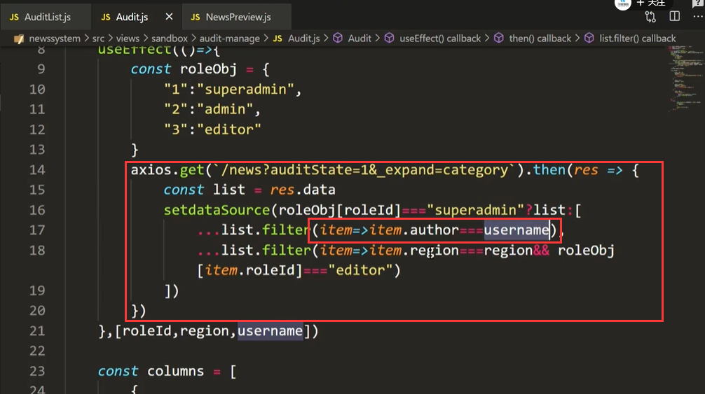

然后再看一下：数据就有了

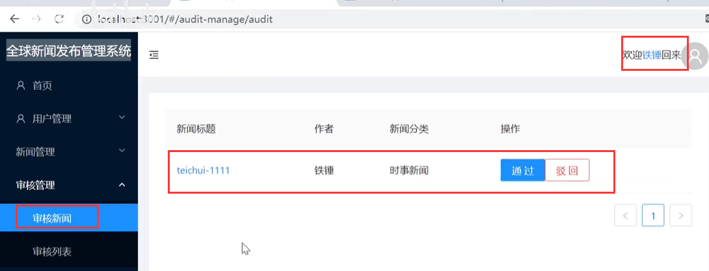

没有问题	

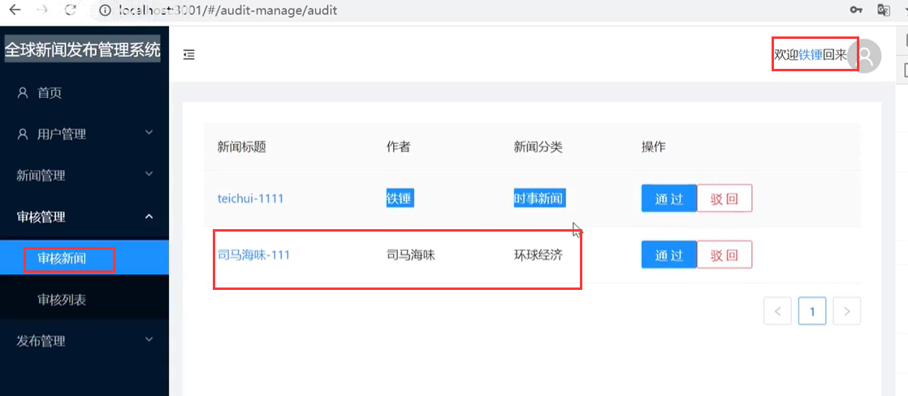

#### 2、按钮操作处理

​	如果是通过审核--需要修改audistate  publish为 1 审核通过 待发布状态

​	如果是驳回 设置 audistate 为3 驳回 publish 为0

先定义一下事件函数：

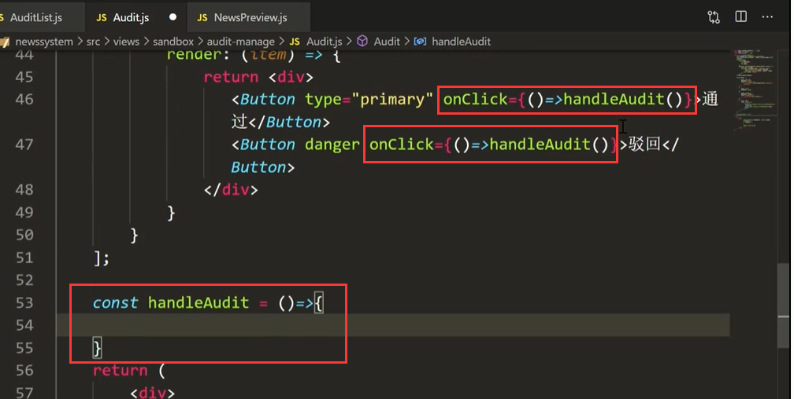

​	需要传入item

​	

首先如果点击审核通过，先要将表格的数据更新，把通过的从table中删除掉，驳回也一样

设置传参

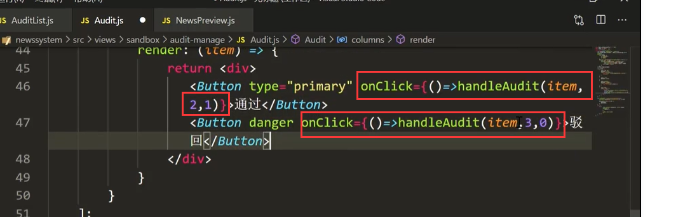

请求设置状态的值

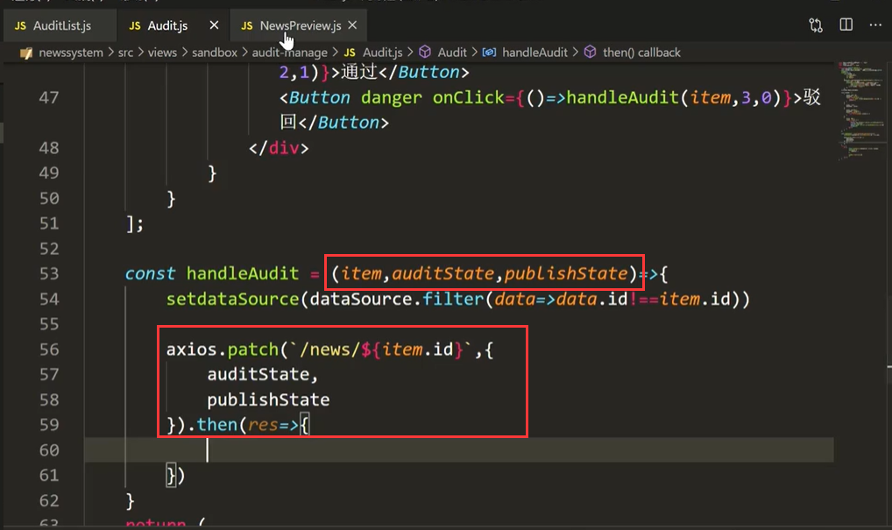

请求成功后--提示一下

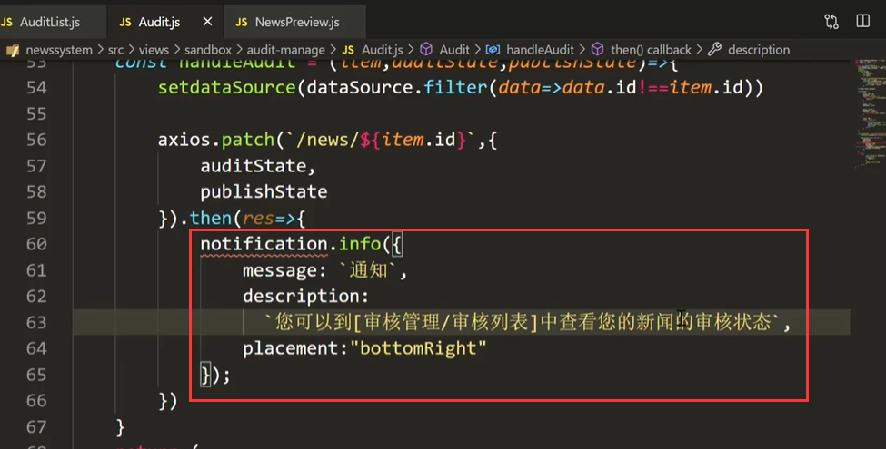

测试并查看效果：

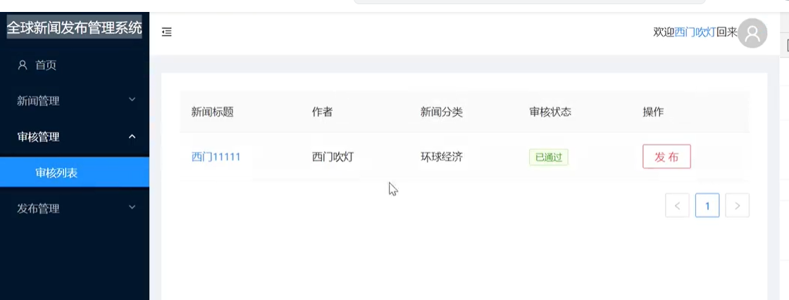

