# .登录页面-权限校验

​	我们现在在点击登录的时候--会收集到表单的提交信息

我们应该使用post请求，但是由于JsonServer认为你发post就是新增，所以我们暂时使用git请求的方式

​	使用axios发起请求--需要校验用户-密码-开关

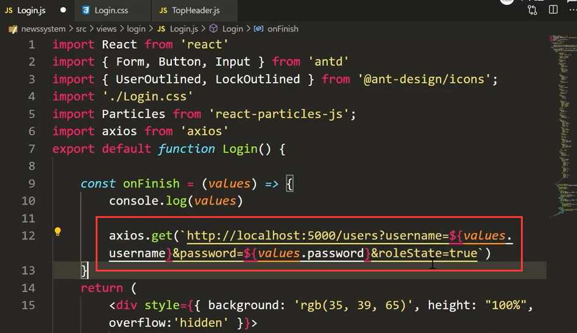

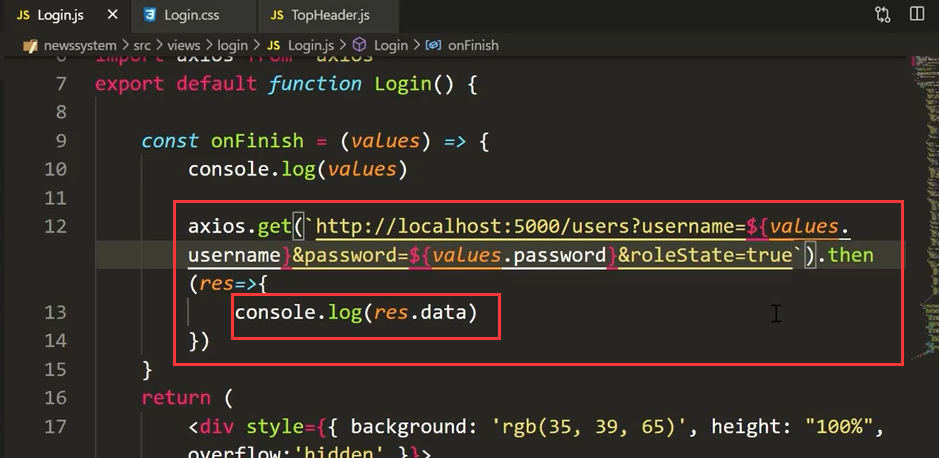

登录请求给我们返回的数据--如果传入的参数都可以匹配上，返回一个对象

​       但是返回的没有权限--我们需要关联查询一下-根据roleId查询出roleList

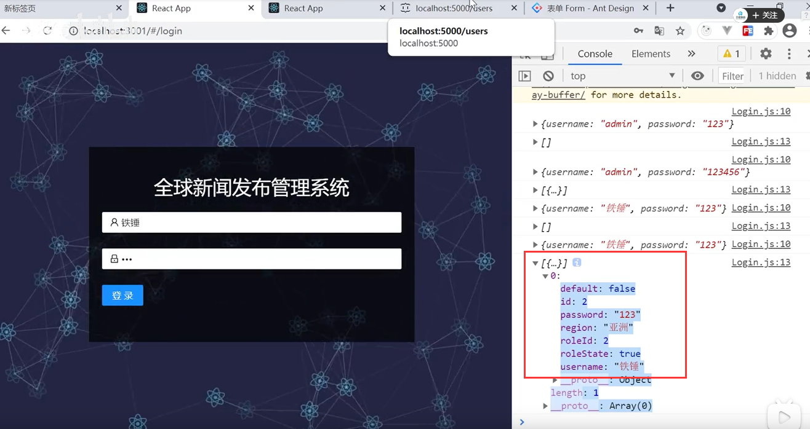

加上关联查询条件关联role     _expand=role

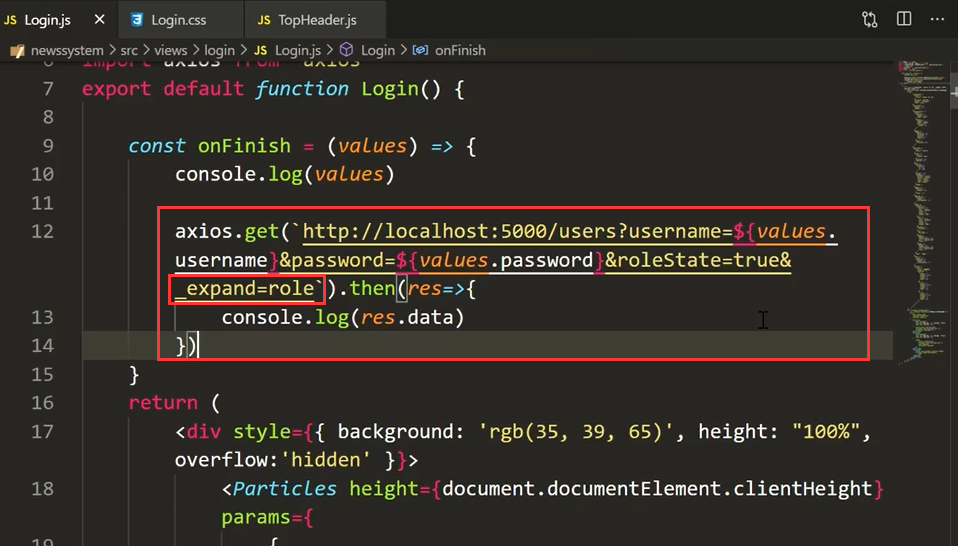

这样就可以关联查询出来role权限集合了

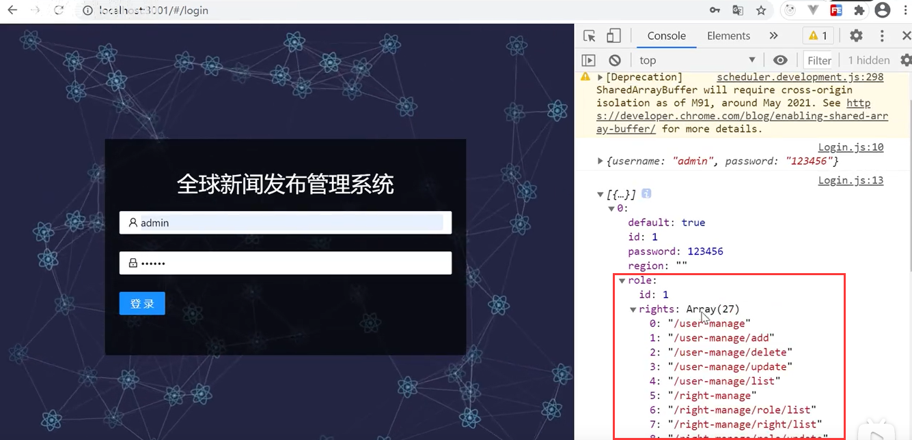

我们判断一下---如果返回的数据是空，说明没有权限，如果不为空那么就跳转到首页

​		我们设置一下token

​		路由到/然后也会重定向到/home首页中

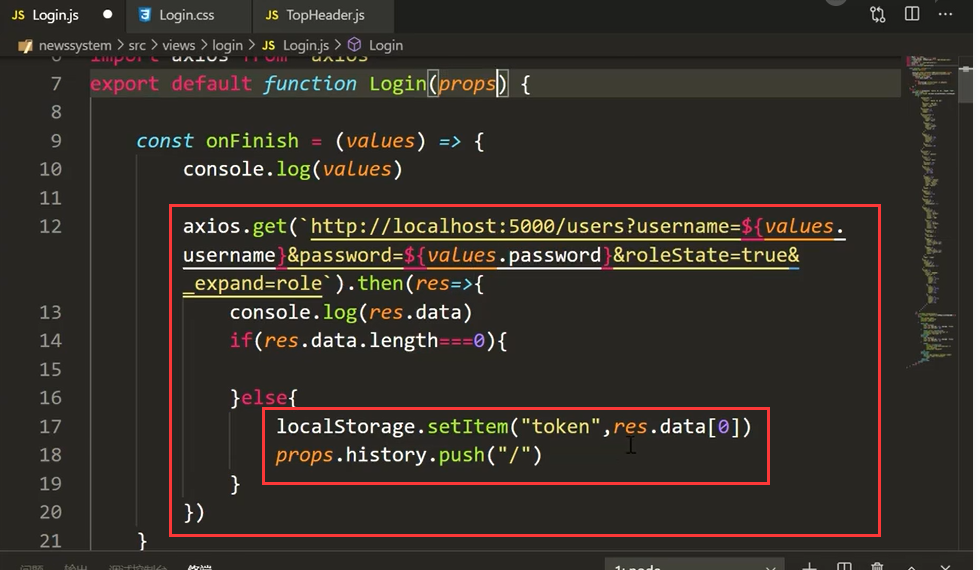

如果没有返回数据---我们提示一下：

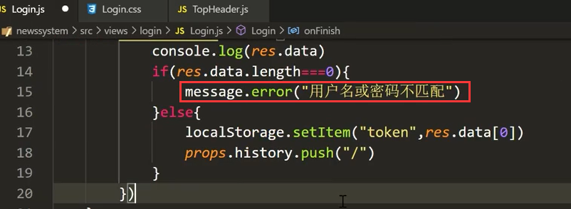

现在我们是没有token的--在Storage中是空的

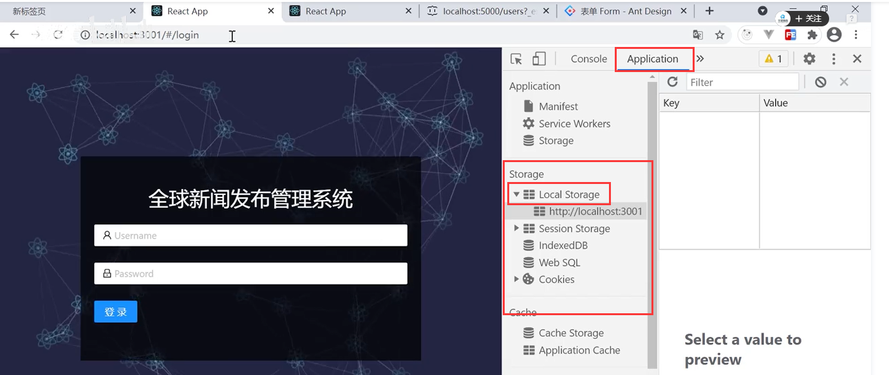

然后我们输入一个错误的---会提示我们错误的信息

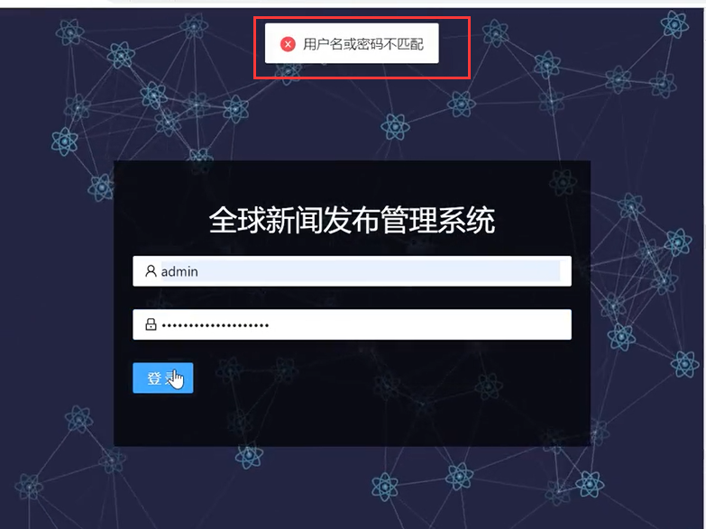

我们现在输入一个正确的--然后可以跳转到首页

​		并且我们可以看到token中有值了--现在token是一个字符串数据 object Object

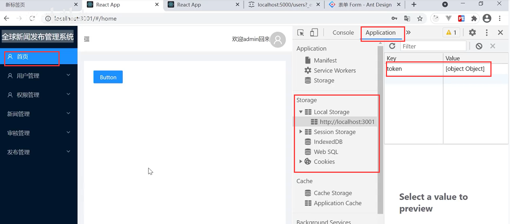

因为这个object我们无法识别他的内容及内容中的全写，所以我们需要对这个字符串进行JSON格式化的处理

JSON.stringify()使用这个方法对数据进行JSON的格式化

​		当然如果是真后端给返回的token他必然不是把用户名密码明文的暴露在这里

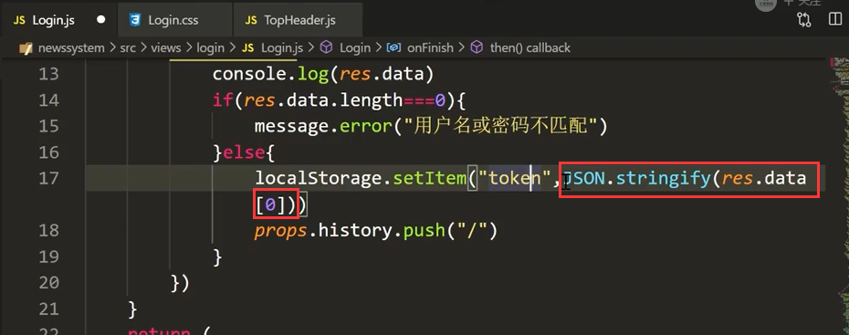

我们这次格式化之后，拿到了全部的个人信息 在token中存放--我们使用这些数据来进行对菜单的权限控制

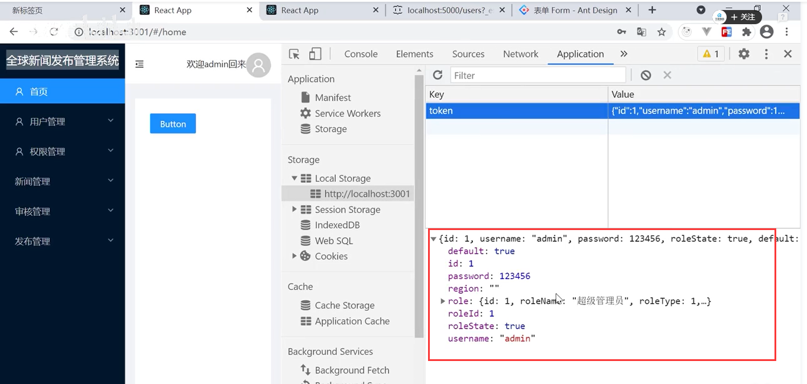

#### 2、设置topHeader为真实数据

​	之前一直是写死的数据--现在我们可以通过登录后进行数据的替换了

​	首先我们获取到token--并且要对获取到的JSON格式的数据-进行一下解析 使用JSON.parse

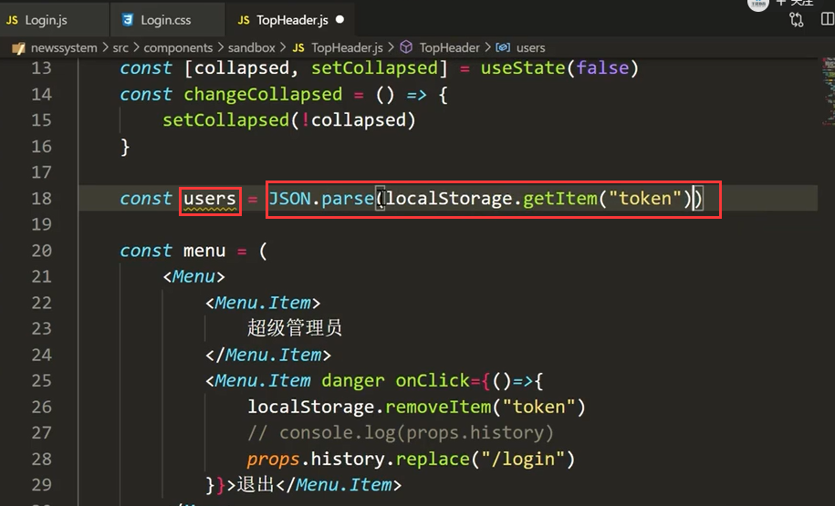

我们结构一下需要的值：

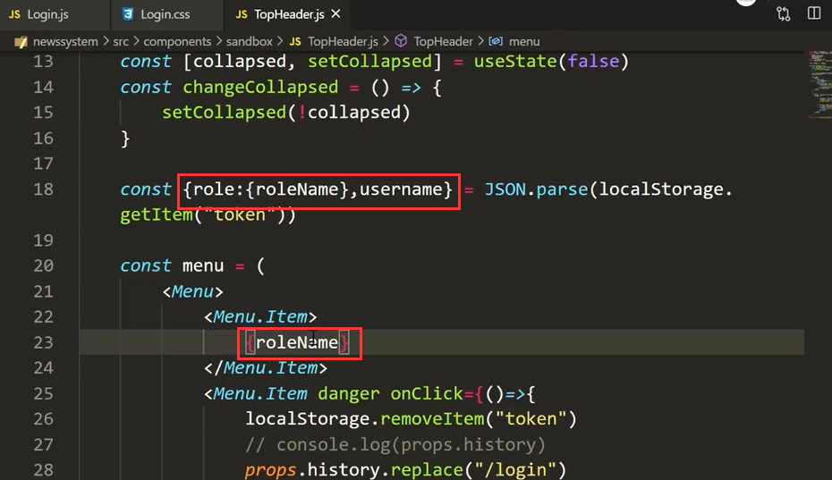

设置动态的数据

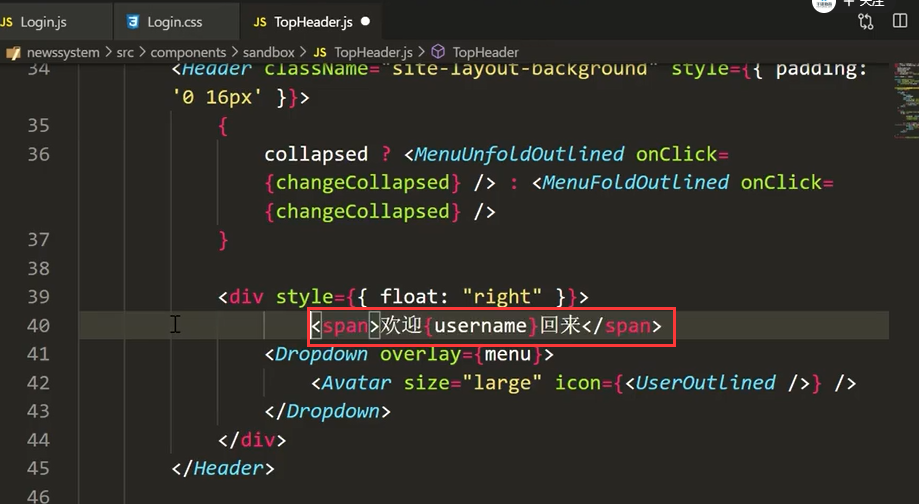

我们用其他账号登录一下-查看效果

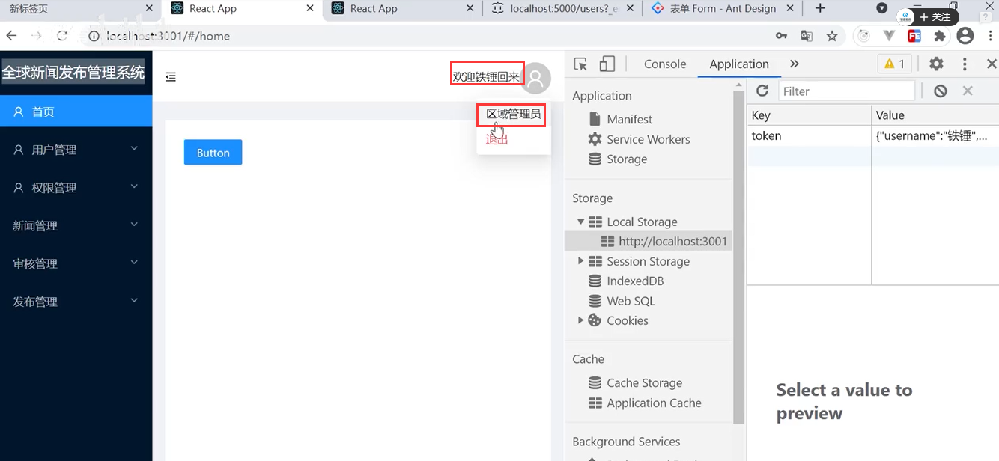

然后我们需要给他添加页面的权限

​		之前的item.pagepermisson是校验是否显示的，我们现在加一个 当前登录用户的权限中 includes包括整个item.key这个路由的才说明有权限--才可以显示出来

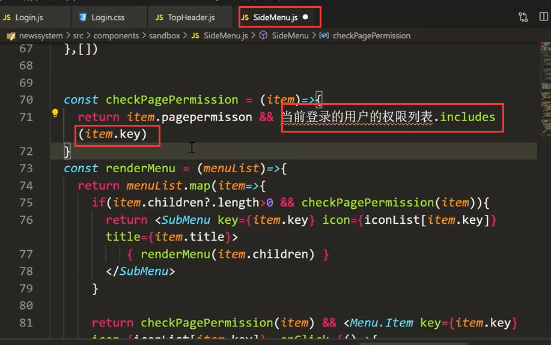

我们获取一下当前用户的权限列表

我们需要的数据是rights

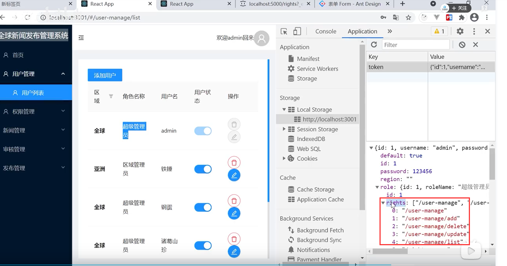

我们获取一下：从token中获取我们需要的数据，结构出角色权限列表

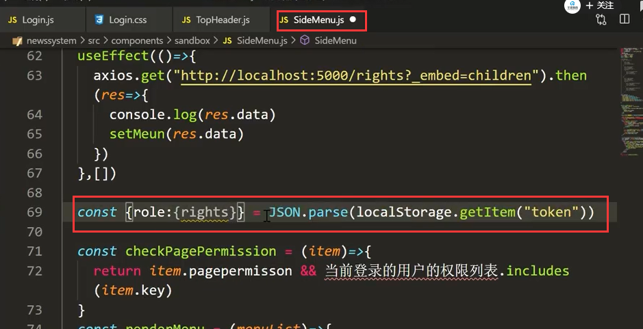

赋值

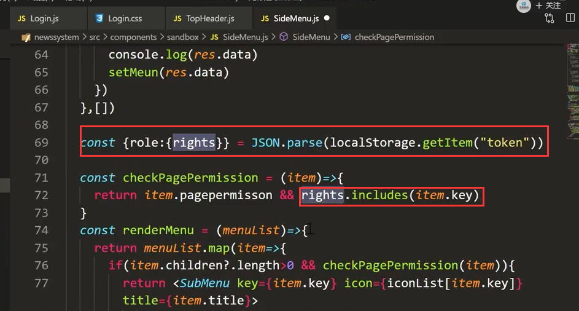

我们查看效果：明显页面中权限列表已经根据用户的权限来动态渲染了

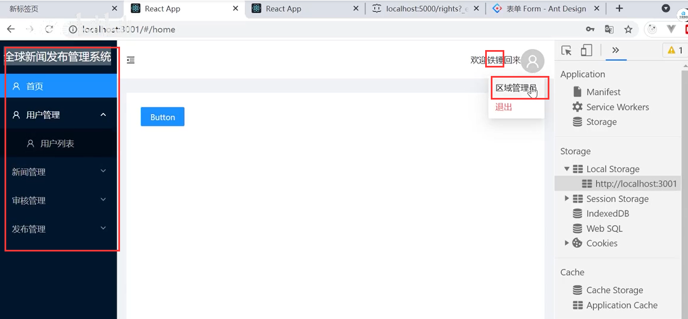

https://www.bilibili.com/video/BV13v411H74b?p=31&spm_id_from=pageDriver

