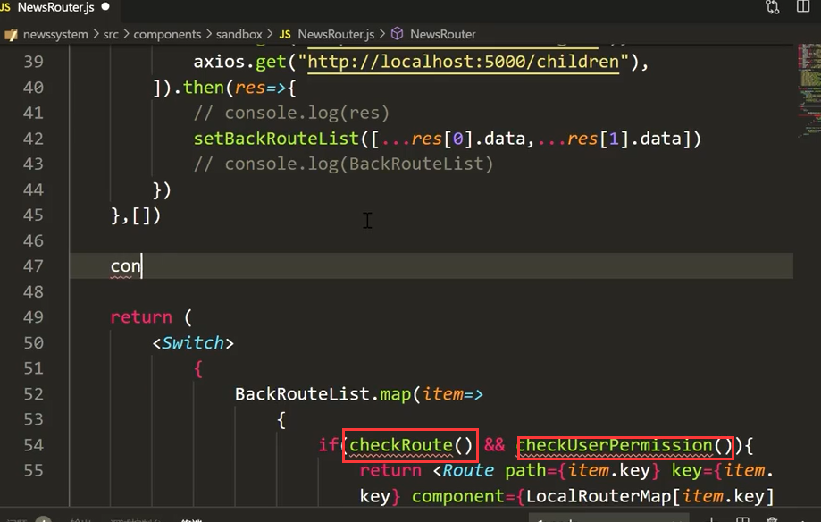
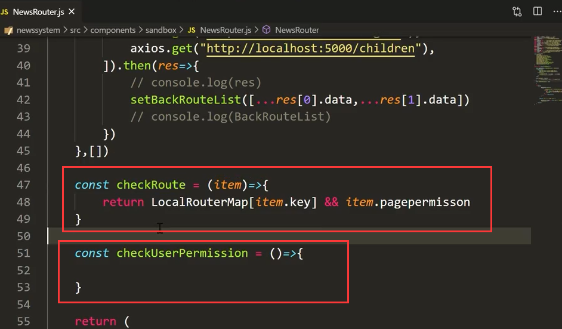
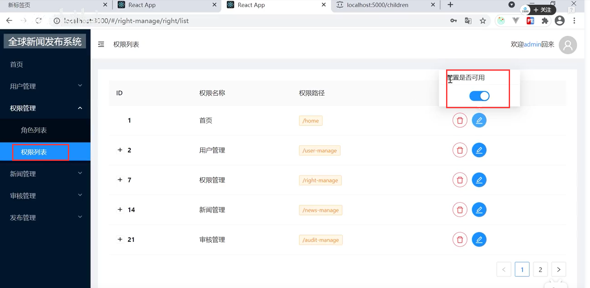
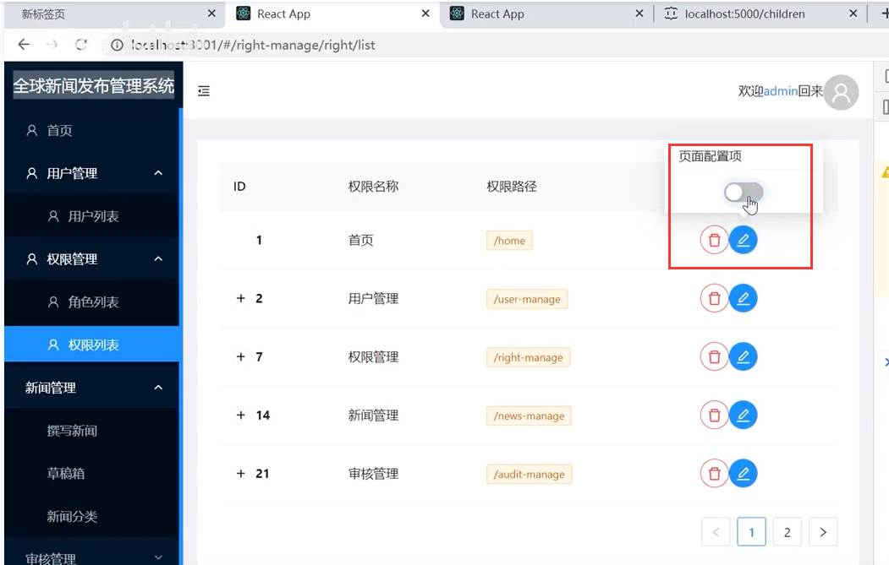
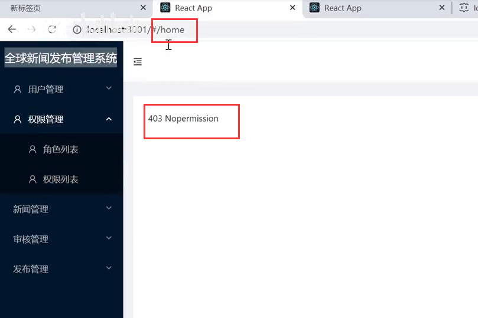
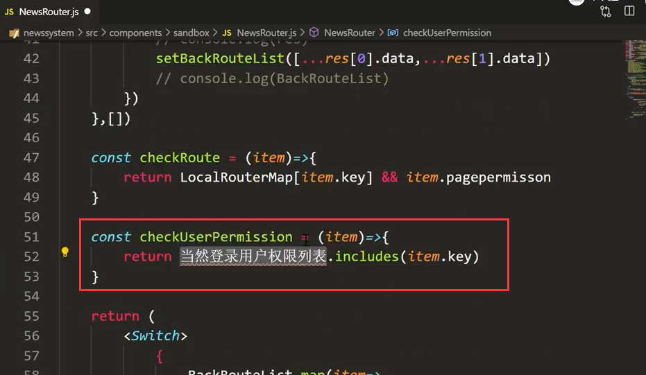
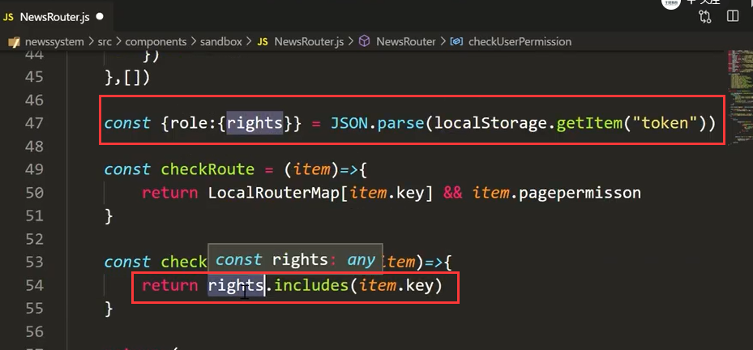
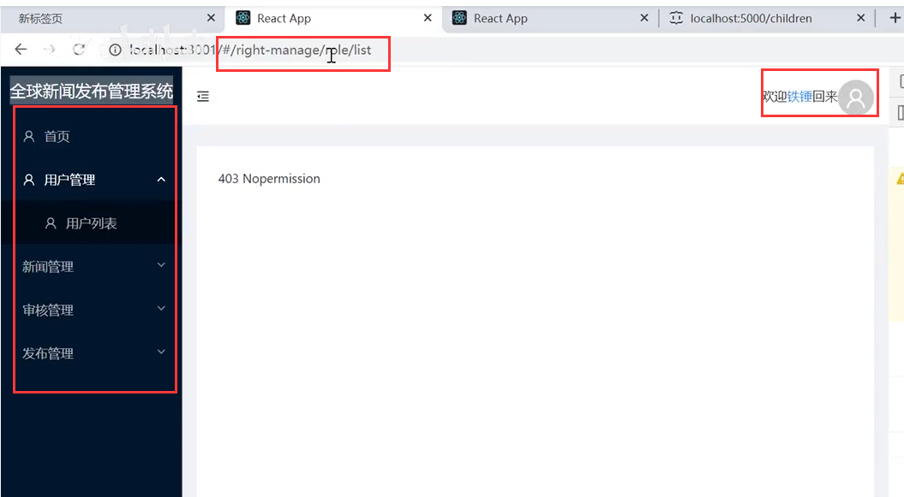
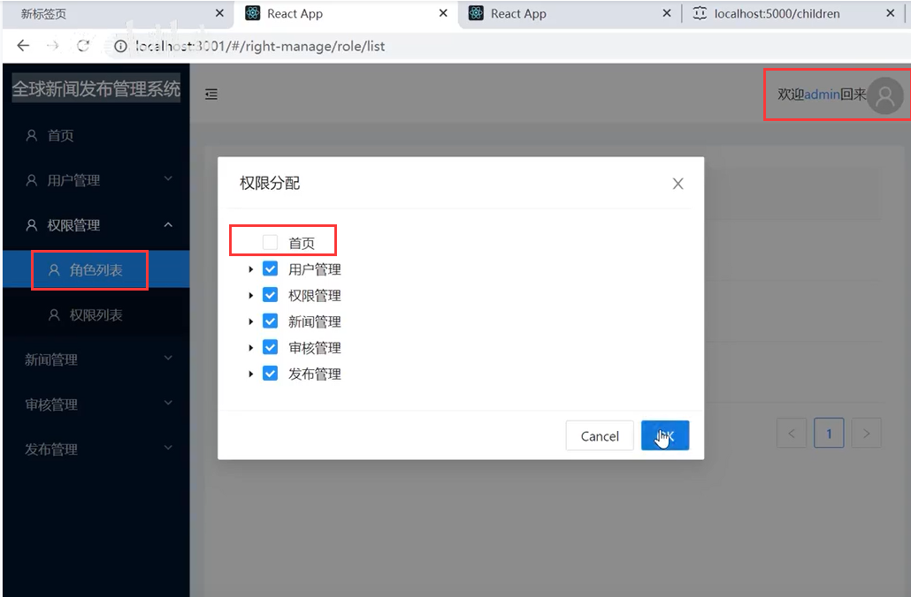
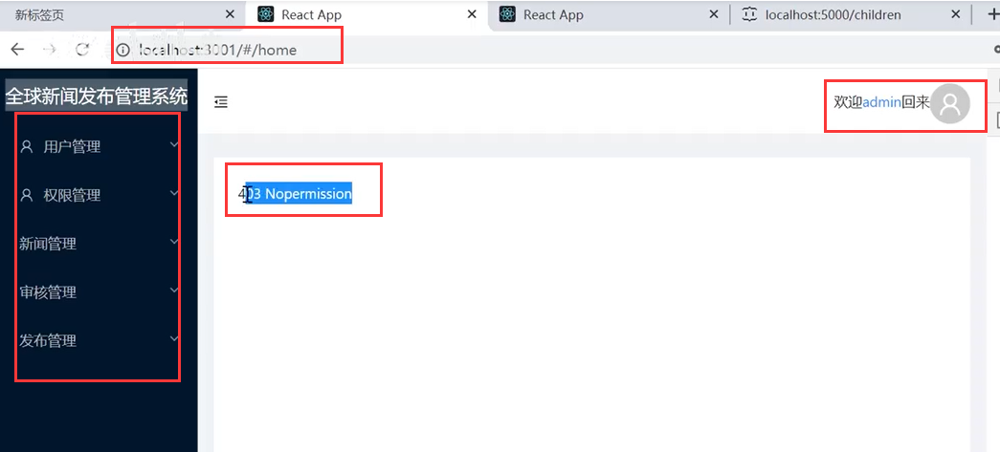

# 6.路由权限-权限控制

先定义一下这俩个判断的函数

在checkRoute中传入item，首先判断本地映射表中是否有这个路由，并且 权限的开关值必须是1,都满足才是true，否则就是false

页面测试一下--比如把首页的权限开关给关闭掉---关闭后就代表侧边栏就看不见了

首先侧边栏已经消失没有首页了--然后我直接输入首页的路由地址进入一下--发现也是进入不了的，说明判断是正确的，item.pagepermisson为0 false了

然后我们判断当前登录用户是否包含item,key当前路由

获取用户的路由权限列表信息

页面测试一下--使用区域管理员登录

​	发现是没有权限列表菜单的--而且我们在访问权限列表的路由的时候-也是无法进入的会提示403进入403这个组件中

我们测试一下超级管理员--这次我们在角色列表中--取消勾选这个首页权限的功能

重新登录后--发现首页的菜单看不见了，而他还是重定向到首页-并且首页显示403了，说明没有权限了

