# 7.路由权限-进度条

我们在使用Antd组件库的时候--点击侧边栏菜单的时候发现人家上面有个进度条的效果

​		有这个进度条的效果确实不错

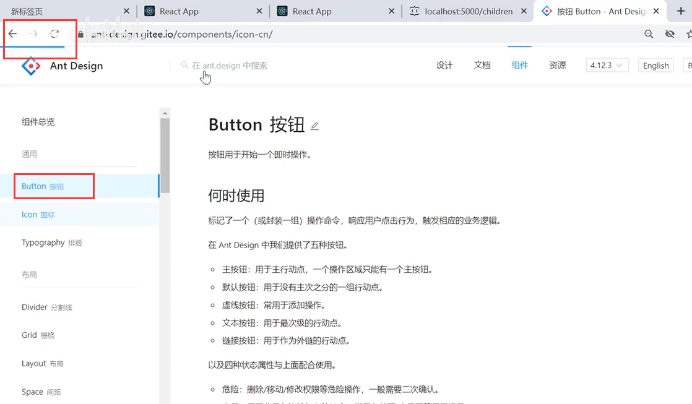

我们从npm中找一个nprogress 进度

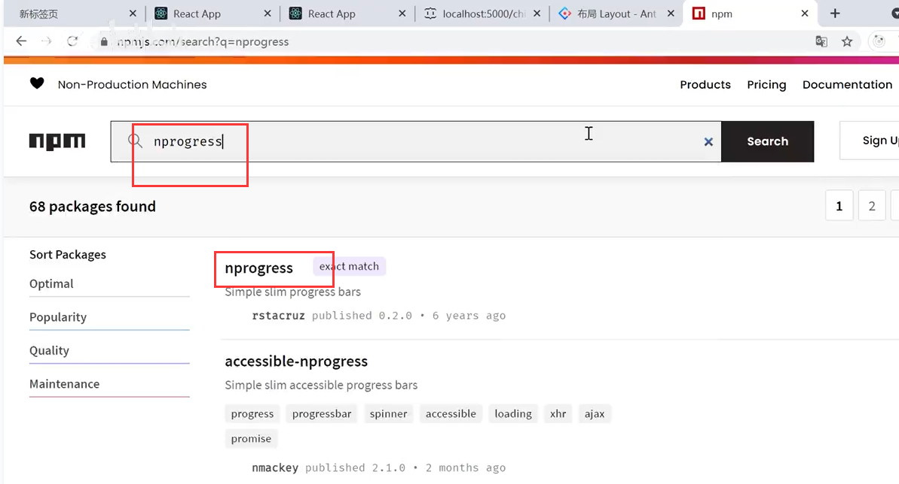

使用也很简单 npm install --save nprogress 安装

然后 NProgress.start()是进度条的开始，Nprogress.done是进度条的结束

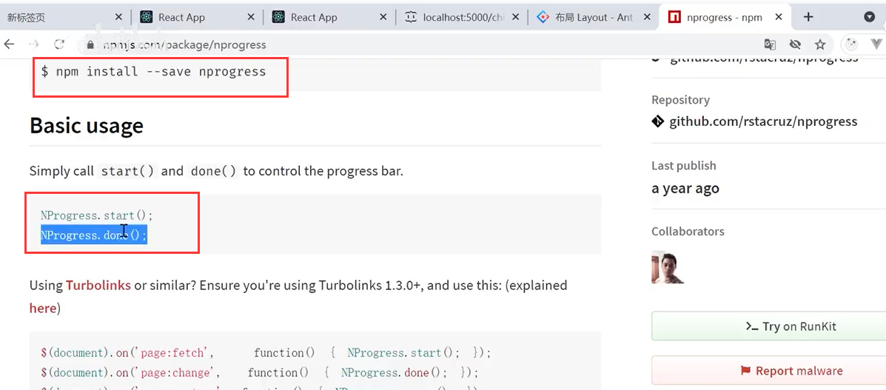

我们引入NProgress和样式

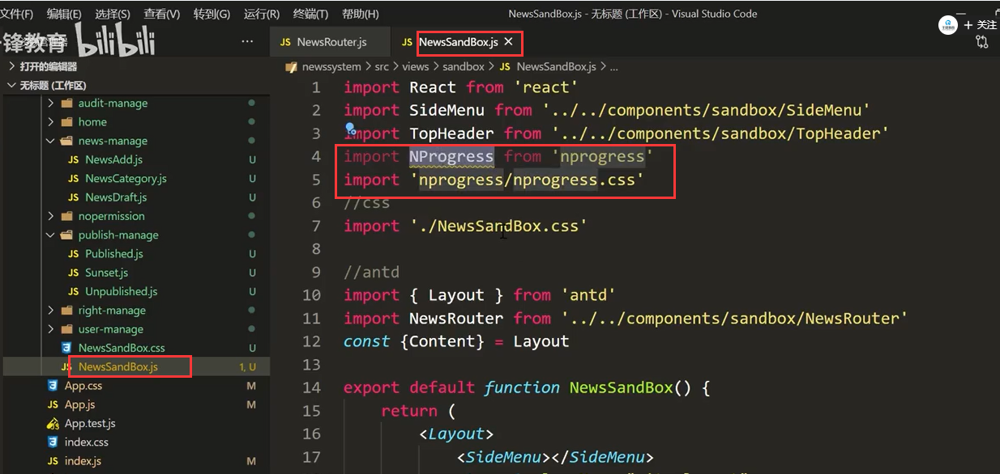

每次在进入创建侧边栏菜单的时候我们就开启进度条

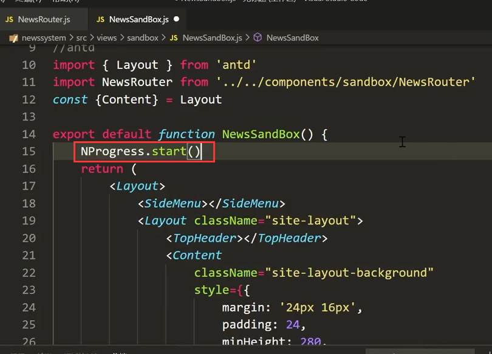

页面查看效果：

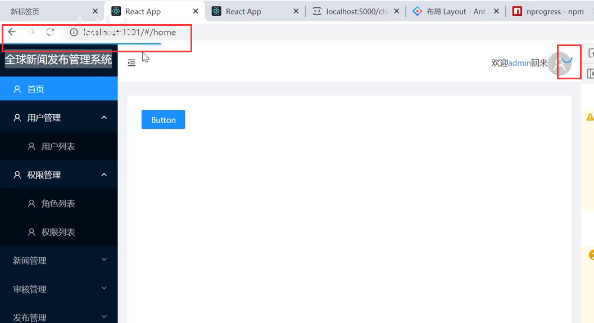

当页面渲染完成后，然后关闭进度条

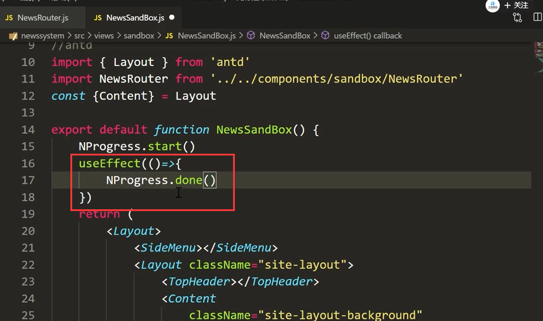

页面查看效果：显示正常--可以正常结束进度条

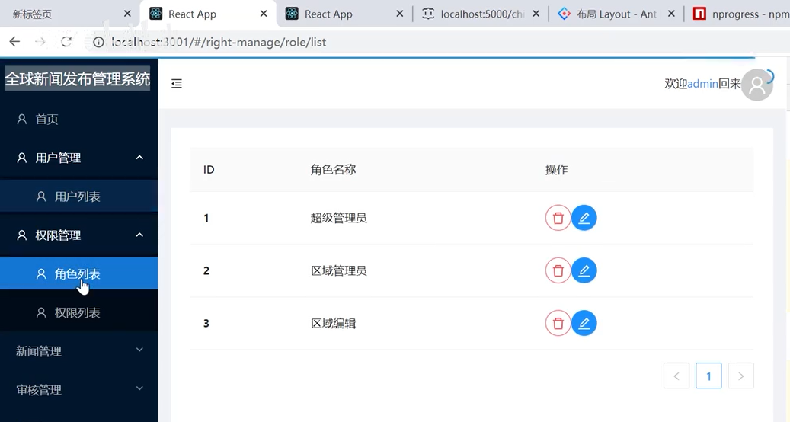

我们再进行一下优化---如果加载数据的时候  有个Loading的效果

​	思路：每次Ajax请求的时候让Loading显示，加载完成Ajax的时候让Loading消失

这样就涉及到Axios的拦截器的调用了--我们在拦截器发请求之前显示Loading

我们新建一个文件http.js然后对Axios进行一个全局操作

​			比如设置BaseURL，还有headers头部信息，interceptors拦截器操作

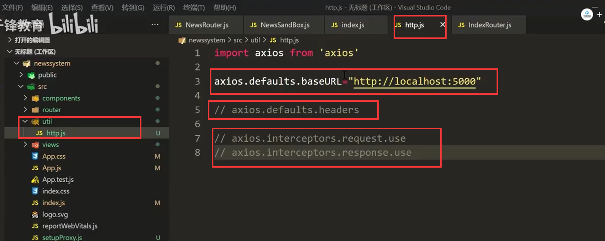

比如之前的UserList的Axios

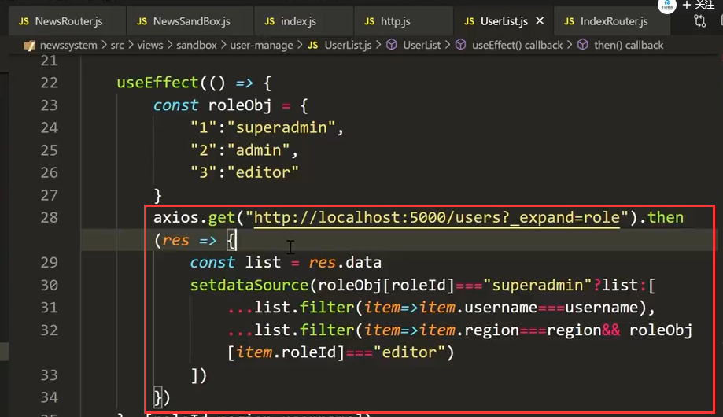

现在我们可以单独使用这个路径就可以了，前面的BaseURL就可以省略掉了

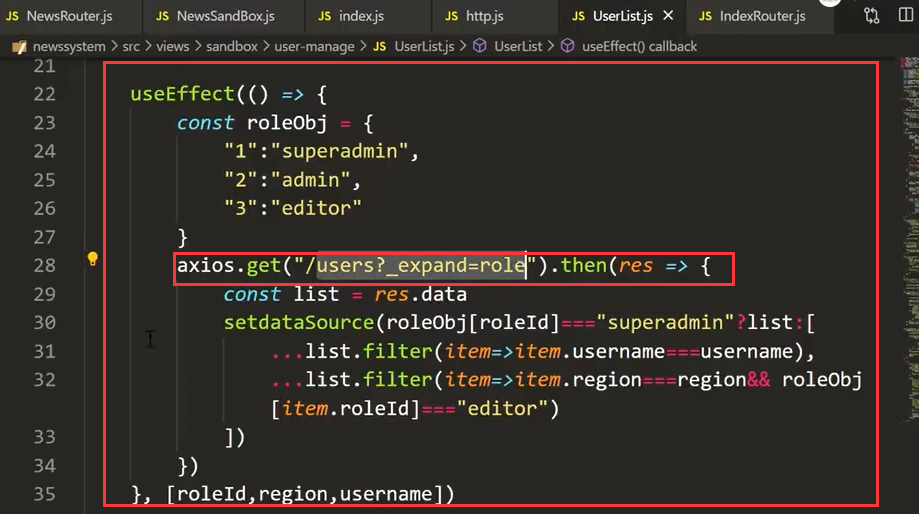

我们将全部的路径全部替换一下--localhost:5000全部替换为空

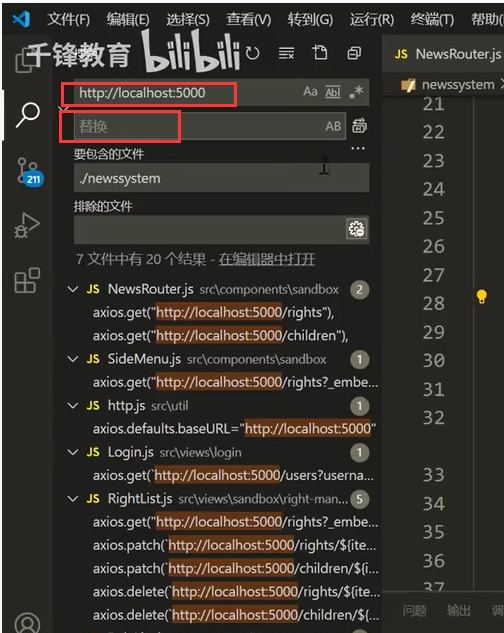

发现报错：原因是把http中的baseURL也替换掉了

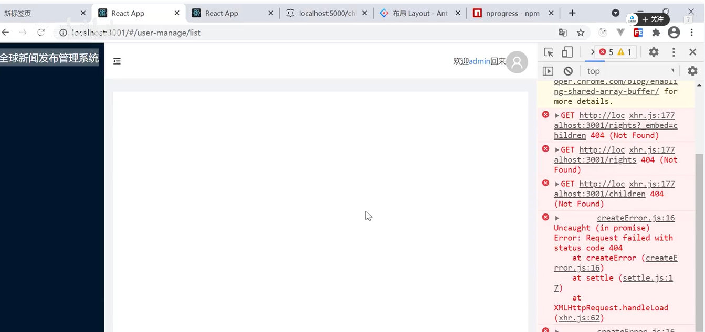

改回来-刷新页面显示没有问题了

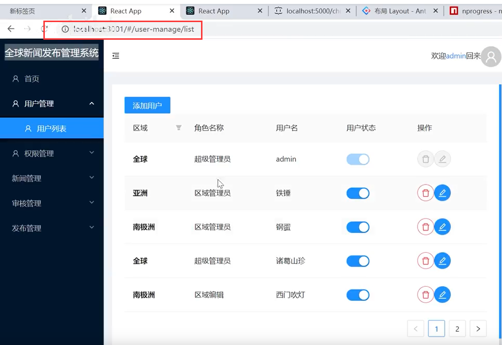

