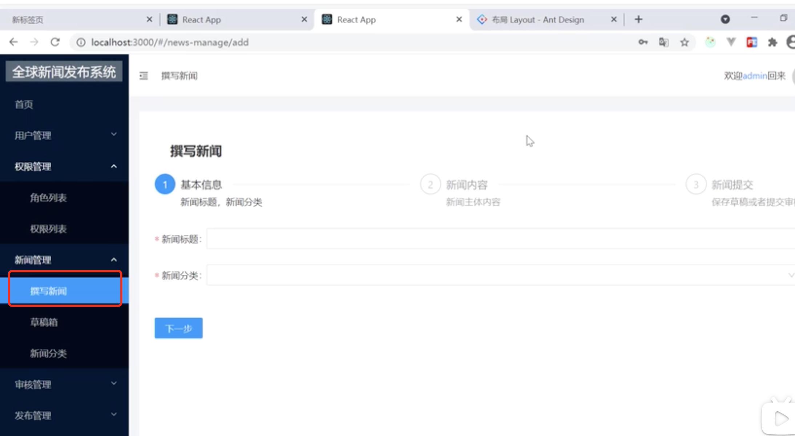
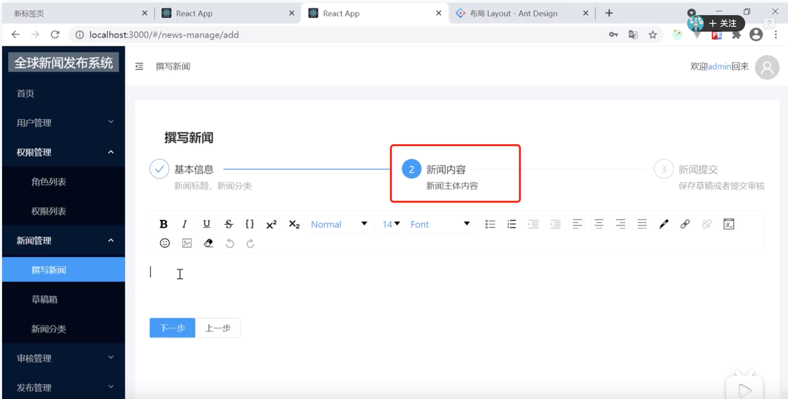
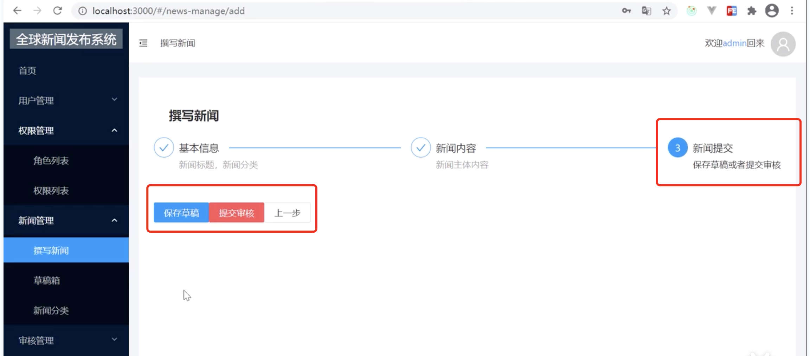
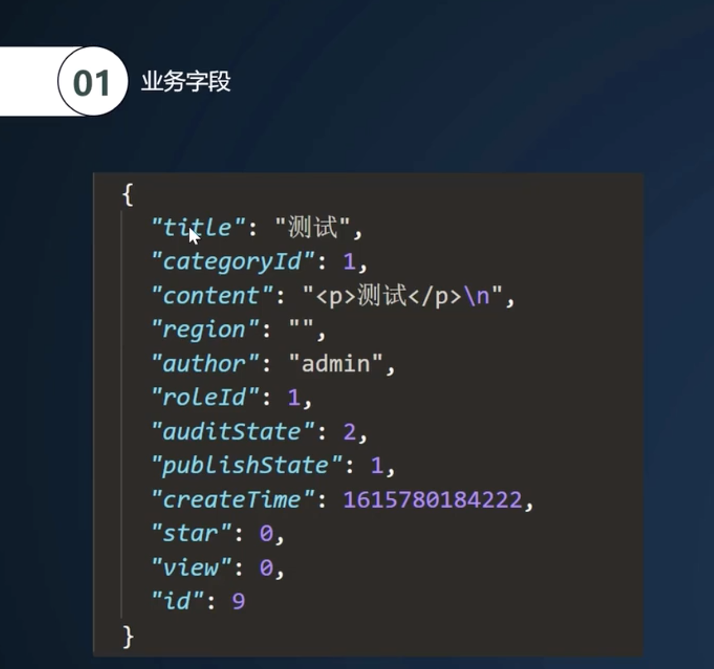
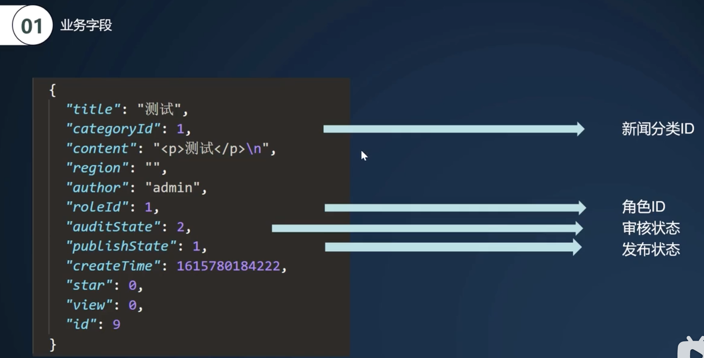
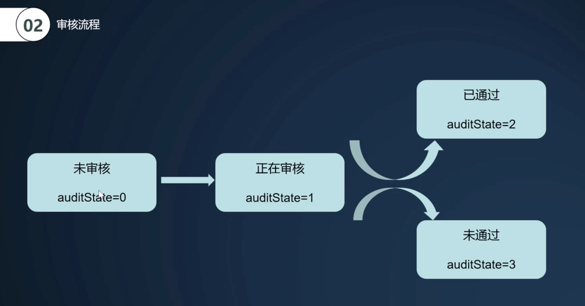
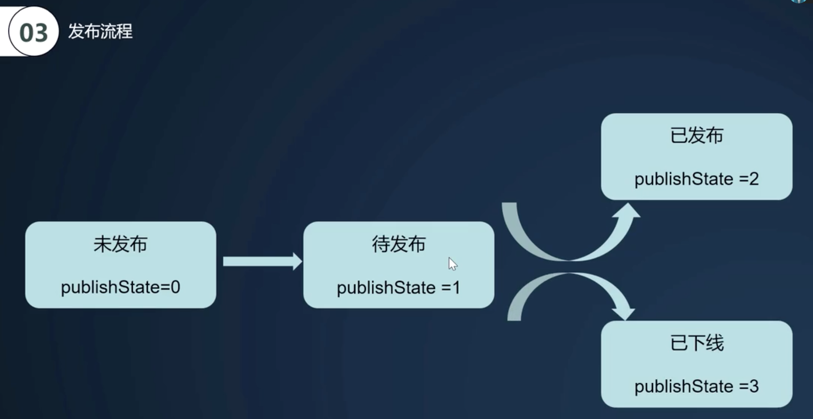

# 8.新闻业务-引入

​		我们先体验一下这个新闻的业务功能

首先是撰写新闻

然后点击下一步

​		进入到新闻主体的编辑内容

然后编辑完成后再点击下一步

​		最终新闻提交，可以保存草稿或者提交审核，也可以返回上一步

#### 2、业务字段梳理

title:标题，category分类，content内容，region区域，author作者，role角色，auditState审核状态

#### 3、审核流程

#### 4、发布流程

我们所有的新闻开始都是**未发布**的，只有审核通过后才是现实待发布状态的

​	如果点击支持发布值就会现实为2，如果改为下线这个值就会改为3

