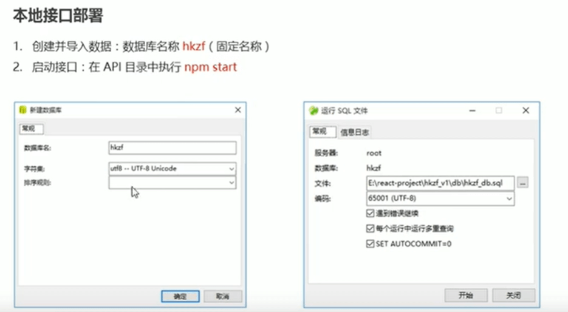
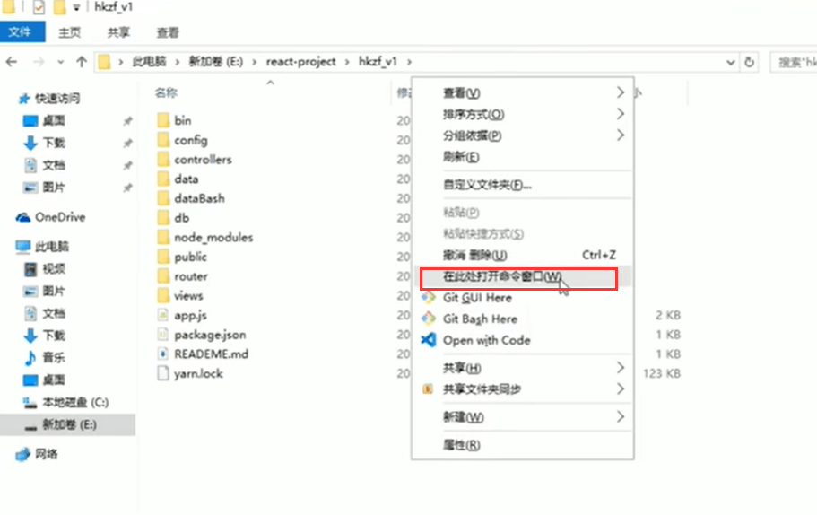

# 1.好客租房移动web项目介绍

https://www.bilibili.com/video/BV14y4y1g7M4?p=100&spm_id_from=pageDriver

#### 项目介绍

#### 项目搭建：

**第一步：本地接口的部署**

​	创建数据库----导入sql

**启动接口**

到项目的根目录下

打开终端：输入npm start

**测试**

测试地址localhost:8080

总结：

