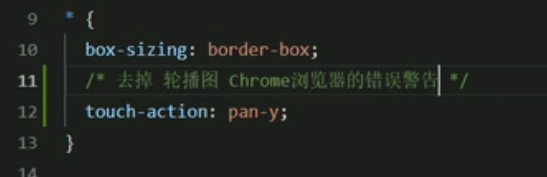
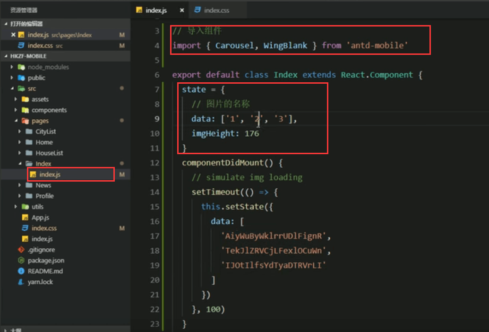
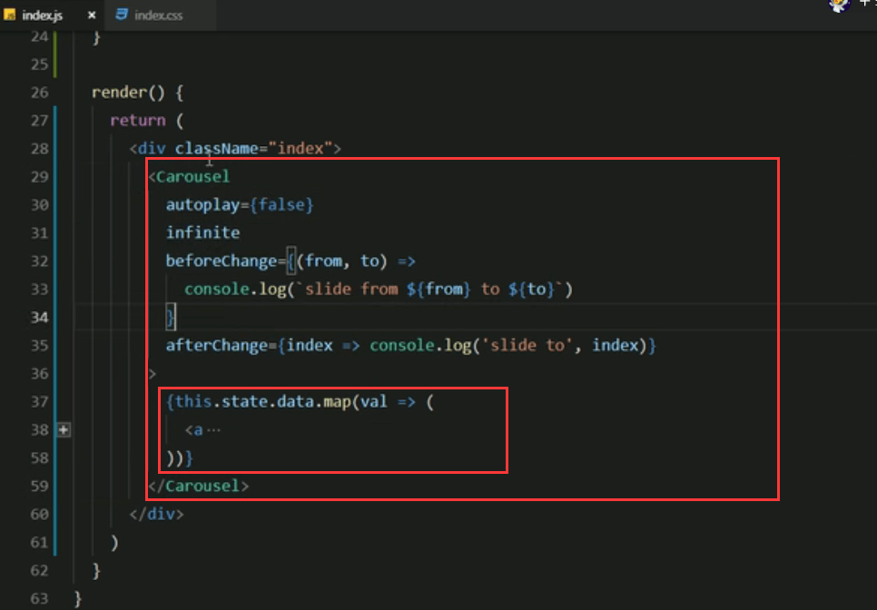
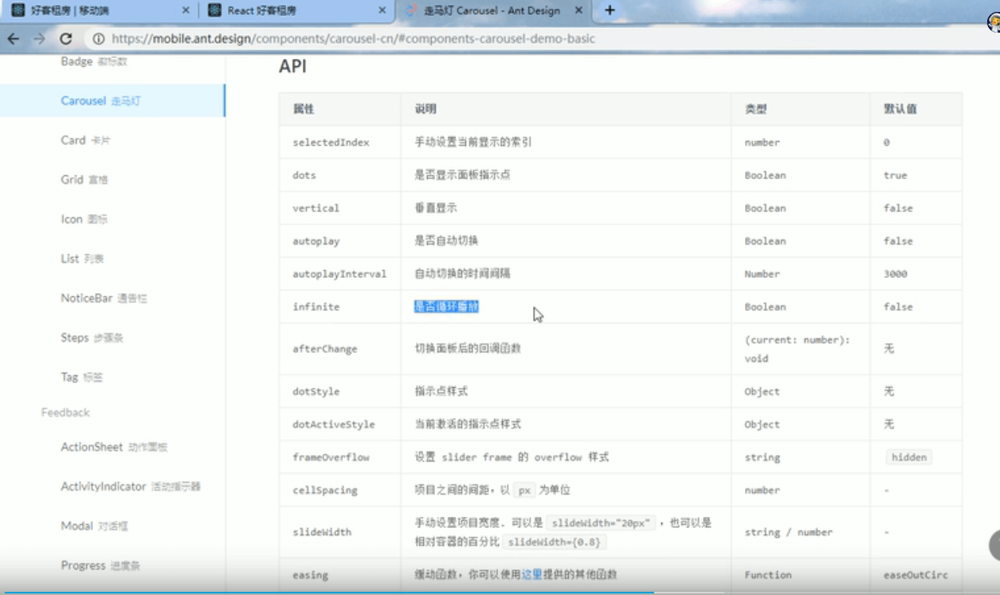
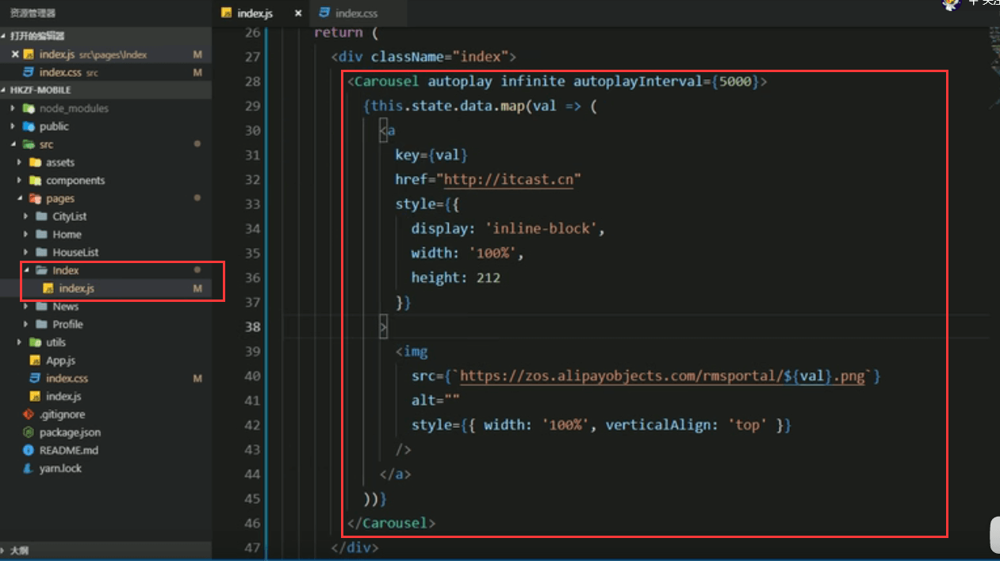
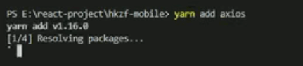
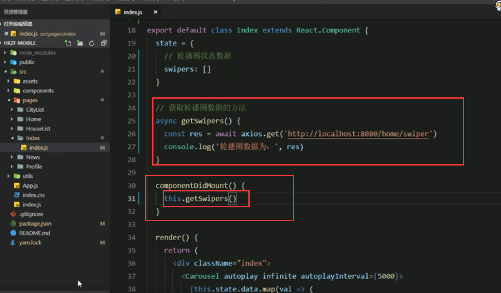
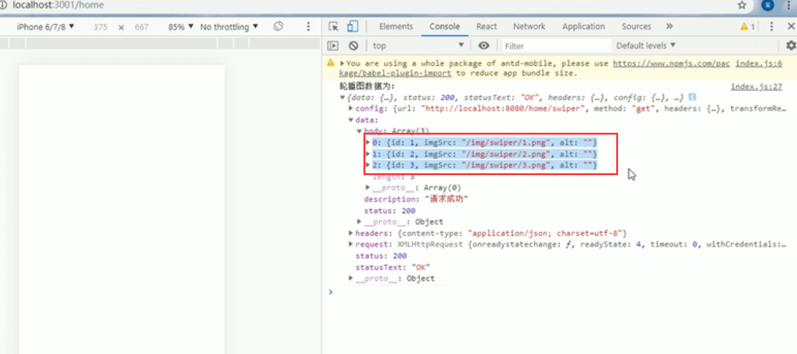
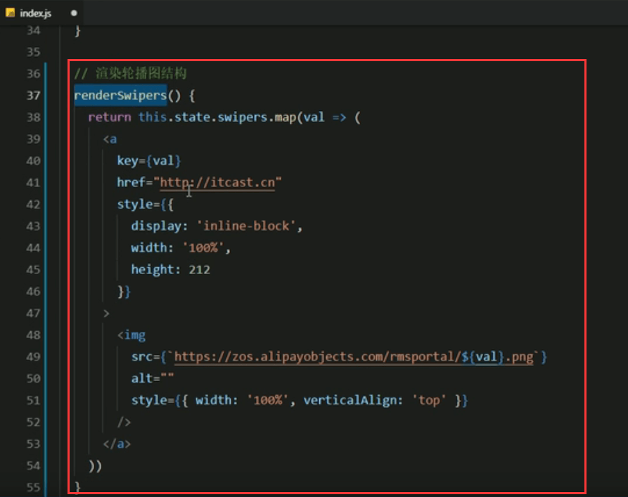
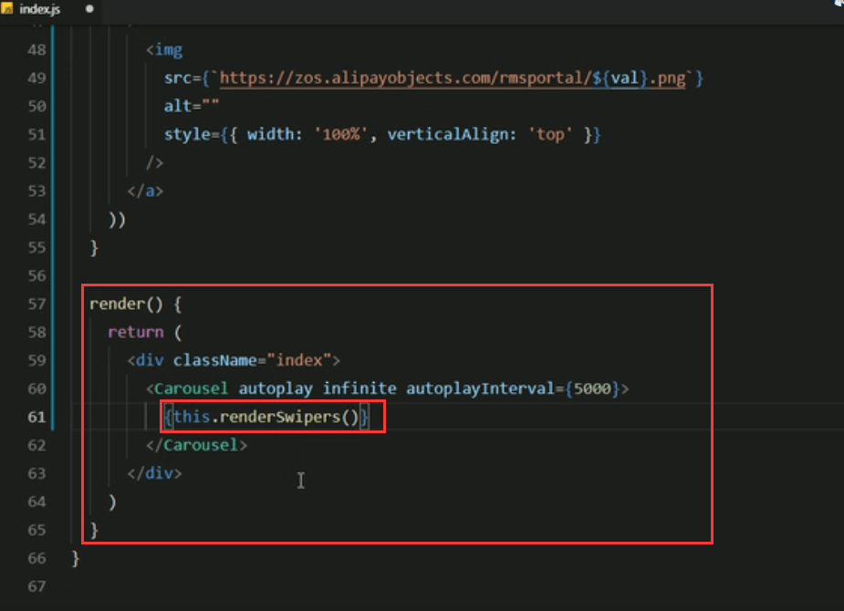

# 10.轮播图

 	思路还是和之前的一样，从文档中找到你要使用的组件，然后把代码copy到项目中，让代码能够在项目中运行起来，调整代码。使用任何一个组件都是这么一个流程。

打开文档：

点击</>拿到源码，然后copy到项目中

控制台有报错，给所有元素加个样式就好了

**代码分析**

整体结构：

autoplay：自动播放

infinite：是否循环播放

如果属性设置为true的话，是可以省略掉属性值的

beforeChange：切换的时候函数处理，这个基本不需要

afterChange：切换之后的函数处理（切换面板后的回调函数），这个我们现在也不需要 

**去掉不需要的现在的代码是这样的**

触发window的大小的事件，当浏览器窗口发生改变的时候就会触发这个事件，并且去修改了图片的高度

​		如果浏览器的窗口大小基本不会改变的情况下，这个事件其实是不需要的，对于我们的项目其实是不需要这个onLoad的内容的

##### 现在我们代码分析完毕

https://www.bilibili.com/video/BV14y4y1g7M4?p=114&spm_id_from=pageDriver

#### 2.获取轮播图的数据

​		使用axios组件库，发起请求获取轮播图的数据，展示轮播图

思路：

**安装axios---第一步**

**导入axios--第二步**

**在state中添加轮播图的数据：swipers---第三步**

**创建获取轮播图数据的方法--第四步**

​		使用axios发送请求获取数据

​		先查看接口地址，在swagger中测试接口

我们使用async的方式请求--使用get的请求因为在接口文档中可以看到是get的请求

**注意在钩子函数中调用一下才有效果--第五步**

页面控制台可以看到请求到的数据:

设置data的数据，也就是设置swipers

**渲染轮播图--第六步**

把逻辑抽离到一个方法里面--不要直接放在render里面

我们在render中直接调用方法就好了，这样结构更加清晰

渲染数据

https://www.bilibili.com/video/BV14y4y1g7M4?p=115&spm_id_from=pageDriver

