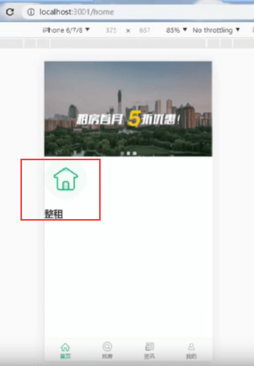
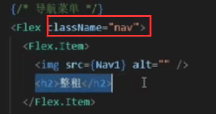
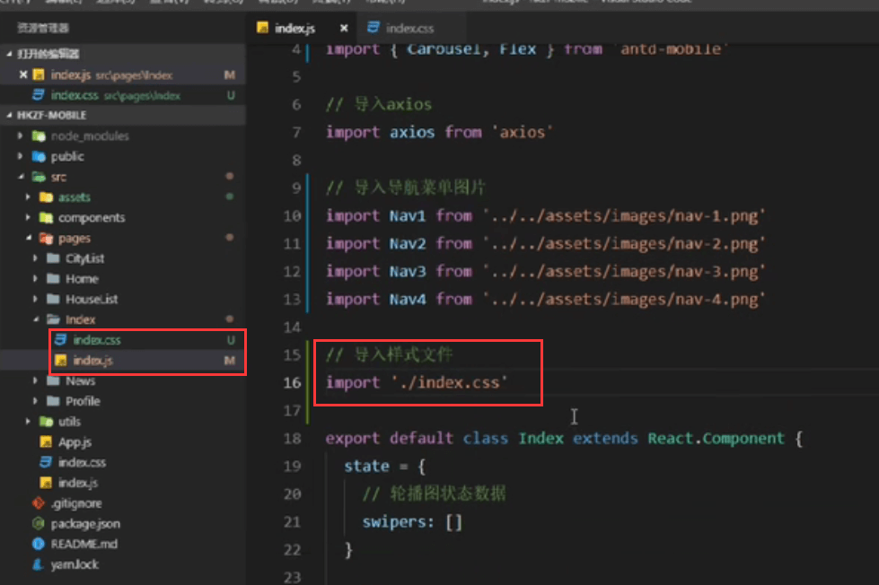
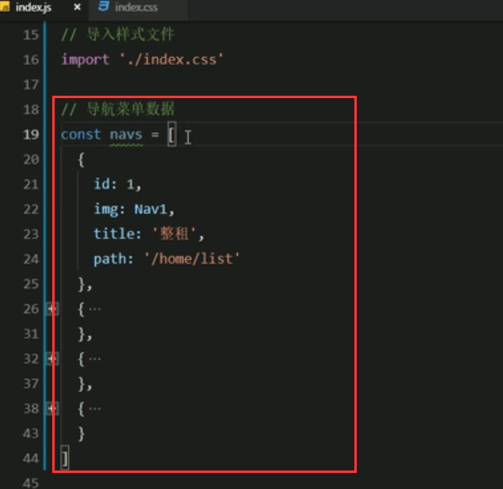

# 11.导航菜单

​		导航菜单指的是--轮播图下面的几个菜单--使用Flex布局

找到Flex布局，查看代码用法

导入组件和图片

创建导航菜单结构--上面是一个图标--下面是一行字

设置图片

查看效果：

我们发现样式需要调整：通过className设置样式

创建样式文件index.css,导入样式文件

首先需要修改图片的大小，调整为48px

修改字体大小，13px，不加粗

发现文字没有居中：

查看效果：

再加一个padding值

#### 导航菜单--代码重构

path是用于之后路由跳转的

然后将数据抽离到一个方法里面

​	渲染导航菜单的方法：注意跳转添加单击事件

