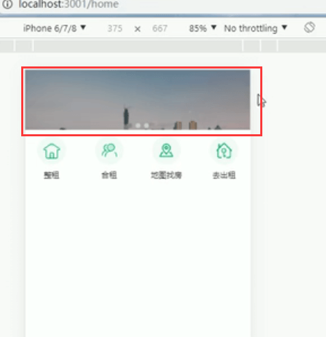
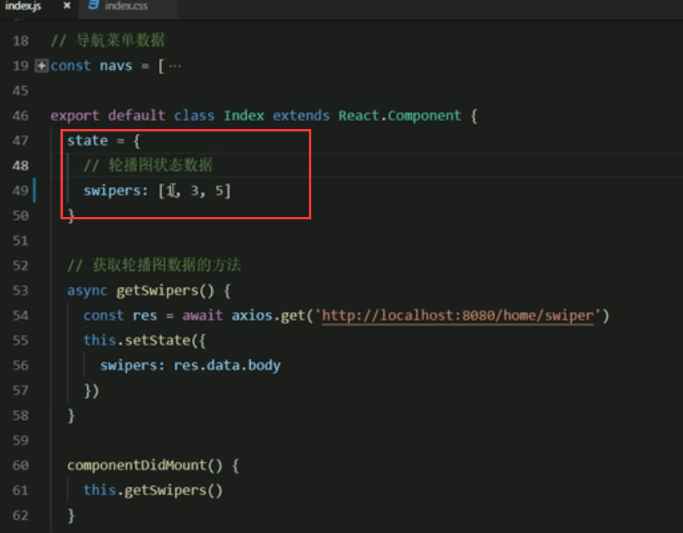
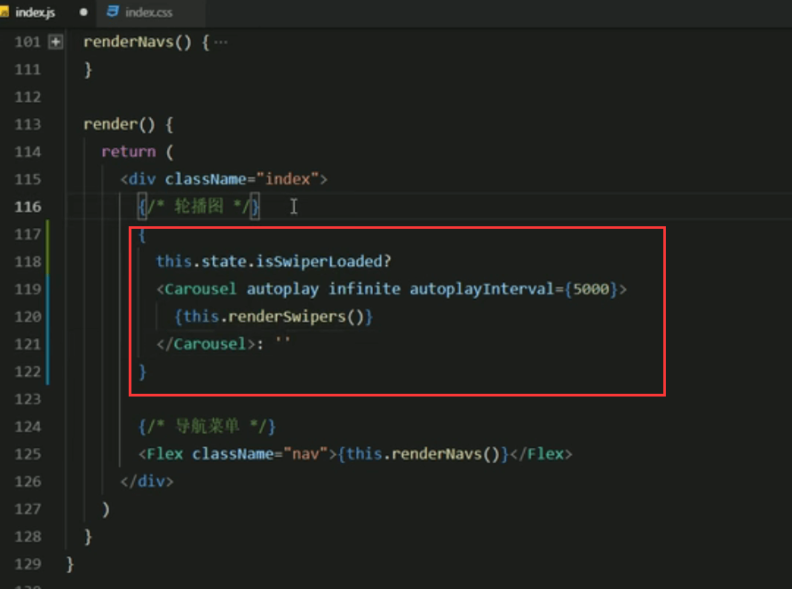
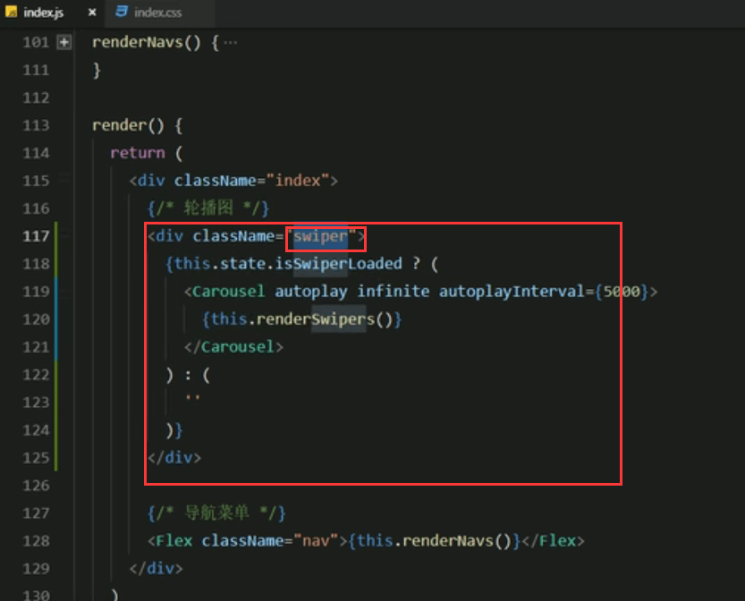

# 12.轮播图Bug分析修复

​	1.发现轮播图不自动轮播了

​	2.我们在切换页面之后，再切回首页轮播图的高度变了

​		为什么会出现这样的问题呢？我们第一想到的是先去看文档，看看文档里有没有说明

​		其实是有提示的，当你使用跑马灯组件的时候，你可能有关于高度的问题

其实原因就是动态加载数据的问题

​	因为默认是没有这个数据的，然后我们动态的去设置了这个数据--导致的这个问题

​	解决方案：可以给添加一些默认值（不推荐）

解决方案2：推荐

设置轮播图是否加载完成的变量

数据加载完成设置为true

加判断--如果数据加载完成就渲染轮播图，没加载完成设置为空

查看效果：可以自动播放，切换路由返回后还是正常的，说明bug解除

这样做可能还有个问题就是会突然闪一下：因为最开始数据是空的，突然渲染会感觉闪了一下，解决方案是我们外层加个div先把内容高度给撑起来

这样不管将来有没有内容，这个区域大小都是一致的，不会发生闪动的效果了。

总结：

