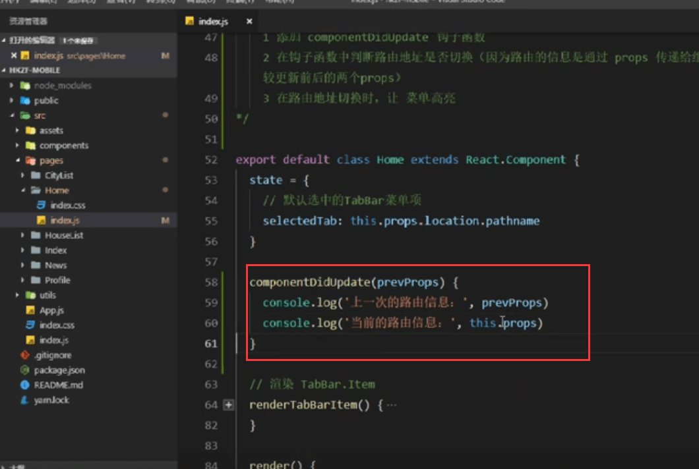
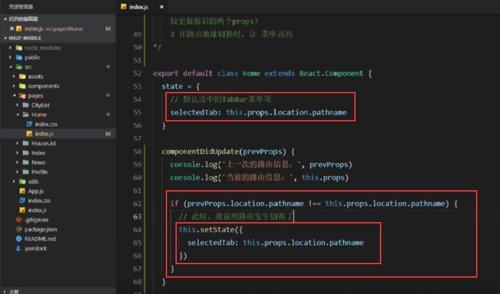

# 13.TabBar菜单高亮Bug分析修复

​	我们点击找房，进入列表找房，那么找房的TabBar应该是高亮显示才对

https://www.bilibili.com/video/BV14y4y1g7M4?p=119&spm_id_from=pageDriver

现在是没有高亮显示：我们是通过selected来决定是否高亮显示

原因是：

​	

因为路由的信息是由props传递给组件的，所以通过比较更新前后的props就可以知道路由是否发生切换了。

