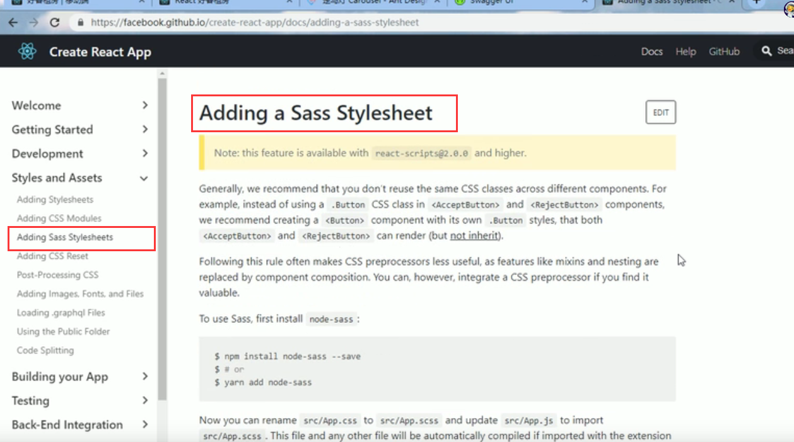
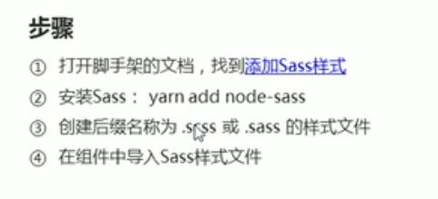
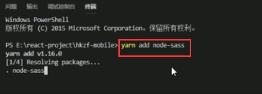
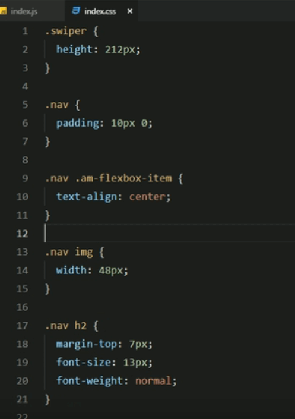
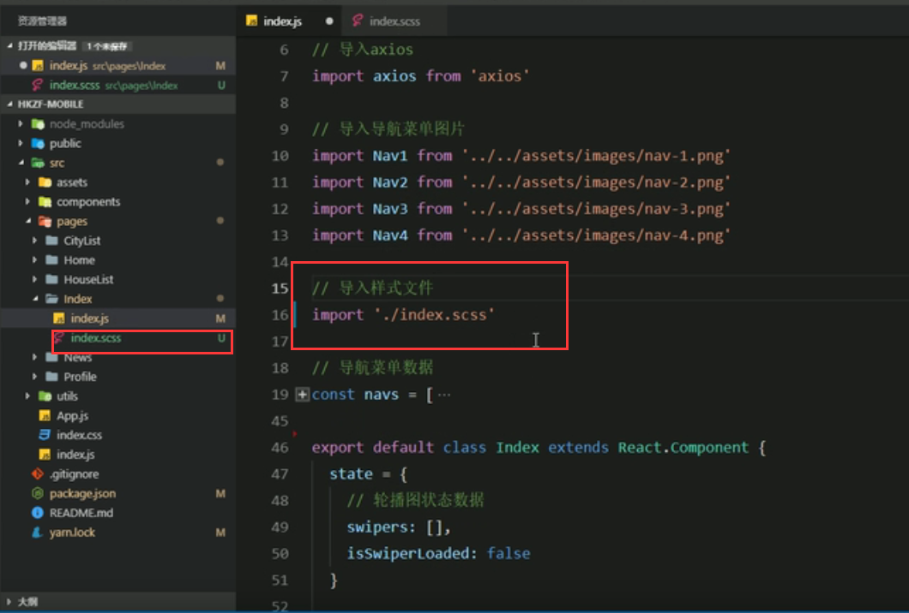
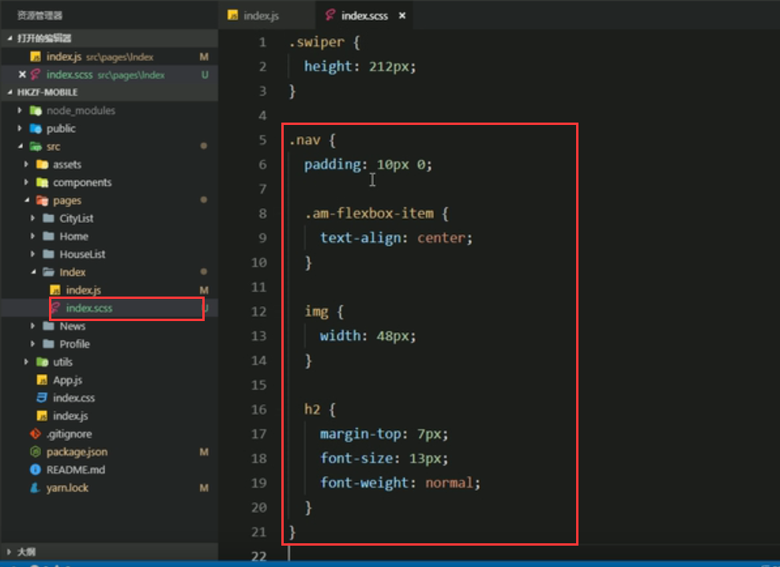
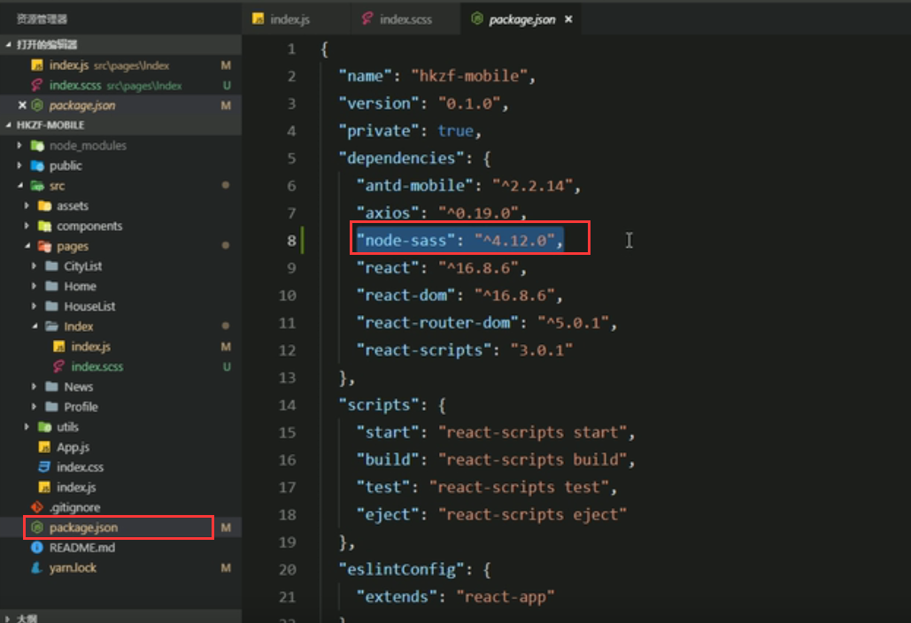

# 14.在脚手架中使用sass

​	Sass是预编译的Css--我们为什么要使用Sass因为使用他来维护样式更加的简单方便，其实使用和less基本一样。

https://www.bilibili.com/video/BV14y4y1g7M4?p=120&spm_id_from=pageDriver

查看脚手架文档：

安装包：

使用前我们的样式是这样的：

导入样式为scss

修改后的样式：

语法和结构更加的清晰

这个包就是node-sass,他可以使用嵌套的方式来表示css的层级关系和样式的渲染

