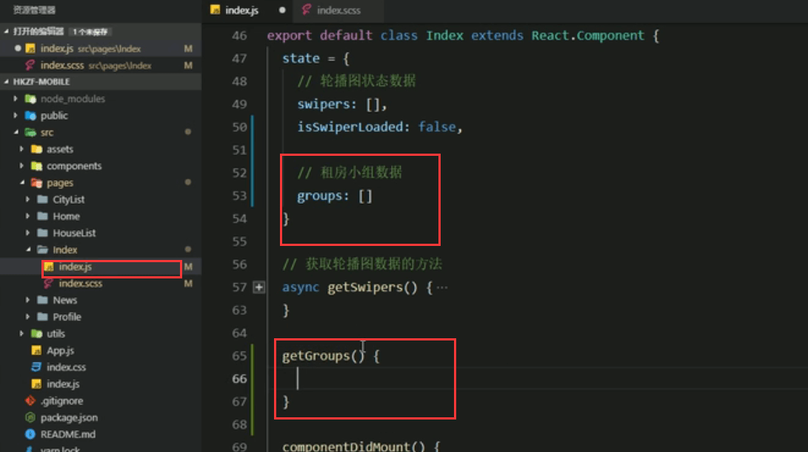
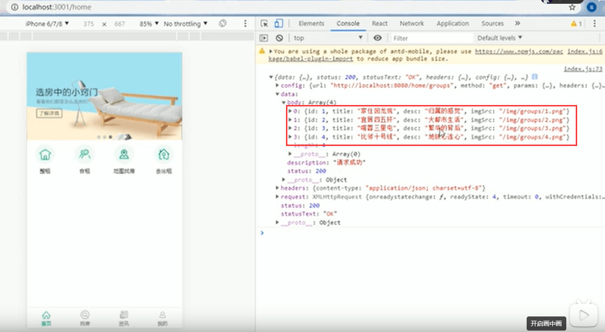

# 15.租房小组的业务介绍

1.根据地理位置的信息，展示不同的租房小组信息

**获取数据**

在获取租房数据的方法中使用axios请求数据

​		传入参数可以通过？的方式直接拼接传输-传入位置id

更为标准的方式是：使用params

注意：要在componentDidMount钩子函数调用一下方法，要么是无法被调用的

页面查看：可以拿到数据

最后需要把我们的状态更新一下

