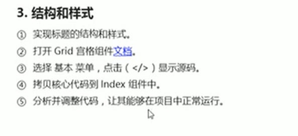
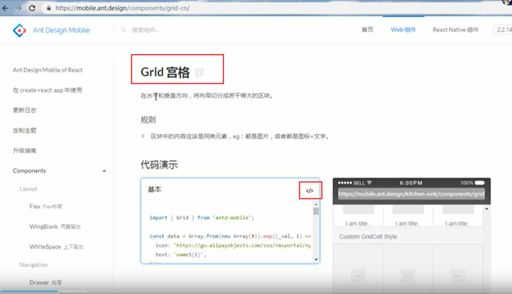
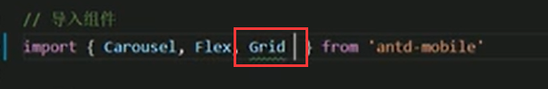
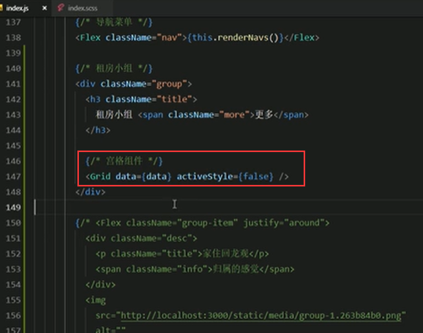
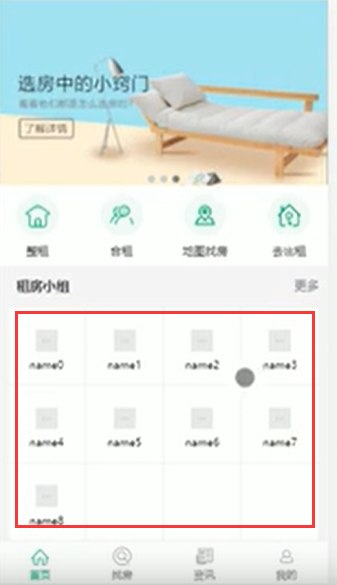
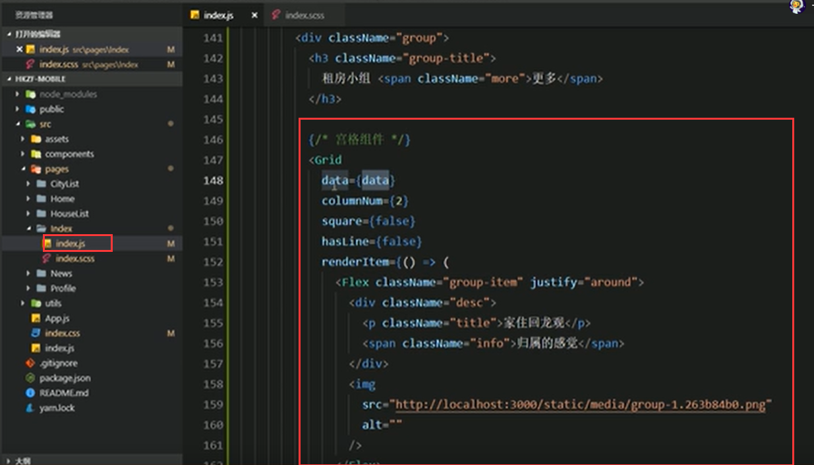
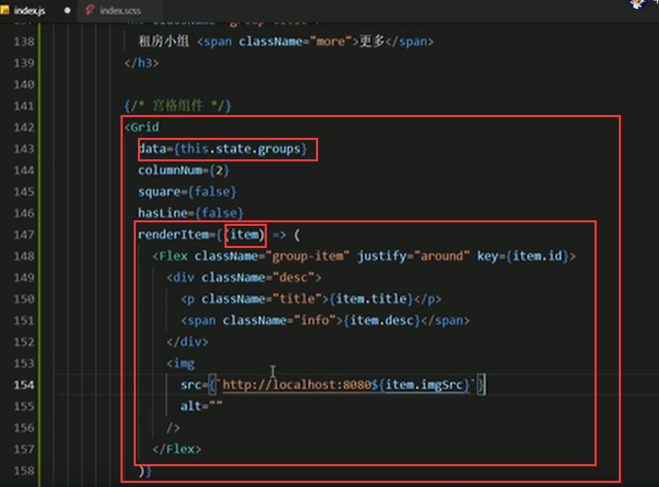

# 16.租房小组结构和样式

 

​		这块实现我们需要使用Grid宫格组件的实现

查看文档

**导入组件Grid**

**使用宫格组件**

页面展示：和我们想要的差距很大

**分析一下**

https://www.bilibili.com/video/BV14y4y1g7M4?p=122&spm_id_from=pageDriver

**数据渲染**

页面展示：

