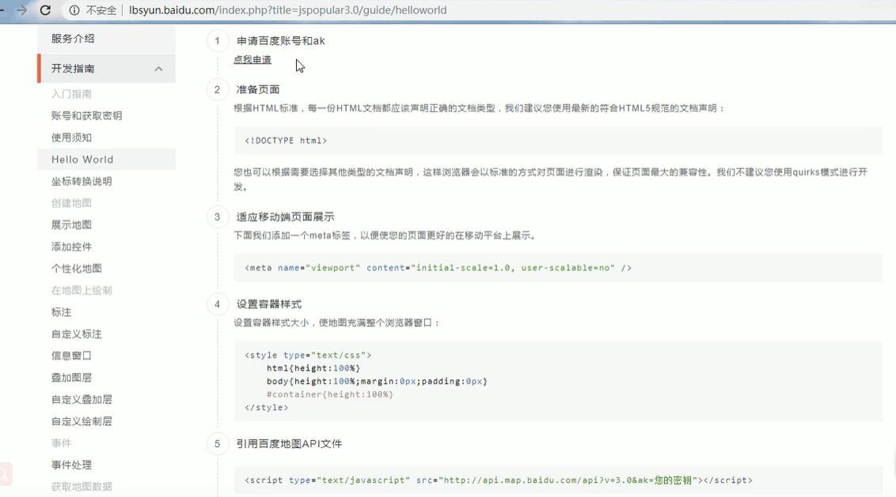
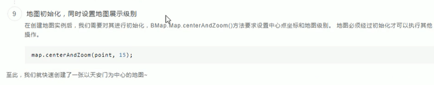
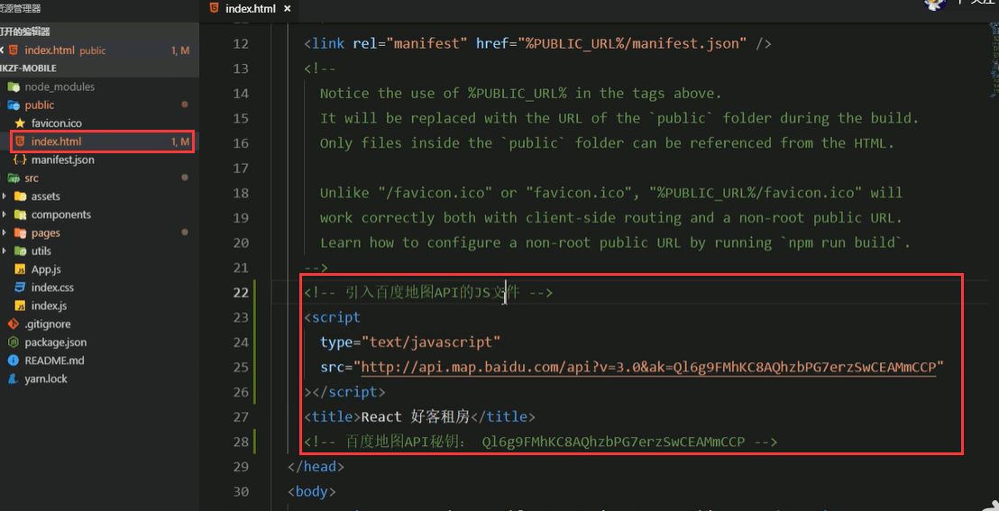
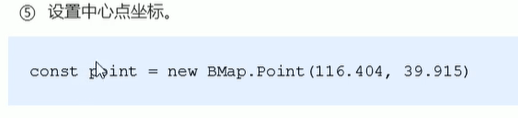
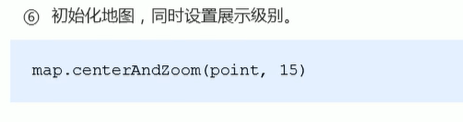
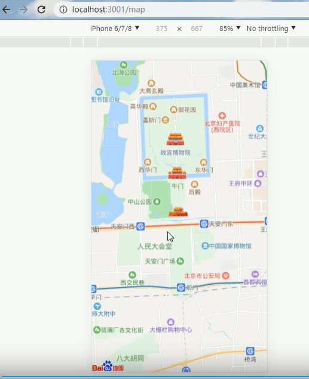
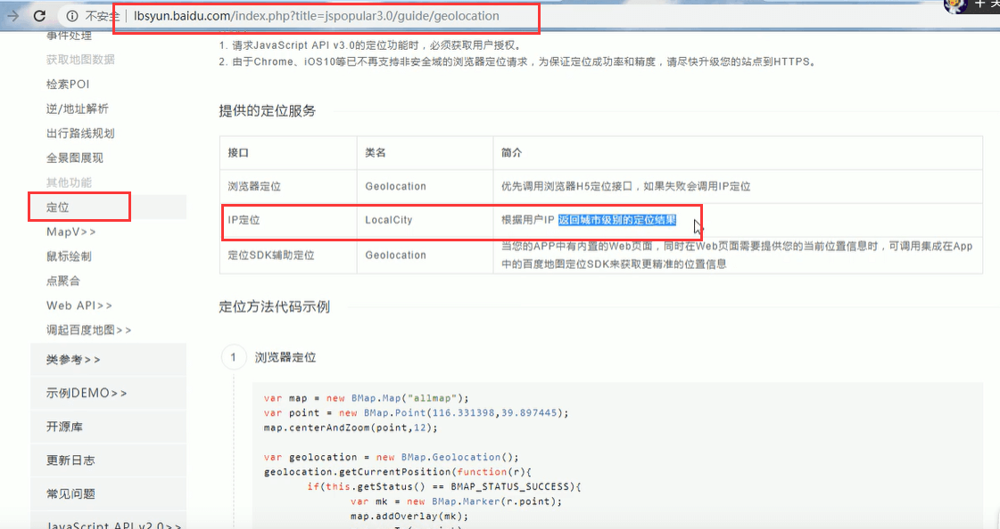
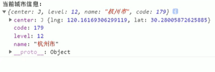

# 21.百度地图API使用

## 初始化地图：

1.使用步骤，我们可以按百度的开发指南去做

2.然后下一步就是需要**准备页面**要符合HTML5规范的文档申明

3.适应移动端我们需要加一个viewport进来

4.设置容器的样式，让我们的地图可以充满整个浏览器窗口

5.引入百度地图API文件

6.创建地图容器样式

7.创建地图实例---需要制定一下容器，也就是把地图渲染在哪个元素中

8.设置中心点坐标

9.初始化地图，同时设置地图展示级别

#### 在我们的项目中使用这个地图还是有些区别的

1、引入百度地图的API的JS文件--替换秘钥

**代码实现**：

2.在index.css中设置全局样式---为了让地图占满整个页面

将这些元素高度设置为100%

设置margin

3、创建一个Map组件，配置路由，并在Map组件中，创建地图元素，并设置样式

​	初始化Map组件

配置路由：因为没有tabBar所以是和Home组件是同级的

创建地图容器元素，和设置样式

4.创建地图实例：在Map组件中创建

​	通过Bmap指定一个容器，最终会得到一个map的实例，Bmap其实就是引入JS文件后的提供的一个全局的对象

地图实例创建好之后并不代表就有地图了

5、设置中心点坐标--坐标其实就是经纬度

6、初始化地图，同时设置展示级别，通过map.centerAndZoom来将我们的map实例和点坐标结合在一起，最终显示地图，**15是级别的意思**

页面展示：

### 获取顶部导航城市信息

**步骤：**

1、打开百度地图API文档找到定位菜单

前3行代码其实我们不需要了，因为之前写过了前3行是创建地图实例的代码

我们首页不需要地图展示，我们就需要一个定位的功能 就可以了，其实使用最后2行代码就可以了

2、我们希望一进来页面就获取到这个定位的信息，那么我们使用componentDidMount这个钩子函数

包含内容：经纬度，级别，城市名称

3、请求后台根据城市名称拿到我们返回的城市名称

发送的是杭州，返回的是上海是后台特殊处理了，因为杭州没有数据

https://www.bilibili.com/video/BV14y4y1g7M4?p=130&spm_id_from=pageDriver

