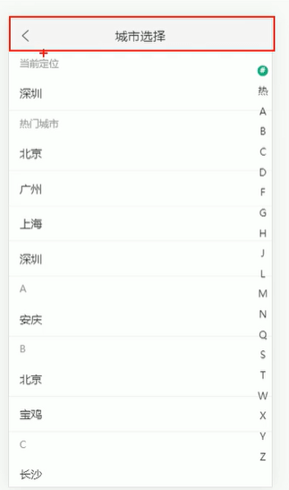
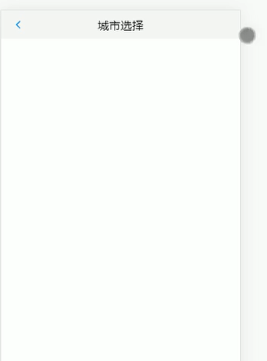
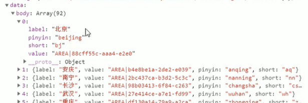
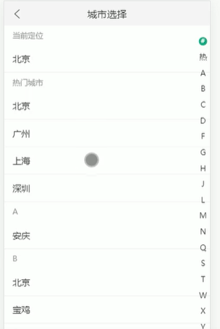
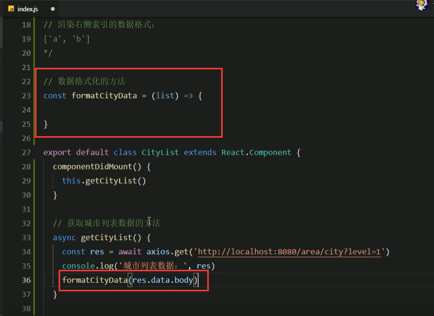
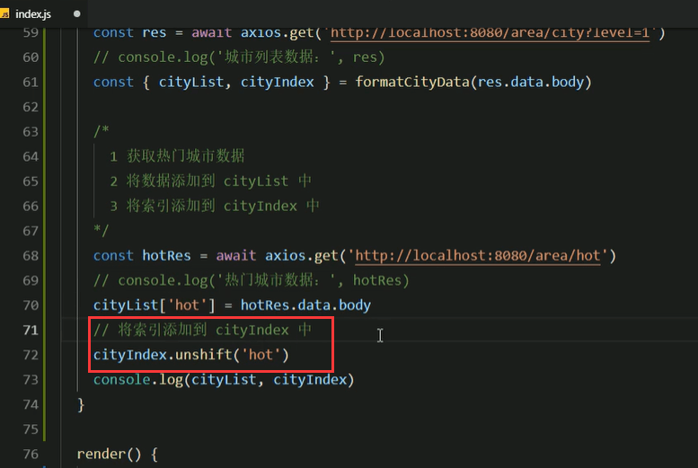

# 22.城市选择模块

## 1、功能分析

### 2.顶部导航栏实现

**开始步骤：**

1、参考文档：

导入icon组件是图标

2、拷贝到项目中

navbar可以正常运行了

3、修改导航栏的样式，调整样式结构

​	分析拷贝过来的内容

页面展示：

返回的《图标颜色不对，我们使用自己的图标库的图标

现在基本效果差不多了

完成点击按钮返回上一个页面

返回到上一页了，测试没问题

### 3.获取并处理城市数据列表

**步骤：**

**1、获取城市数据：**

​		先导入axios因为需要发起请求---然后在页面渲染之前获取数据，那就需要在componentDidMount这个钩子函数中写请求获取数据---最好的是我们封装一个方法，在钩子函数中调用这个方法更加合适

**拿到列表数据**

第一步完成了

**2、分析当前数据**

这个数据结构并不能满足我们页面需要的展示结构----需要字母的索引来展示

我们需要按字母索引分组的数据类型---最后我们还需要一个字母数组来保证他们的顺序

#### 3、转化数据--转化为我们需要的格式

cityList是处理完返回的数据---cityIndex是返回的索引字母

根据sort的首字母进行分类

开始遍历处理数据：

转化数据查看一下：分类数据已经拿到了

然后我们拿到分类数据的每一个键，就可以得到索引数据了

通过Object.keys可以直接获取到对象的key，然后sort一下排序

拿到索引数据：

#### 4、获取热门城市数据，并添加到现有数据列表中

将索引数据里面添加hot索引--使用unshift方法，是在第一条数据再加一条数据放在首位

查看一下

bilibili.com/video/BV14y4y1g7M4?p=135&spm_id_from=pageDriver

