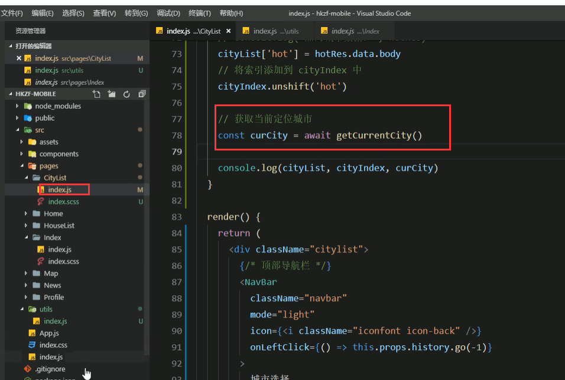
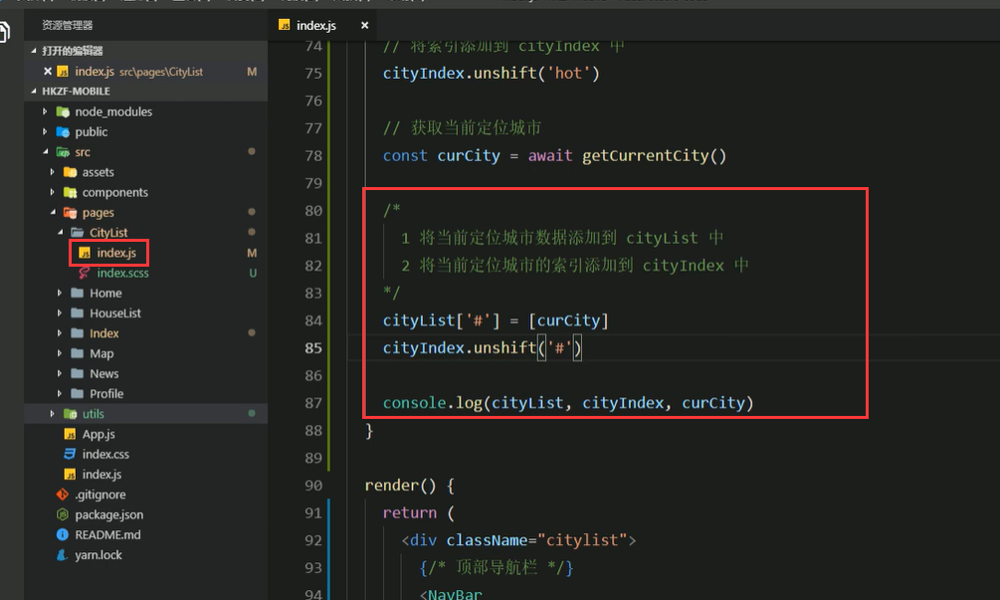

# 23.获取并处理城市列表数据


现在我们已经获取到城市数据，也获取到了热门城市数据，并且已经将数据过滤


现在我们缺的是获取当前定位城市数据


#### 1、获取当前定位城市的数据

**分析问题：**

​	首页模块中，需要获取定位城市信息（我们已经获取到了），城市列表模块中也需要获取定位城市，如何处理？


因为之前已经获取过一次了，那么我们就不需要再次获取了，我们将这个封装成函数，那个页面需要获取定位城市，直接调用该方法就可以了


**如何封装？**

- 1、在utils目录中新建index.js,在该文件中封装
- 2、创建并导出获取定位城市的函数getCurrentCity
- 3、判断localStorage中是否有定位城市（为什么要从localStorage获取呢，是因为如果我们获取到了就放在localStorage本地存储中）
- 4、如果没有，就使用首页中获取定位城市的代码来获取，并且存储到本地存储中，然后返回该城市
- 5、如果有那就直接返回本地存储中的城市数据


**代码中封装函数：**

​	现在我们创建utils工具包，然后在包下面创建index.js

```js
// 导入axios
import axios from 'axios'

// 1 在 utils 目录中，新建 index.js，在该文件中封装
// 2 创建并导出获取定位城市的函数 getCurrentCity
export const getCurrentCity = () => {
  // 3 判断 localStorage 中是否有定位城市
  const localCity = JSON.parse(localStorage.getItem('hkzf_city'))
  if (!localCity) {
    // 4 如果没有，就使用首页中获取定位城市的代码来获取，并且存储到本地存储中，然后返回该城市数据
    return new Promise((resolve, reject) => {
      const curCity = new window.BMap.LocalCity()
      curCity.get(async res => {
        try {
          // console.log('当前城市信息：', res)
          const result = await axios.get(
            `http://localhost:8080/area/info?name=${res.name}`
          )
          // result.data.body => { label: '上海', value: '' }

          // 存储到本地存储中 stringify是将对象转化为字符串
          localStorage.setItem('hkzf_city', JSON.stringify(result.data.body))
          
            // 返回该城市数据 return肯定是不行的，因为return返回的是curcity的方法，而我们需要给getCurrentCity返回数据--如何返回我们使用Promise获取异步数据-如果成功调用resolve回调函数，如果失败调用reject回调函数
          // return result.data.body 
          resolve(result.data.body)
        } catch (e) {
          // 获取定位城市失败
          reject(e)
        }
      })
    })
  }

  // 5 如果有，直接返回本地存储中的城市数据
  // 注意：因为上面为了处理异步操作，使用了Promise，因此，为了该函数返回值的统一，此处，也应该使用Promise
  // 因为此处的 Promise 不会失败，所以，此处，只要返回一个成功的Promise即可
  return Promise.resolve(localCity)
}

```


获取定位信息已经封装好了，那么我们现在需要使用这个函数




将当前定位城市数据添加到CityList中，将当前定位的城市索引值添加到 cityIndex中




测试


那么现在我们需要的城市列表数据已经完全拿到了，之后就可以对页面进行渲染了


现在我们将**当前定位数据**放入cityList 和cityIndex中


