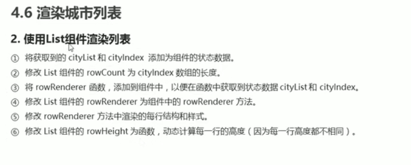
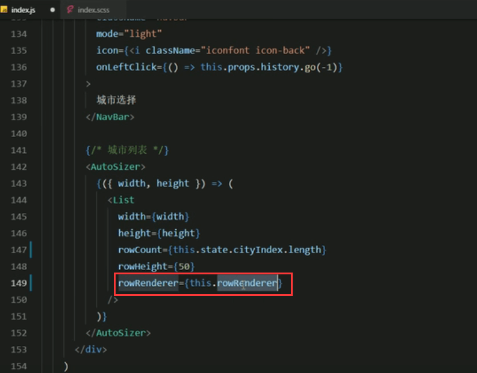
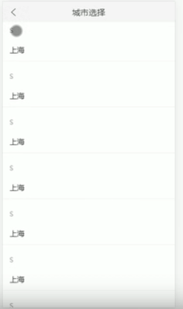
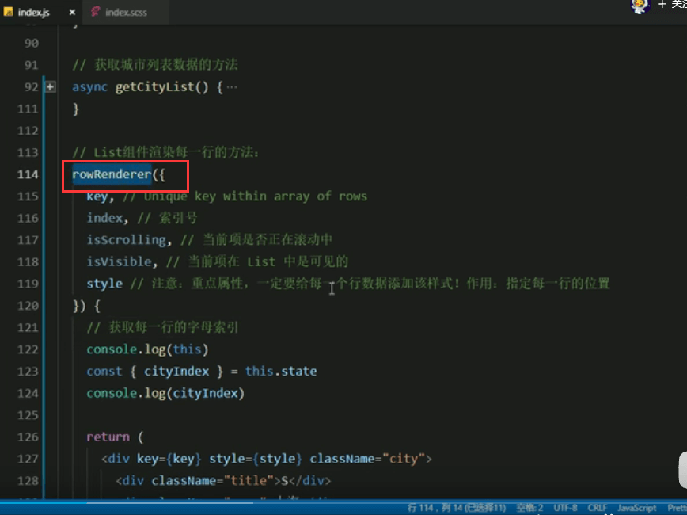
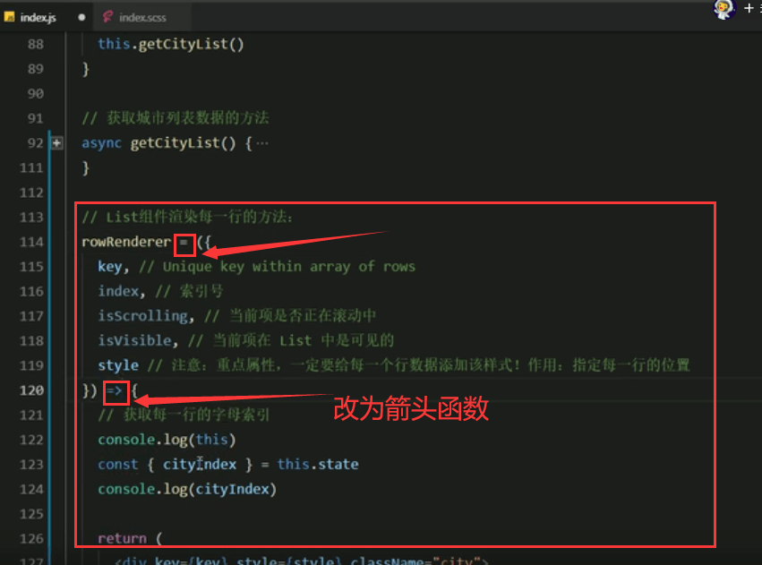
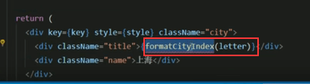

# 24.长列表性能优化

使用这个组件来渲染长列表是性能非常好的

#### react-virtualized基本使用

https://www.bilibili.com/video/BV14y4y1g7M4?p=142&spm_id_from=pageDriver

让组件占满屏幕---我们使用高阶组件0打开文档看一下

可能出现一个问题--顶部也一起滚动---可以通过给整体添加padding-top：45px，然后给顶部导航添加margin-top：-45，这样就可以避免导航栏滚动了，原理是空出45个像素作为不滚动，而我们将导航放入这个区域就好了

#### P144-渲染城市列表

https://www.bilibili.com/video/BV14y4y1g7M4?p=144

**1.第一步添加组件状态：**

在拿到数据的方法中请求获取到的数据设置到state中

可以看到数据已经获取到了

**2.第二步修改List组件的rowCount为cityIndex的长度**

**3.第三步将rowRenderer 函数，添加到组件中，以便在函数中获取到状态数据 cityList 和 cityIndex**

**4.第四步-在List组件中的rowRender指向一下组件中的rowRenderer**

**5.第五步-修改rowRenderer方法中渲染的每行结构和样式**

**6.第六步-页面效果：因为高度的问题导致有些重叠--之前高度是50我们调成100就好了**

调整后的效果：

现在数据还是静态的

#### P145-将数据调整为动态数据 

先是获取每一行字母的索引

结果发生了报错--原因是this是undifiend了，因为这个rowRenderer这个方法，最终是交给List组件内部来使用的

因为组件内部处理的时候，没有去处理this指向所以就导致this-undifind

解决方式--**改为箭头函数就可以了**

现在就有数据了

然后就是通过CityIndex数组中的index索引号来取出每一行的索引数据

这个letter就是拿到字母索引了--打印一下

然后我们渲染到页面中

查看渲染效果

那么现在我们发现这个索引号还是需要处理一下才可以使用--转化为我们需要的内容--我们创建一个formatCityIndex方法

定义一个formatCityIndex方法 然后接收 一个letter参数，通过switch case判断来转化，小写转大写可以通过toUpperCase（）方法来转化

查看页面效果： 索引已经转化完成了

