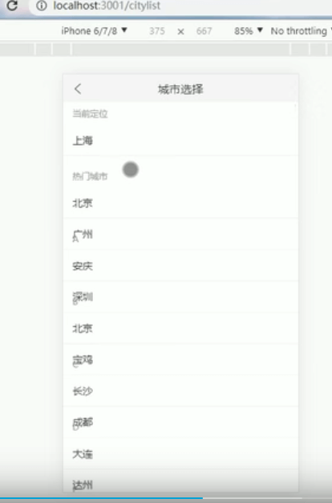

# 25.渲染城市列表展示索引下的城市-及动态计算每一行的高度

那么需要做这个功能-那就需要将--目前这个静态的上海改为动态的数据

**1.先拿到当前索引对应的数据列表**

通过索引拿到的每一个都是一个数组

**2.然后我们就可以动态来渲染数据了**

页面效果：我们发现城市和索引发生错乱-需要动态调整高度

**3.动态的去计算高度**

从文档中我们发现可以使用number也可以使用function--我们之前是使用的number-他可以是一个固定数值的高度，如果是函数的话，是需要返回一个高度的index

那么我们使用这个getRowHeight函数来动态计算一下高度

这个高度怎么来计算呢？其实应该分为2部分来计算，分为标题+城市来计算

动态计算： 发现还是会发生this指向的问题  --通过箭头函数的方式解决

页面效果展示：

