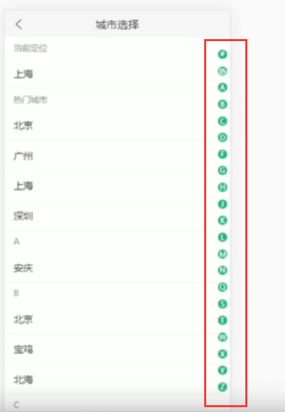
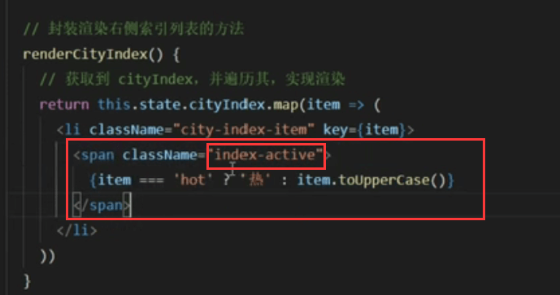

# 26.城市索引列表

#### P147

https://www.bilibili.com/video/BV14y4y1g7M4?p=147&spm_id_from=pageDriver

城市索引列表指的就是右侧的列表内容

​	1.需要将列表渲染在指的的位置

​	2.在选中当前城市需要索引列表中有高亮显示

​	3.点击索引-有跳转效果，跳转到对应的城市位置

第一步：渲染右侧城市索引列表

​	在方法中，获取索引数组cityIndex，遍历cityIndex，渲染索引列表 cityIndex.map

查看效果：索引里面的内容已经渲染好了

第三步：现在需要处理一下高亮的问题：因为所有的span现在都有样式index-active这个高亮样式

第四步：在state中添加状态activeIndex，指定当前高亮的索引

查看效果：默认当前定位高亮

P148：

#### 滚动城市列表让对应索引高亮

​	点击索引列表--高亮效果，滚动索引列表-高亮效果，其实这2种高亮效果实现 滚动高亮效果就可以了，他就可以覆盖点击的高亮效果--因为点击高亮效果其实也是发生了滚动

#### 代码实现：

先定义一个函数onRowsRendered = （{startIndex}） =>  { } 用于获取List组件中渲染行的信息

然后判断startIndex和activeIndex是否相同，如果不同进行更新

查看页面效果：这样就完成了右侧索引随滚动达到高亮显示效果

