# 27.点击索引置顶该索引城市

想要达到的效果：其实就是我们点击右侧字母索引---然后将对应的城市给置顶显示

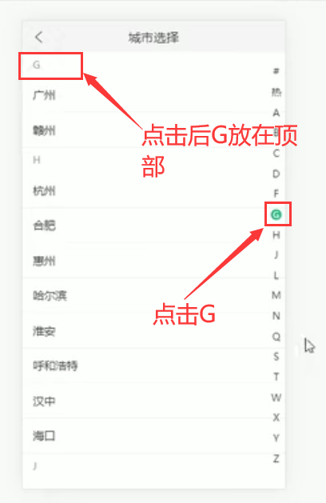

**实现步骤：**

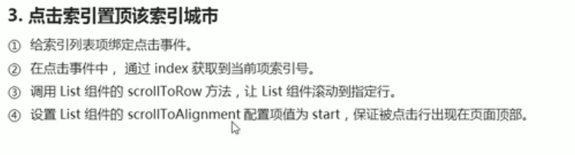

主要是使用到List组件的scrollToRow这个方法：这个方法的作用就是被用于安全的滚动到指定的行

​	但是这个有一个限制就是 Ensure row is visible 这个行必须是可见的---意思就是这个行必须是出现过可视区域内的。如果你这行还没有渲染过就可能发生定位不准确的问题。

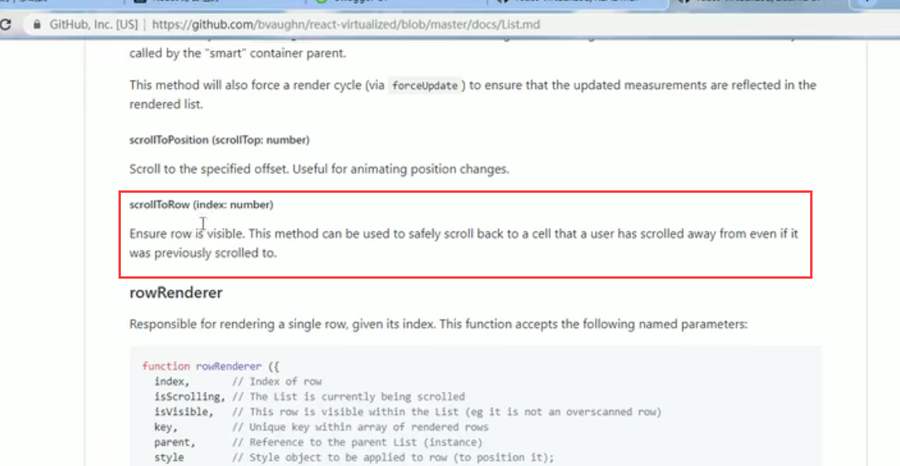

##### 代码实现：

1、绑定事件：

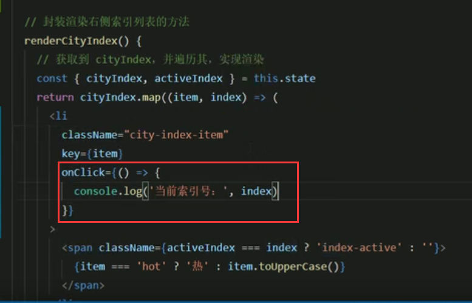

2.调用scrollToRow方法-让List滚动到指定行，那么怎么调用这个方法呢，就需要创建ref对象

​	在constructor中，调用React.createRef() 创建ref对象

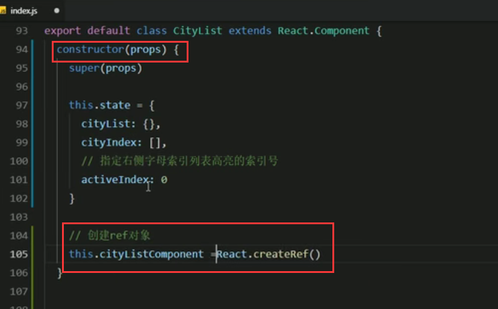

然后在List组件中 指定一下创建好的ref对象，就是将ref对象和List组件关联到一起

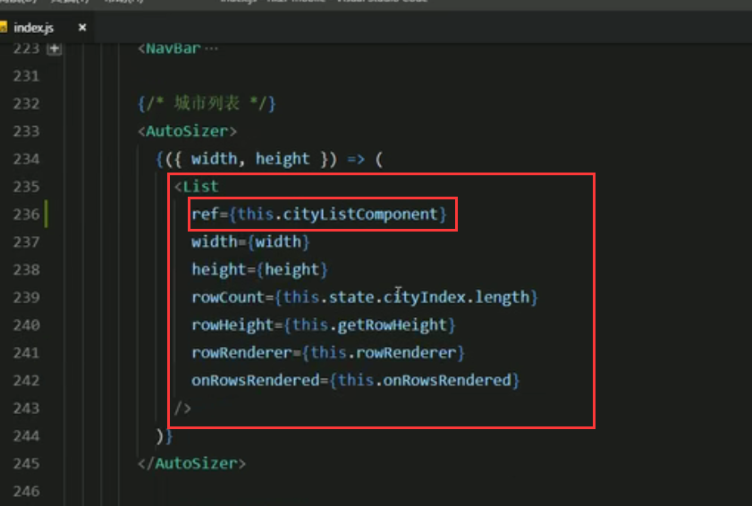

然后通过ref的current 属性，获取到组件实例，再调用组件的scrollToRow方法

现在我们可以在事件中调用scrollToRow方法了

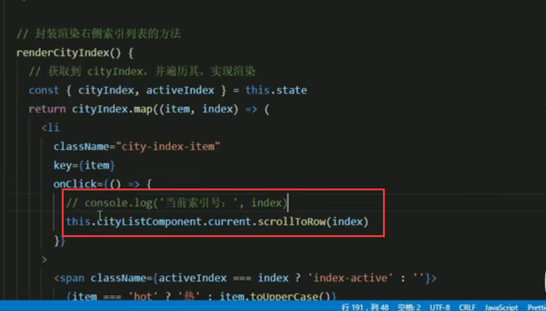

查看页面效果：点击J发生滚动-但是定位不准确--并没有置顶

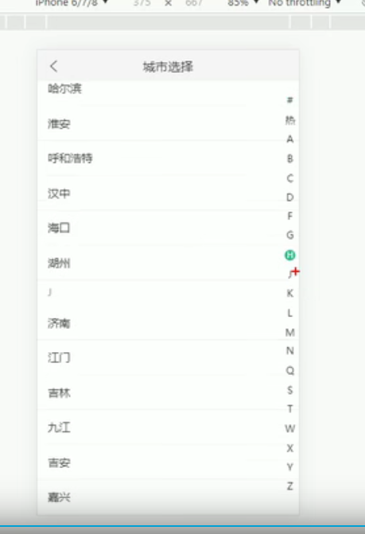

通过设置List组件的scrollToAlignment 属性   来置顶

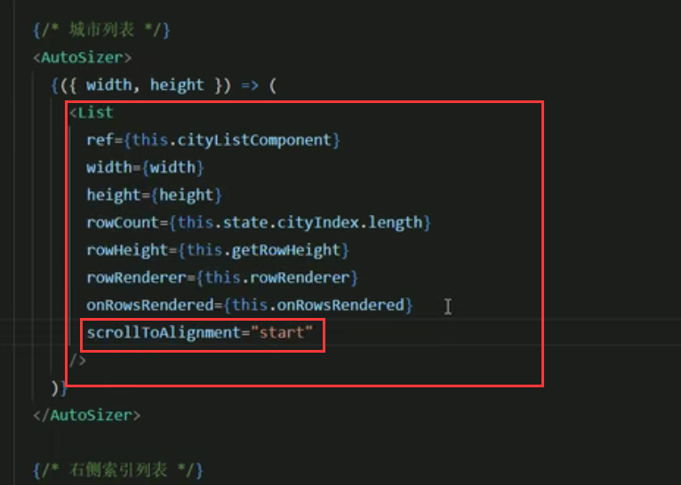

查看效果：点击字母J----定位准确

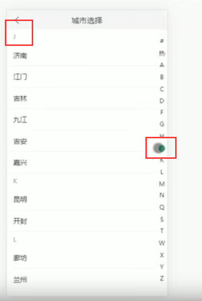

如果没有在页面显示，定位的时候就会发生精度的问题，如何解决

调用List 组件的 measureAllRows  方法，提前计算高度来解决，使用钩子函数componentDidMount()在页面渲染完毕后计算高度

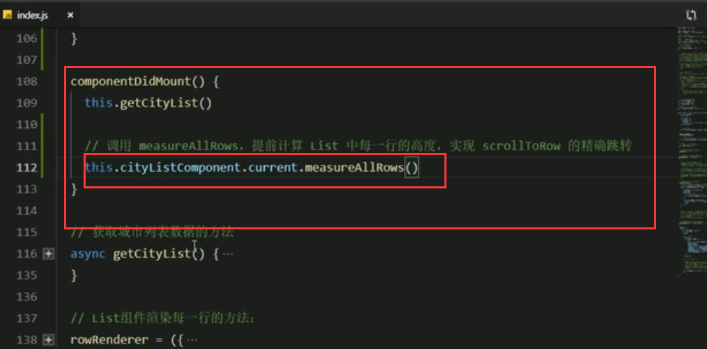

可能发生报错：

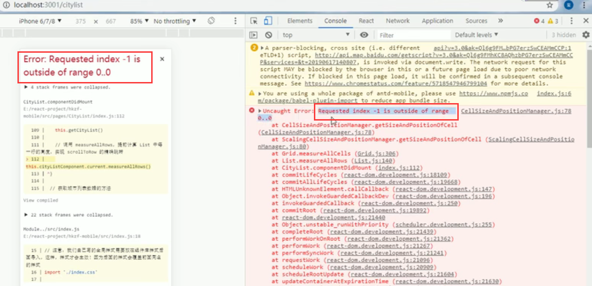

原因是异步调用获取数据的时候List还没执行完毕，然后就执行高度计算导致的

​	我们通过await 等待执行完成List有数据后再执行

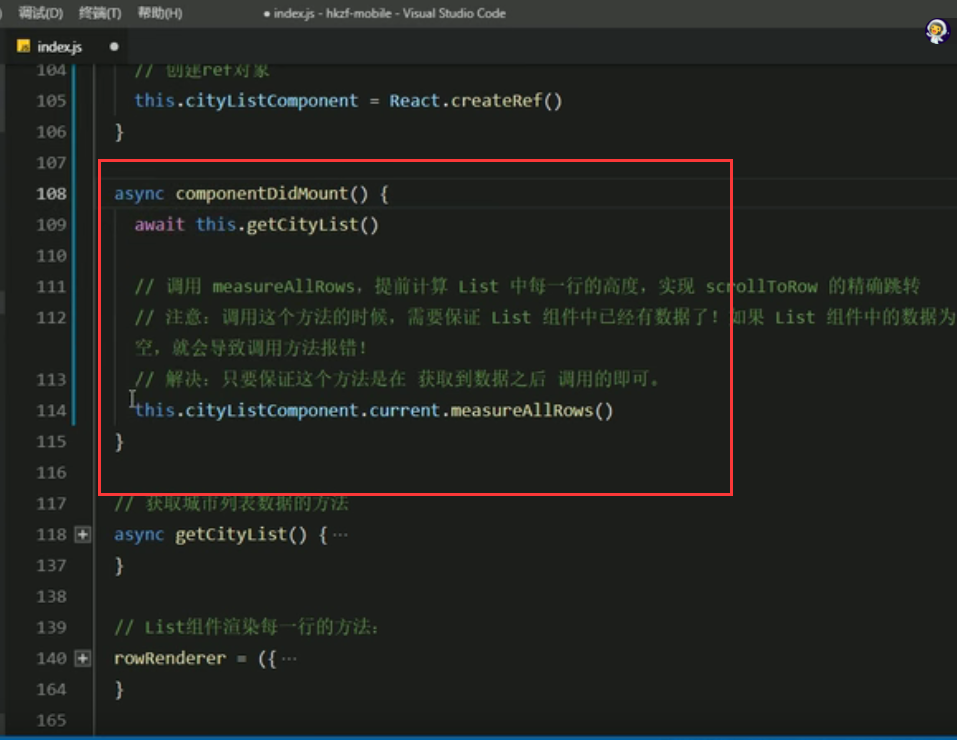

查看效果： 点击X，定位完全正确

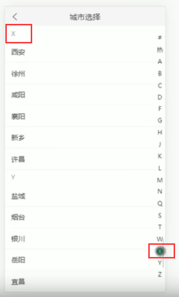

