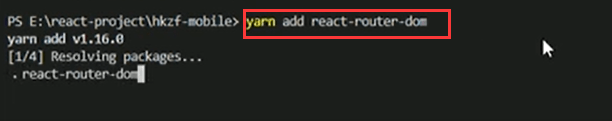
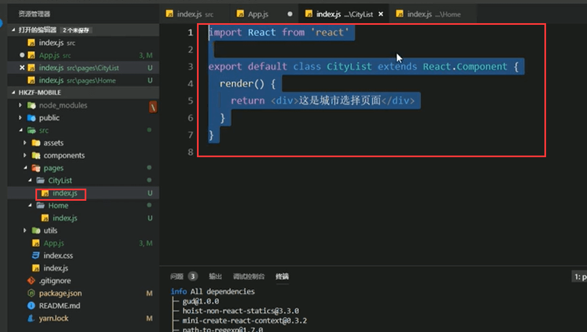
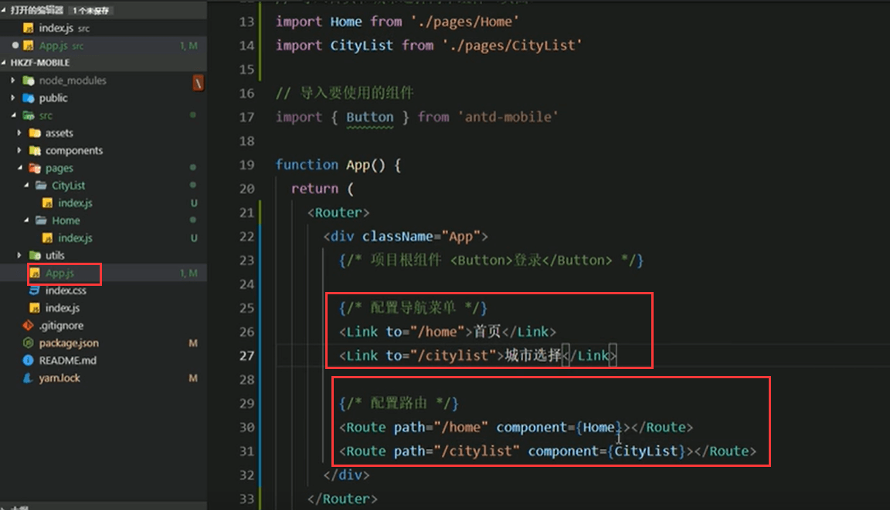

# 4.配置基础路由

**1.安装路由**

**2.导入路由**

**3.在page下创建页面文件夹**

​		然后分别创建2个组件index.js

**1.城市选择页面初始化组件**

在Home中同样的方式创建一份

#### 4.使用Route组件配置首页和城市选择页面

​	导入页面组件index.js都可以省略掉

配置基础路由

https://www.bilibili.com/video/BV14y4y1g7M4?p=105&spm_id_from=pageDriver

