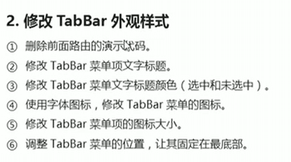
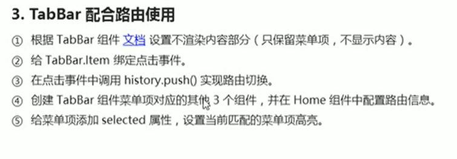

# 8.实现tabBar

https://www.bilibili.com/video/BV14y4y1g7M4?p=109&spm_id_from=pageDriver

需要使用到ant的TabBar组件

#### 2.修改TabBar外观样式

#### TabBar配合路由使用

实现路由的切换

设置选中高亮显示：

创建组件4个组件--在父组件导入子组件-然后进行配置路由

**实现点击高亮显示效果**

第一步：

第二步：设置selected

页面显示，已经高亮显示了

现在是输入地址可以切换高亮，但是点击并没有高亮切换--设置单击事件效果

#### 4.TabBar.item代码重构

​	因为有很多重复的代码-我们把相同的抽离出来，把不同的封装到一个数据里面去

抽离前的代码

第一步：先将不一样的数据定义出来

第二步，循环

https://www.bilibili.com/video/BV14y4y1g7M4?p=112&spm_id_from=pageDriver

112节，数据抽离

