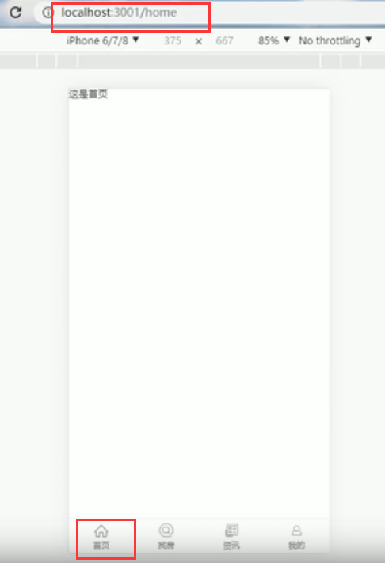

# 9.首页路由处理

​	首页的路由一般都是比较特殊的，我们都会给首页进行一个特殊的处理。

现在我们是必须url 是以/home/index才可以进入首页，我们希望是/home的情况下也可以进入到首页

​	

​		路由去掉index,然后加上精确匹配exact

这样处理之后菜单不高亮了

将TabBar的数据内容的path也修改为/home

配合默认路由，实现默认跳转到/home首页

默认路由：指定重定向到首页

我们输入ip+端口后自动就为我们跳转到首页了

