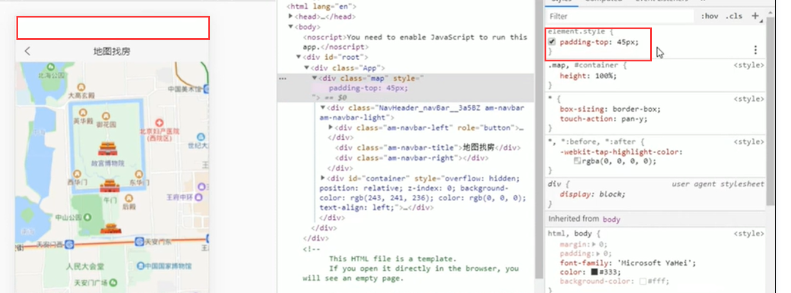
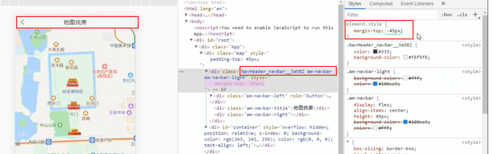
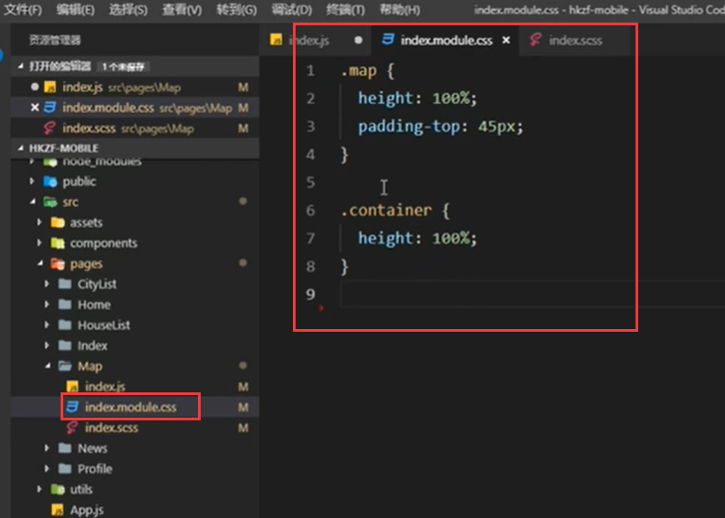

# 10.地图找房顶部导航栏处理

现在是页面上下滚动--导致顶部导航栏跟着滚动的问题

处理的方式其实就是，给整个页面添加一个padding-top

然后给导航栏组件添加一个margin-top -45px 这样就可以了--这样就解决滚动的问题了

我们现在使用mudules的方式添加样式：

https://www.bilibili.com/video/BV14y4y1g7M4?p=164&spm_id_from=pageDriver

##### 2021-11-15  未完结164节

