# 2.地图找房模块

P153

#### 功能分析

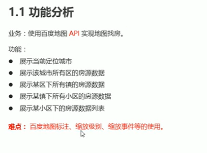

#### 顶部导航栏组件

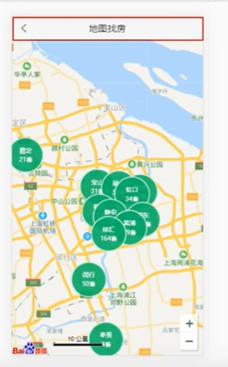

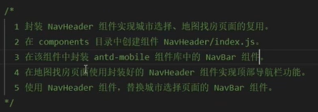

代码实现：

创建封装的顶部导航组件

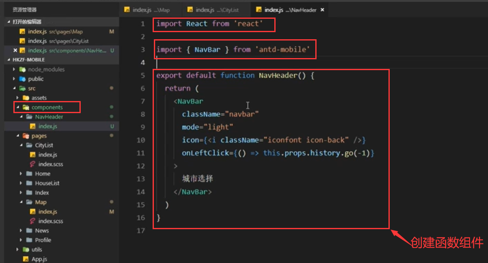

我们发现文字显示和背景样式都有些不对

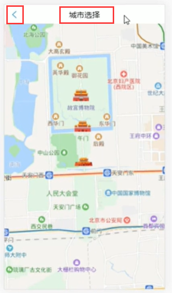

给组件样式调整：

​	1.调整文字：将文字改为动态显示的内容--那么如何为动态的呢，其实就是通过组件的属性值来传入进来的，或者使用它的child属性

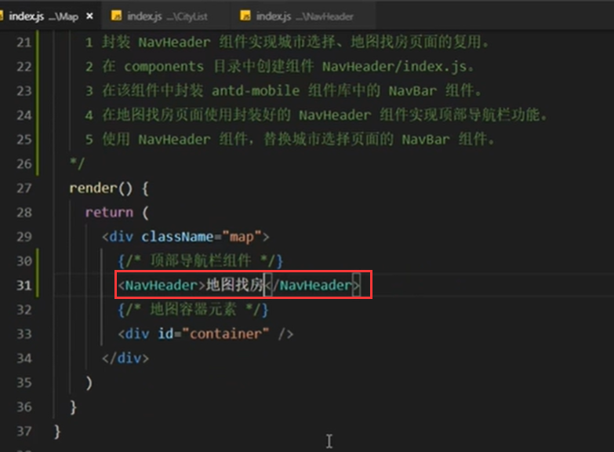

结构化一下内容

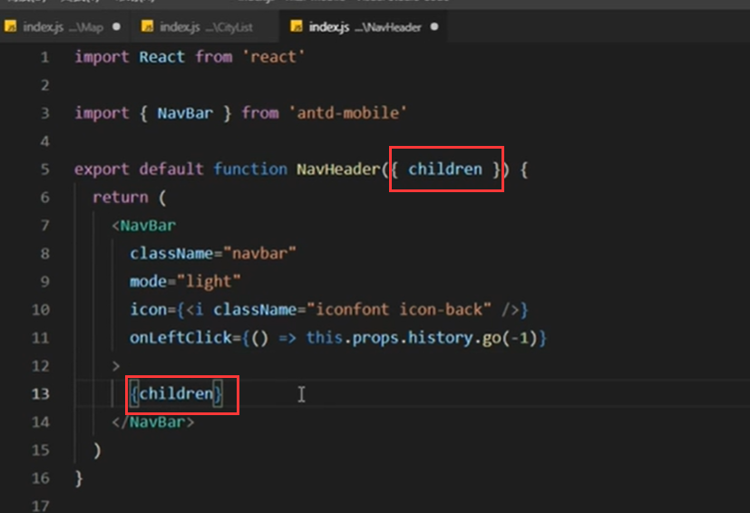

查看页面效果：标题已经改变了，实现了动态效果了

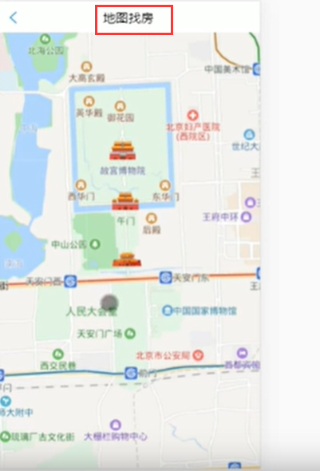

#### 样式的处理：

以前顶部导航栏的样式是放在-城市列表里的

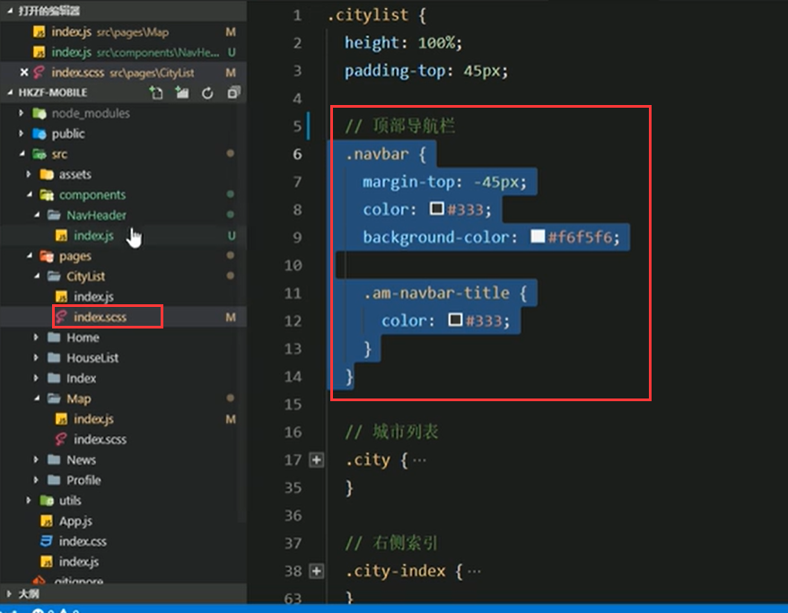

现在我们将顶部导航栏单独作为组件使用，那么就需要把样式也抽离出来

在组件中新建一个属于组件自己的样式

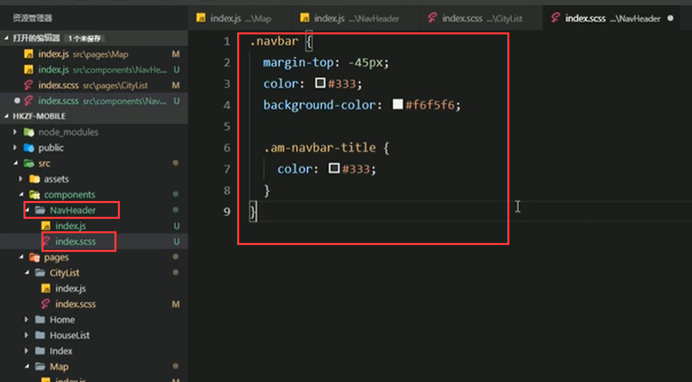

然后在组件中导入一下样式：

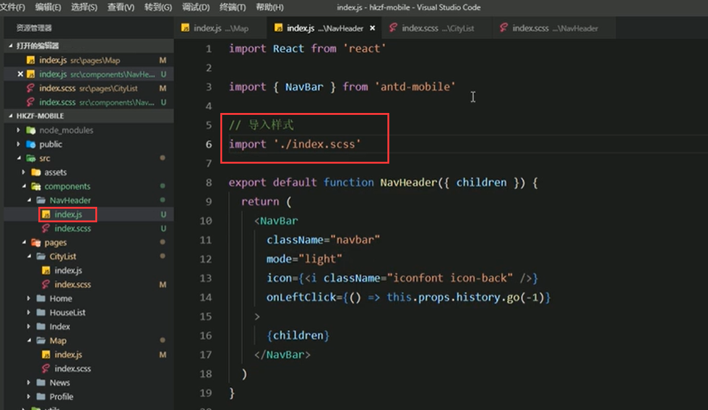

发现我们自己写的组件样式被引入的组件样式覆盖了--为什么被覆盖了呢--导入样式顺序的问题

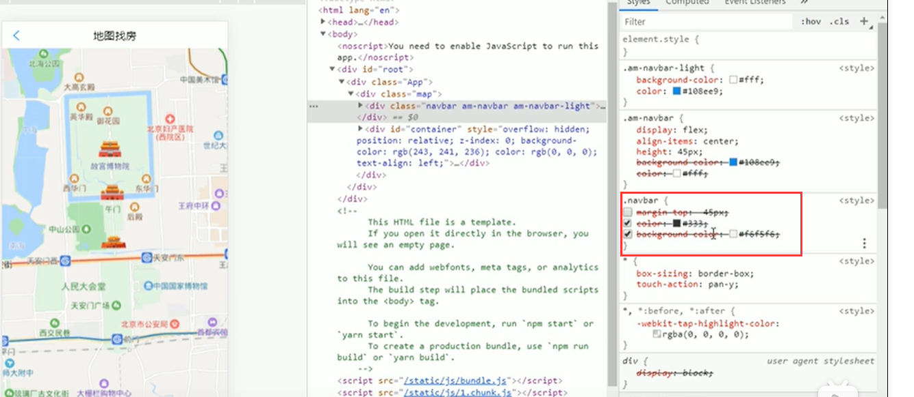

将组件的导入放入样式的后面--防止样式被覆盖

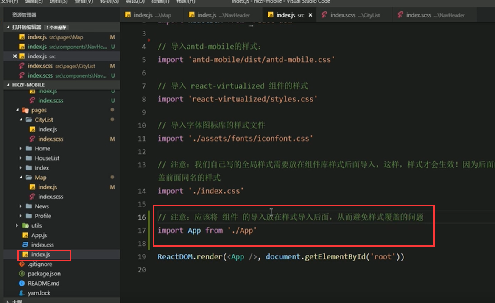

页面效果： 发现样式好了

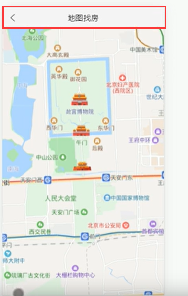

有些样式每个页面不一样，那就需要给使用组件的时候单独指定样式了

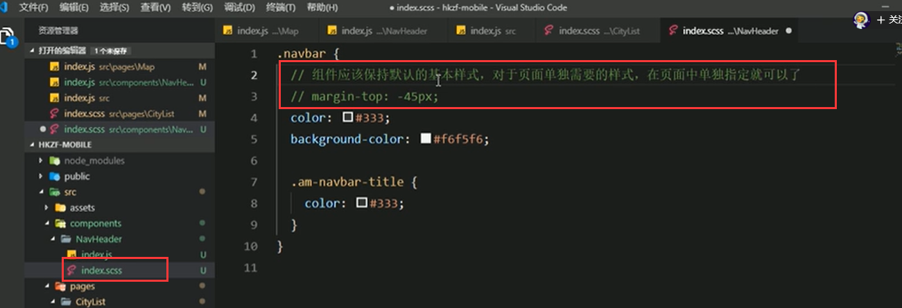

https://www.bilibili.com/video/BV14y4y1g7M4?p=155&spm_id_from=pageDriver

