# 3.封装顶部导航栏组件3

#### 功能问题：

​	比如点击返回按钮，结果发生报错：

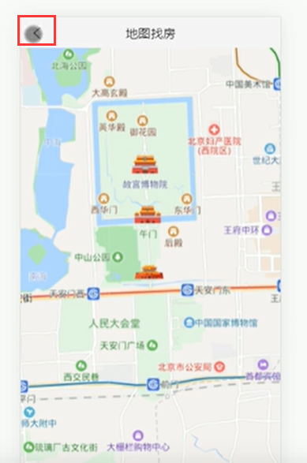

不能够读取 undefined 的属性 props

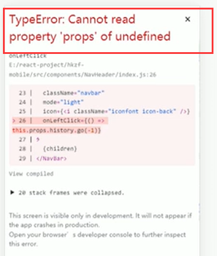

原因其实就是：this变成undefined的了，因为我们使用的是函数组件，函数组件就不能使用这个this了

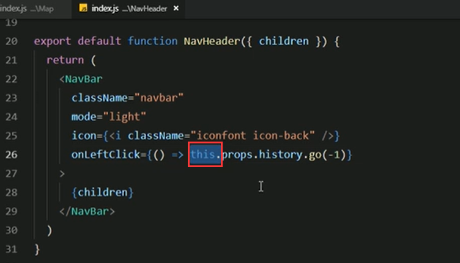

我们将history也结构出来就可以了

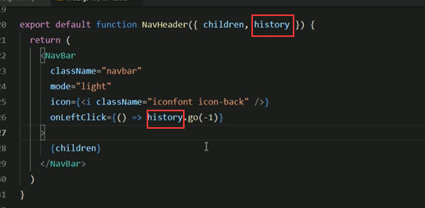

发现又报错了： history又变成undefined了--我们拿不到history

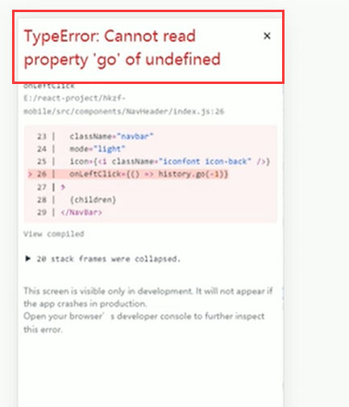

我们使用WithRouter才可以获取到路由信息--因为导航栏组件不是由App组件渲染的

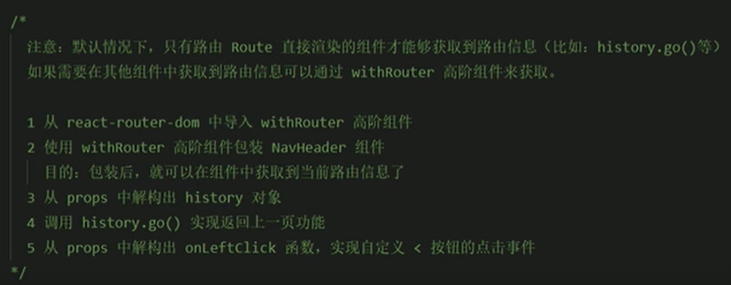

导入WithRouter组件：使用高阶组件会产生一个新组件

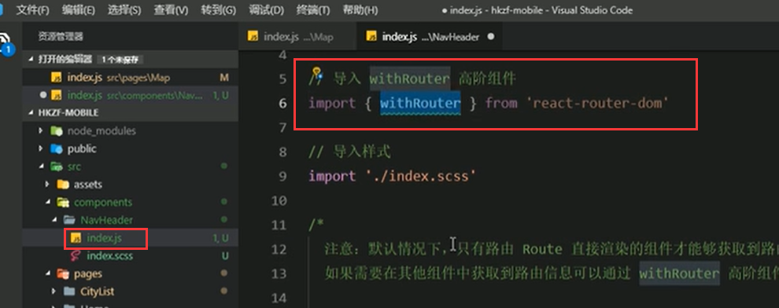

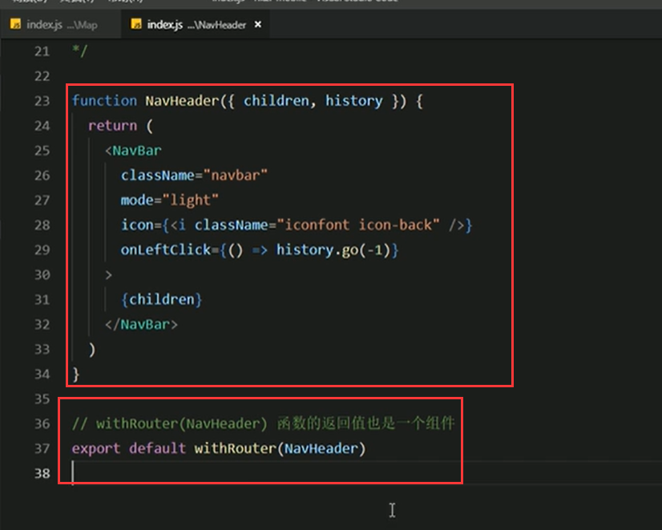

现在我们点击返回按钮：发现好使了

如果每次点击<都是返回上一页--有的页面不想让他返回上一个页面：那么就需要自定义了--需要结构出一个和组件页面跳转的函数 同样的名字函数才可以自定义-如果用户传了这个函数就使用用户的-如果不传就默认返回上一页

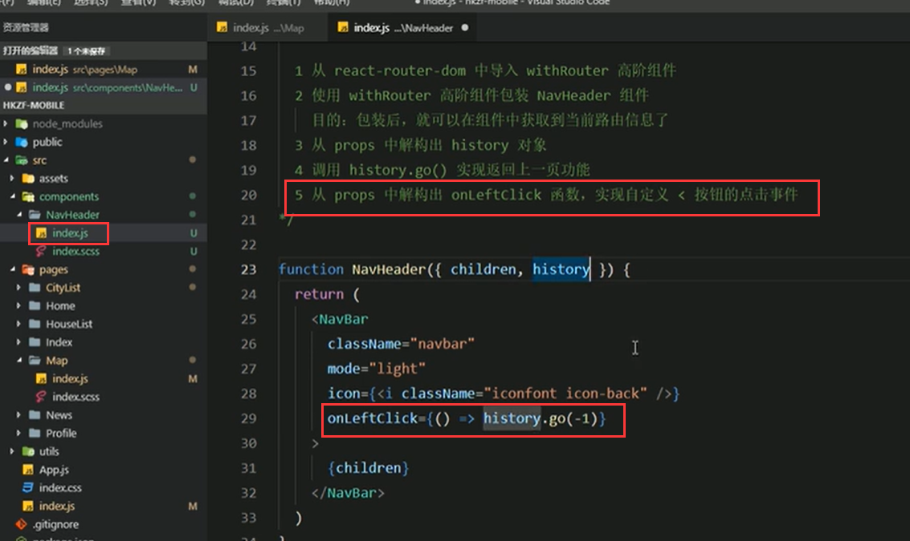

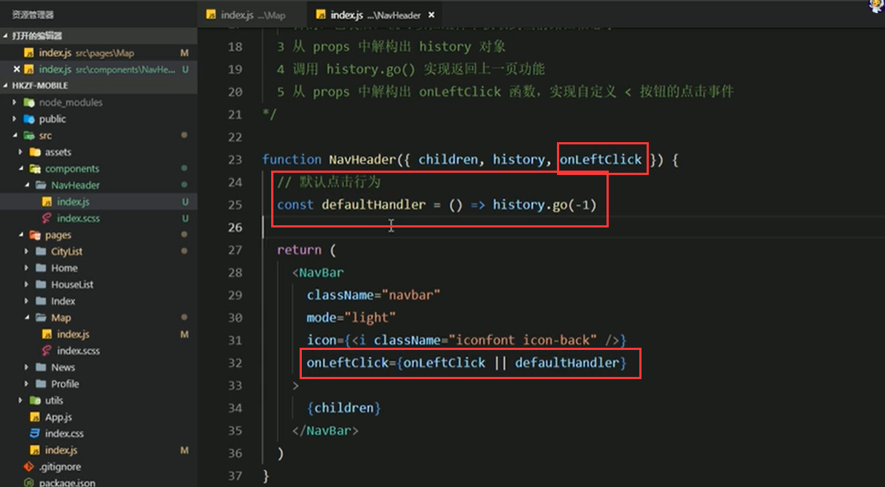

假设我们自定义：传入一个函数进来

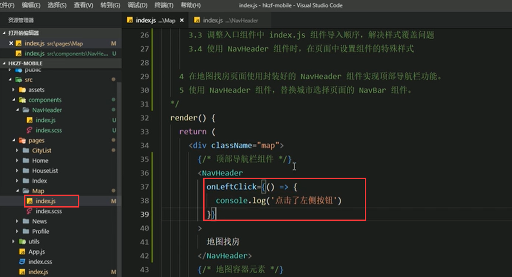

发现自定义是生效的：

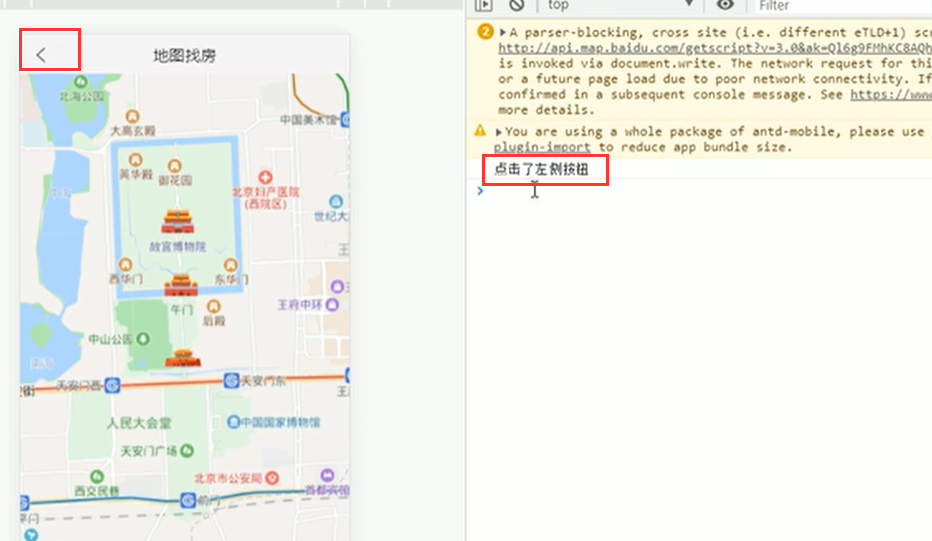

