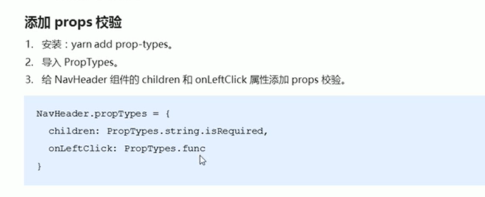
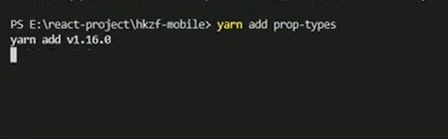
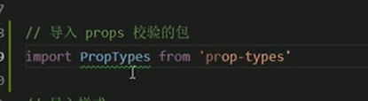
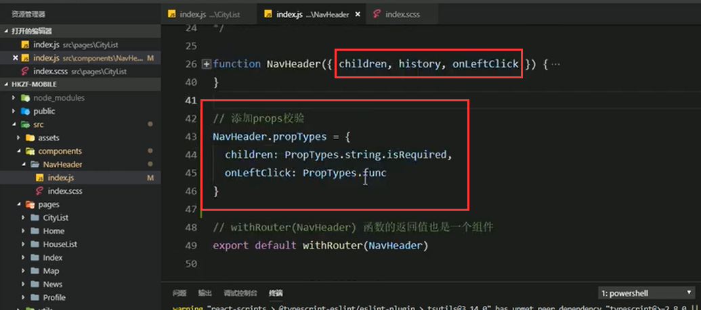
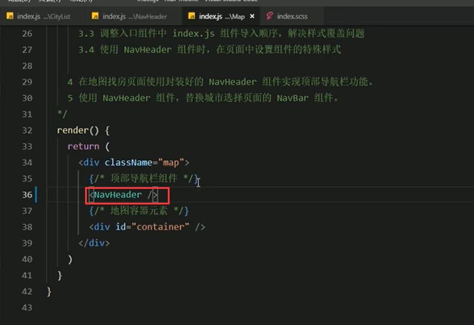
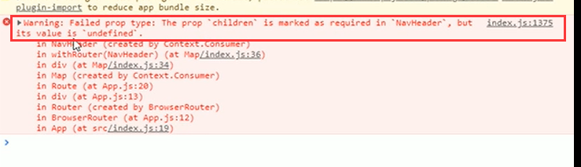
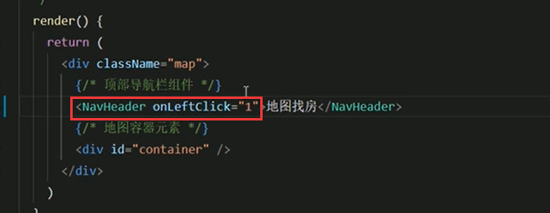
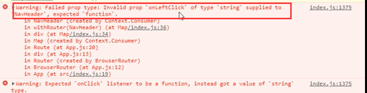

# 4.封装顶部导航栏-添加校验

https://www.bilibili.com/video/BV14y4y1g7M4?p=157&spm_id_from=pageDriver

因为我们在写组件的时候，可能是其他的人在使用这个组件，那么我们就需要props校验，在其他人使用的时候会有提示，需要传入什么东西，什么参数等等。

安装prop-types包

#### 代码实现：

​	导入校验包：

​	添加props校验--history就不需要校验了，因为他不是用户传入的，他是高阶组件传入的

#### 验证一下校验

​	是否生效：

假设把字符串去掉--相当于没有传child属性

查看效果：提示报错--说children属性在NavHeader组件中是必填项，但是他的值是undefined

另外一个错误：onleftClick 是一个String类型的，但是组件期望的是一个function函数类型的

这样就说明我们添加props校验是成功的。

我们以后在写组件的时候 都要给组件添加props校验，因为这样做才是规范的。

