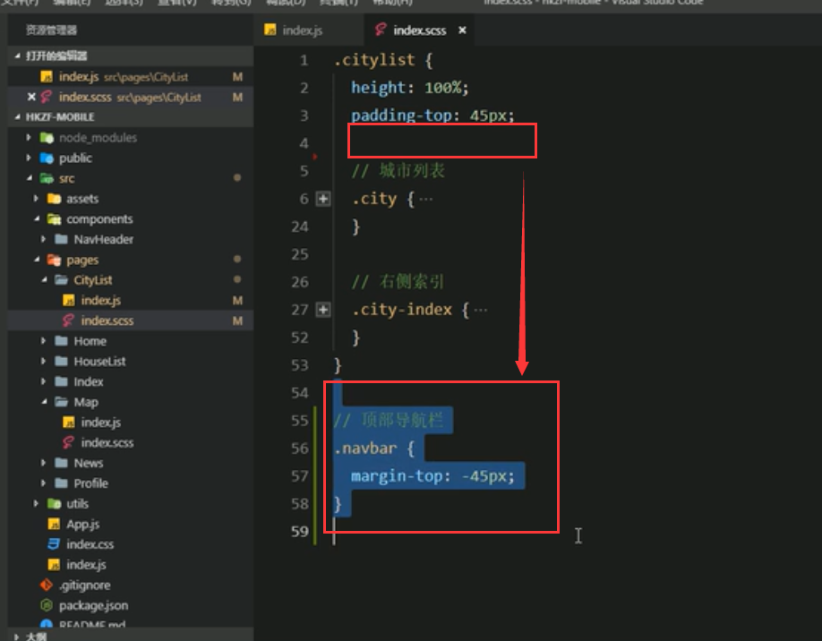
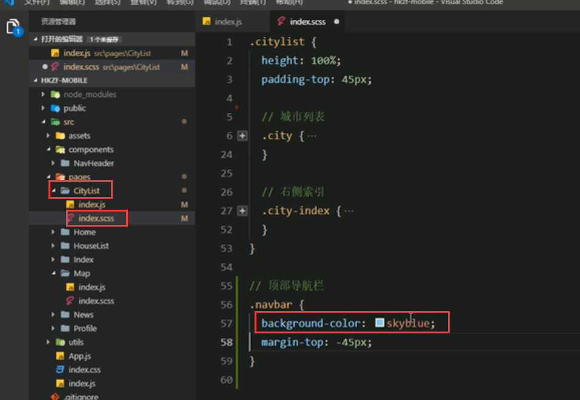
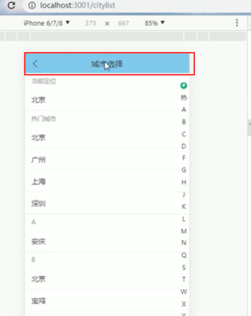
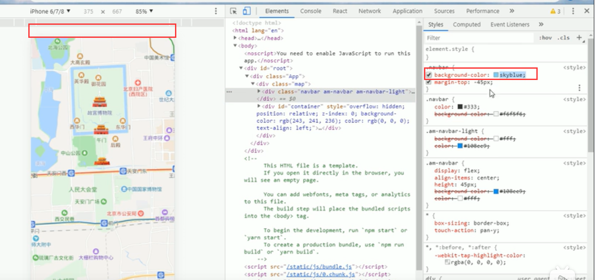
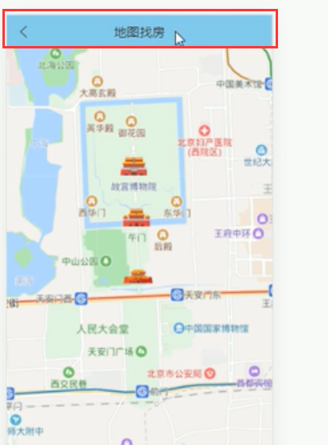
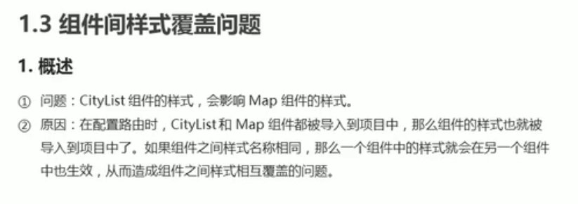
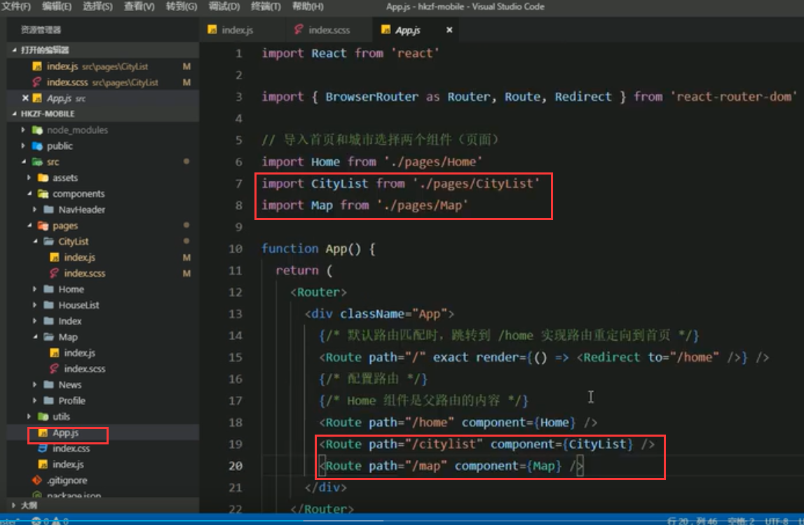
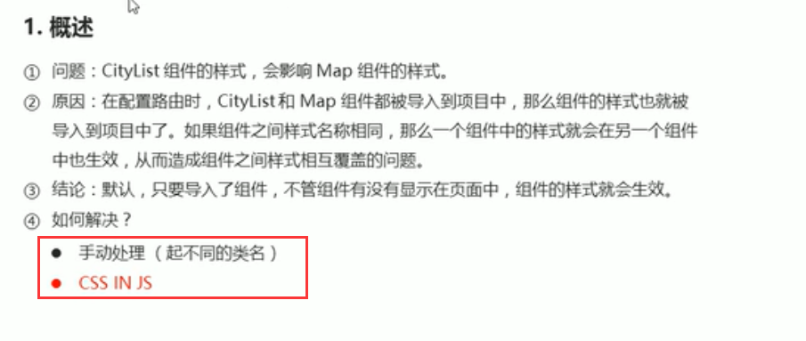

# 6.组件间样式覆盖的问题

https://www.bilibili.com/video/BV14y4y1g7M4?p=159&spm_id_from=pageDriver

将,navbar 的样式从cityList中拿出来，然后就会发生影响其他页面样式的问题--产生了组件之间样式相互影响的问题了

比如：

城市选择页面：

我们发现地图找房里面的样式也发生了改变--也变成天蓝色了

去掉margin-top -45 颜色还是受到影响的

可以通过唯一的类名来指定样式，这样就不会造成样式的影响了，比如 .cityList{}里面指定的样式都是针对cityList的。

特别是在使用路由的时候，会加载所有的路由，然后会加载路由下面所有的组件样式

解决方案：起不同的类名--效率可能比较低，可能还是会重复

​					使用CSS IN JS 的方式

