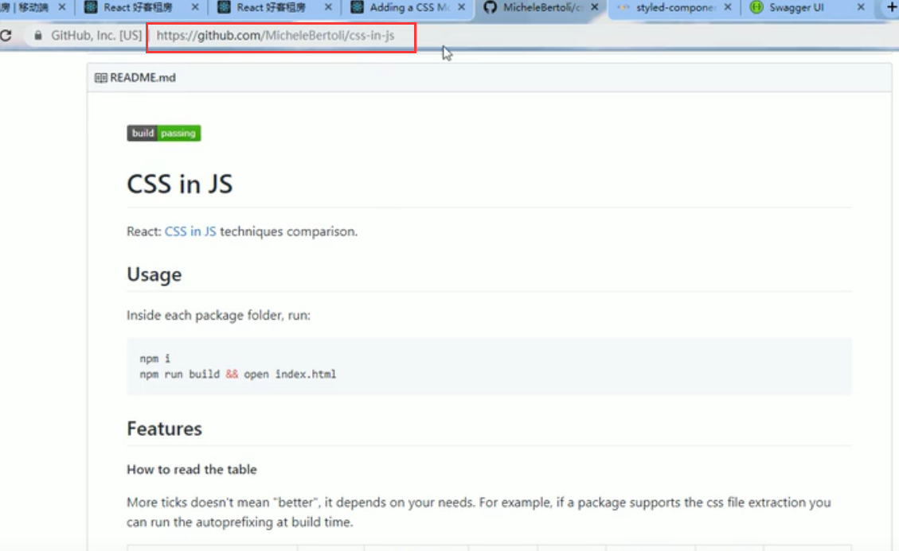
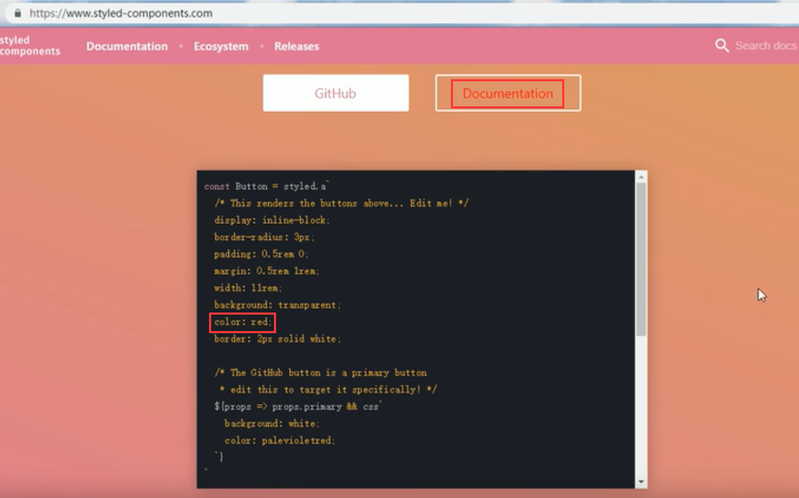
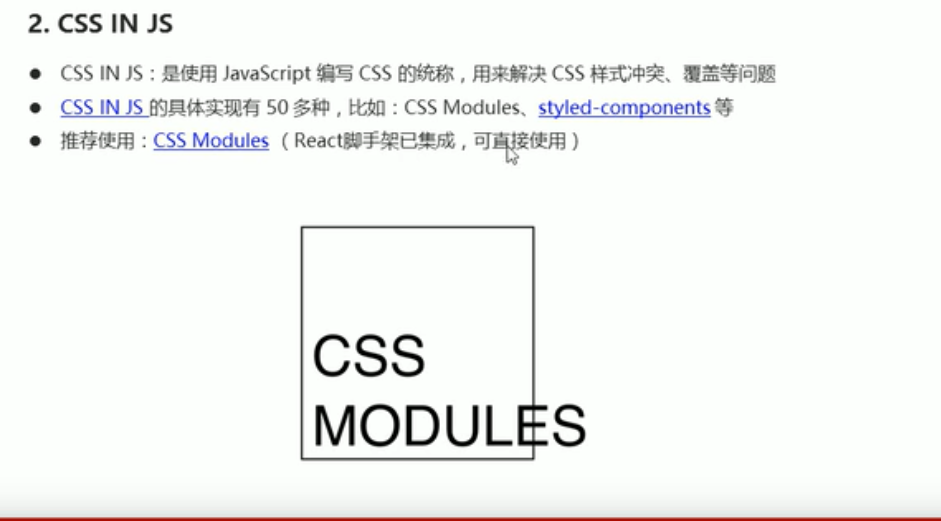
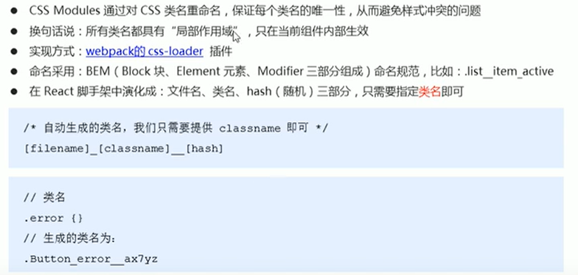
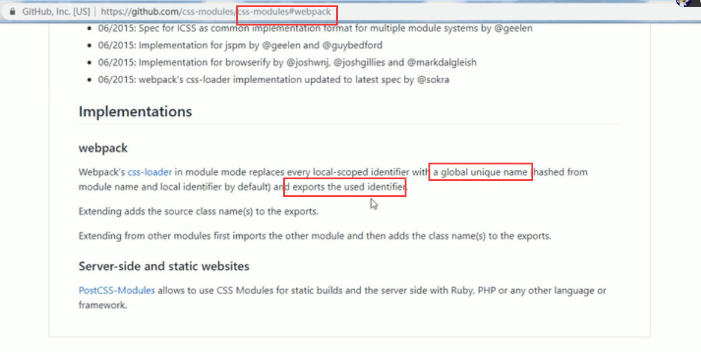

# 7.CSS-IN-JS

 其实就是使用JavaScript来编写css的统称，用来解决css样式冲突的问题，和覆盖的问题。

github我们看一下：

比较常用的css解决覆盖方案：

还有就是styled Components

比如：

CSS-Modules 是比较推荐的，因为React 脚手架已经集成

https://www.bilibili.com/video/BV14y4y1g7M4?p=161&spm_id_from=pageDriver

#### CSS Modules 的说明

其实就是将本地的类名自动替换为一个全局的类名

他是如何来对我们css类名进行重新命名的：

