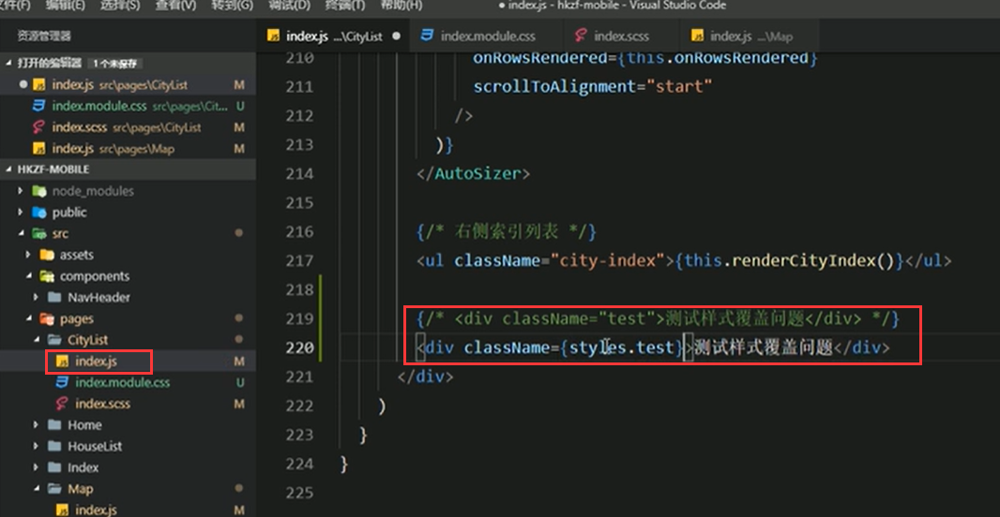

# 8.Mudules在项目中的使用

CSS Mudules在项目中的使用：

- 创建名为[name].modules.css的样式文件（React脚手架中的约定，与普通css作区分）

#### 代码中使用：

我们先在城市列表中添加一个测试test样式

新建一个index.mudule.css

在组件中导入样式文件：要去通过一个变量来接收一下这个样式

然后我们看一下style是个什么打印一下

打印发现就是一个对象 里面包含样式：对象的键就是类名--他的值就是随机生成的 比如第一层是CityList（组件名称） 第二个是test（类名称） 第三个是IdWXA 随机内容

给组件添加样式：className={style.类名称}

查看效果：

