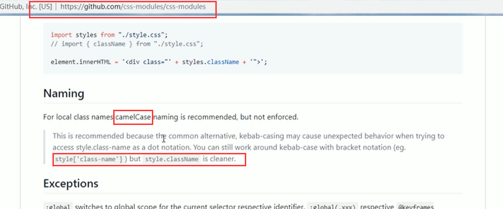
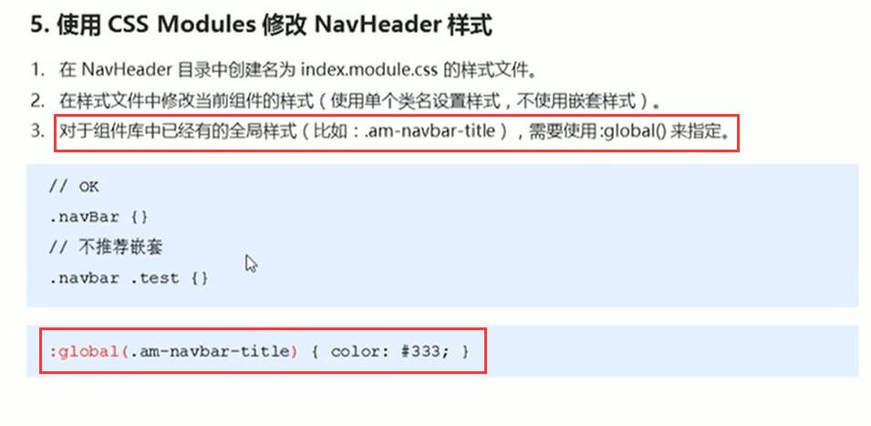
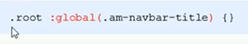
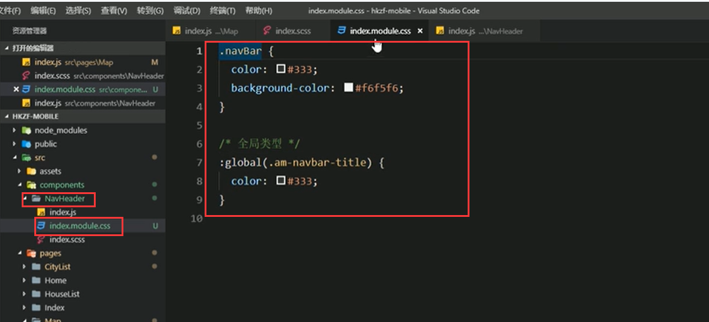
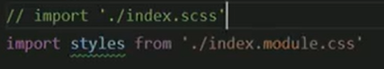
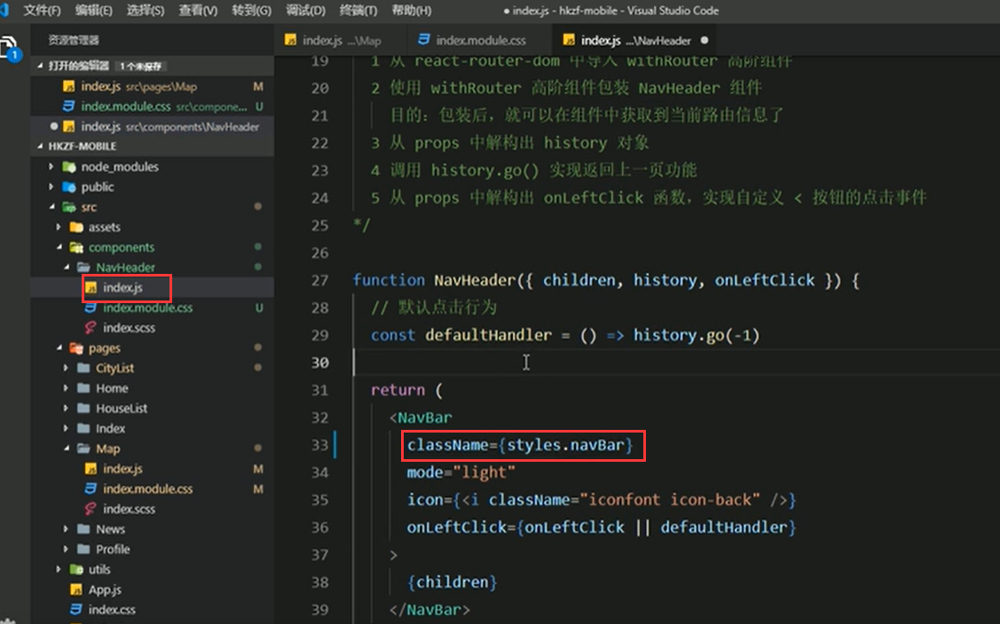
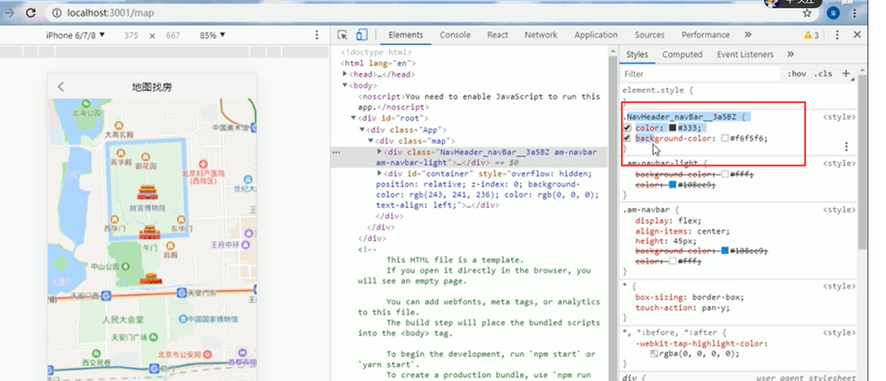
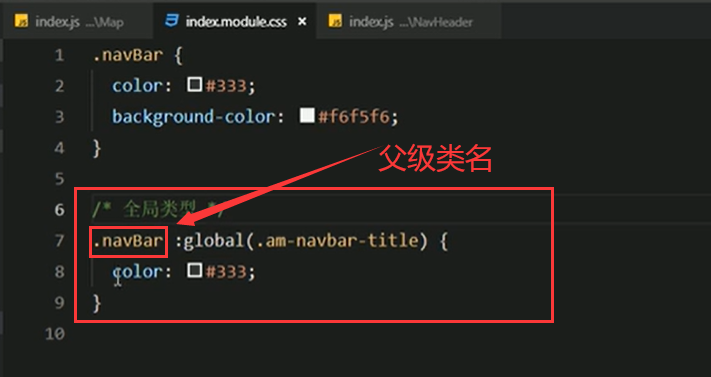

# 9.应用CSS-Mudules

推荐使用驼峰命名的方式-因为使用驼峰命名的方式取样式更简单一些

对于组件库中已经有的全局样式，需要使用  :global() 来指定

也可以使用：.root ：global的方式

https://www.bilibili.com/video/BV14y4y1g7M4?p=163&spm_id_from=pageDriver

给NavHeader组件使用CSS-Mudules样式

然后导入样式：

然后在组件样式使用：

页面查看效果：类名是 NavHeader_navBar_随机码

然后我们发现--全局的样式被覆盖了，我们可以指定一下父级的全局样式--全局样式的处理

