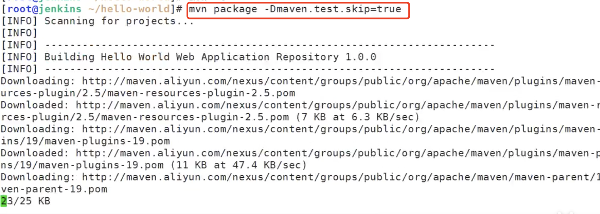

# 10.java项目手动实现项目上线


## 1、搭建nginx和tomcat集群

	#### 1.配置nginx


配置nginx代理服务--这个配置我们并没有写全，目前只写我们用到的


​	将代理pass 改为java--到资源池java中去


重启nginx：


#### 2.安装tomcat


如果找不到包地址，就进入apache官网找tomcat的tar包copy连接 然后wget


#### 3、解压tomcat-然后做一个软连接

​		这样我们找soft下的tomcat其实就是找的9.0.24这个版本-如果需要换tomcat更换软连接路径


#### 4、安装一下java


#### 5、启动tomcat


实时查看一下tomcat的日志：


我们给8这个服务器也scp 发送一下tomcat


#### 6、配置一下host的域名解析


## 2、配置数据库

​	连接一下mysql，发现mysql的密码忘记了，我们从历史命令中查看一下

​	然后过滤一下 |grep mysql


连接上之后我们查看一下数据库


如果需要安装redis 

​	yum install redis 就可以了


## 3、模拟人员提交代码到gitlab仓库


创建helloword项目


上传项目包--解压项目包


然后git init初始化项目git

​	设置项目远程仓库地址


提交代码


​	现在代码也有了


## 4、jenkins获取代码，然后使用maven进行编译

​		由于maven编译工具依赖java 所以需要安装jdk

```
yum install java -y
```

​	

​	安装maven编译打包工具

```
yum install maven -y
```


​	maven的解压安装方式


克隆代码：


源码包-jar包-war包的关系


配置maven国内镜像地址


maven打包--并且跳过单元测试用例

```
mvn package -Dmaven.test.skip=true
```




打包完成获取到war包的地址


我们用脚本将war包推送到 web服务器上 使用scp远程推送

​	war包的名字叫Root.war 为什么叫root.war这样更方便，启动tomcat直接访问的就是这里了


​	将tomcat原先的ROOT目录删除掉


重启tomcat


​	访问一下--看效果：到此这个java项目就部署成功了


​	但是这样如果部署的话还是太麻烦了--这样手动部署还是比较慢的，如果我们借助于jenkins那就方便的多了。


