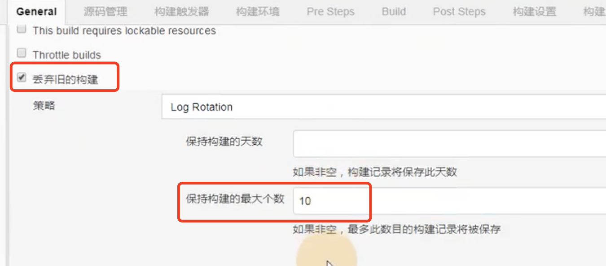

# 11.jenkins集成maven

​	我们使用jenkins实现一下java代码的自动化部署--其实和我们实现纯静态的自动化部署差不多

​	流程就是：

​		开发提交代码--》到gitlab--》jenkins去抓取代码--》然后jenkins--调用sonarqube进行质量检测

--》然后进行maven打包---》打包完成jenkins推送war包到web集群组

注意：jenkins原本不支持maven的调度--需要自己安装maven的插件，jenkins才能调用maven的插件执行编译打包代码

​	我们在服务器上装的maven--jenkins并不知道，我们需要告诉jenkins我们安装的maven在哪

## 1、jenkins集成maven插件

​		安装Maven Integration插件，这样才可以使用jenkins构建一个maven项目

或者是这个名字

## 2、构建maven项目

编写一下描述--然后设置丢弃旧的构建保留10个

源码管理

​	设置远程地址---设置认证的key

有个Pre Steps 构建前的操作--是做代码扫描的现在先不做这个

打开这个连接配置maven安装路径

​	首先配置jdk 名字随便写就行-然后写一下javahome的路径

​	配置maven

​	配置地址--

​	然后现在再回到刚刚构建项目的页面中

​		设置maven的构建参数--一般由开发人员提供

​		 package -Dmaven.test.skip=true

​		Post Steps:是配置构建后的动作--目前不需要

然后保存--点击立即构建

​	然后可以看到正在构建我们的项目

​	由于我们之前已经手动构建过了--所以现在构建的非常的快--jar包都被缓存下来了

现在我们的jdk ，maven都已经在jenkins配置好了，而且代码也顺利从gitlab获取到了

接下来就是我们如何将代码打包好的war包推送到web服务器上

