# 12.jenkins实现java项目通过tag方式自动部署

​		

​		我们使用一下之前的脚本-在这基础之上我们修改一下脚本完成自动部署

copy脚本

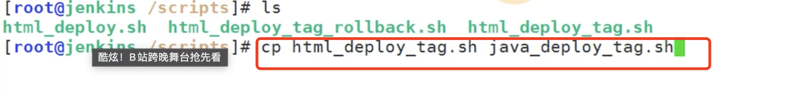

首先把目标的文件夹修改一下：

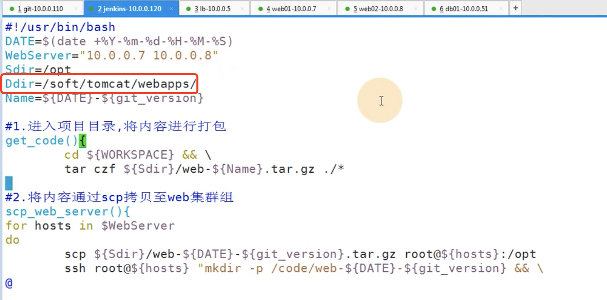

然后也不需要tar打包了直接copy进去就可以了

--然后就是scp远程推送到web服务器下的opt文件夹下--创建文件夹在webapps目录下创建Root-时间戳-版本号

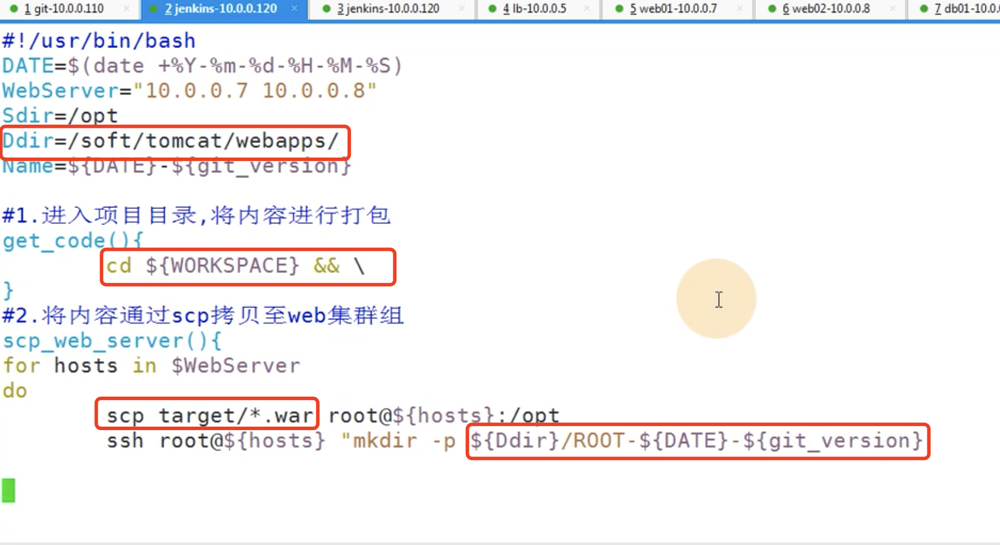

我们jenkins获取过来的代码是在 workspace下 然后进入项目目录，需要的是target下的war包

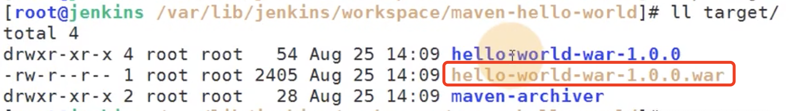

​	copy完war包还需要解压缩包

​	使用unzip解压war包， -d 解压到webapps下的Root-时间戳-版本文件夹下

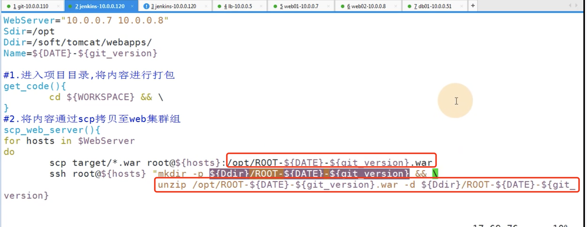

copy解压完成后还不行--还需要设置软连接--连接到webapps下的ROOT

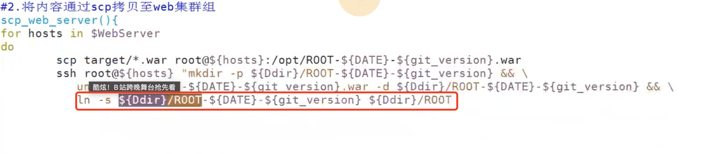

还需要删除之前存在过的软连接

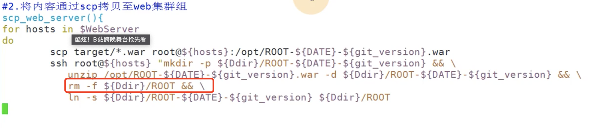

脚本初步编辑完成

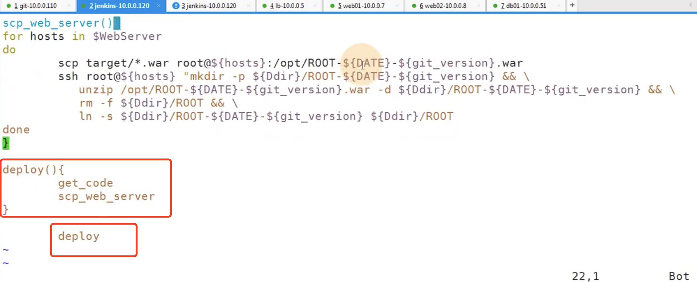

​	忽然想起脚本可能存在问题-- rm -f可能无法清空，因为之前就有一个，使用rm -rf

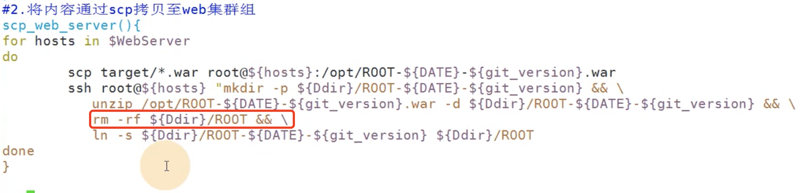

​	注意git_version这个变量是我们构建的时候传入进去的

设置参数化构建：

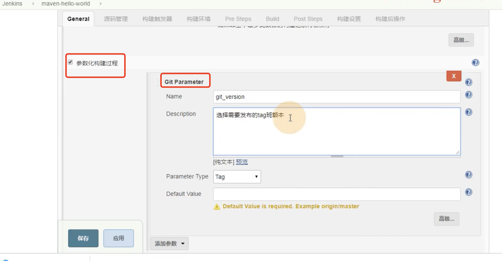

源码管理中获取代码--设置变量，拉取指定tag包

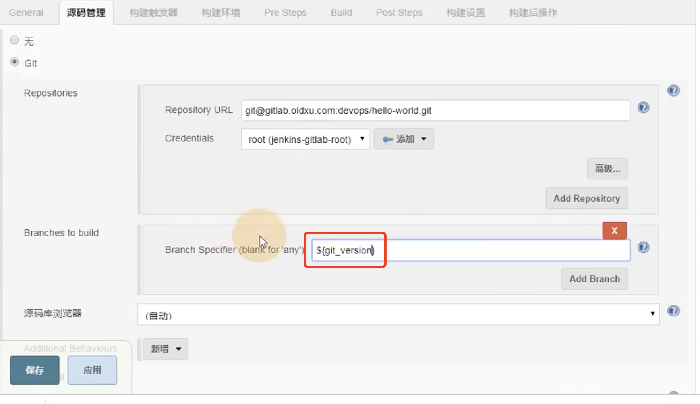

​	然后在post Step在这里执行shell脚本

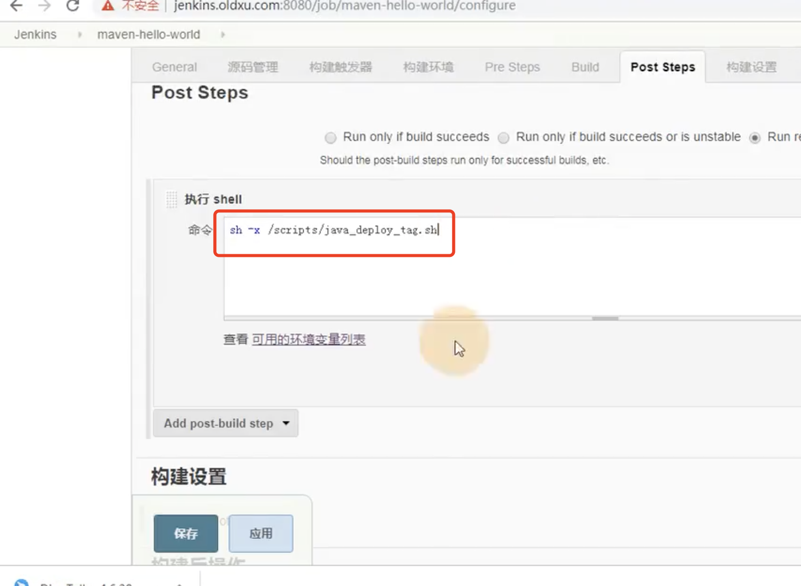

应用保存

点击构建Build。。。。然后选择版本

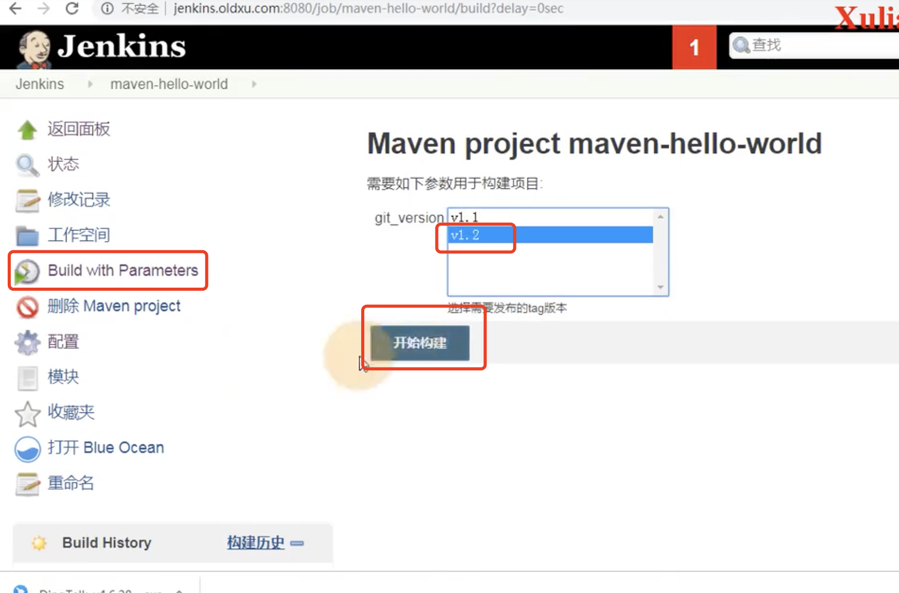

 构建的时候发生报错--脚本第11行

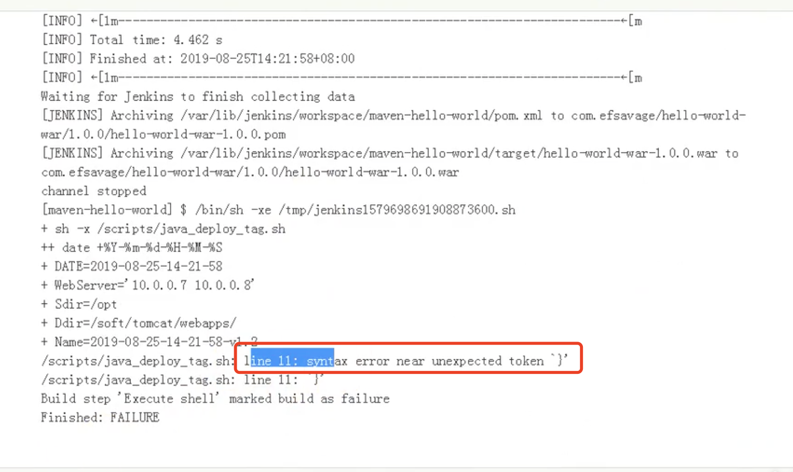

之前11行后面有&&空的情况

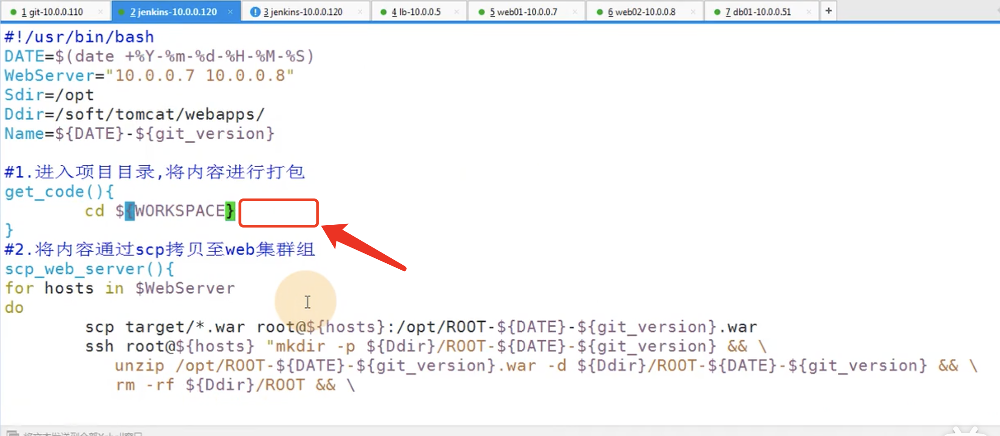

​	重新构建一下： 脚本17行又报错了--少加一个引号

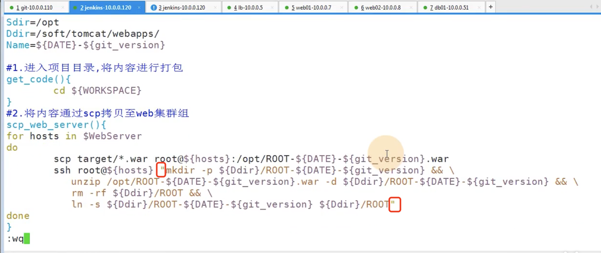

​	再次构建：构建成功

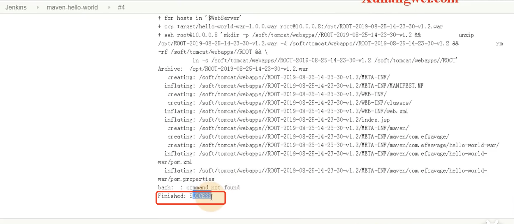

测试构建版本1.1页没有问题

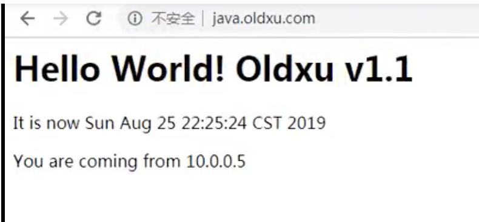

​	其实直接mv到webapps目录下就可以，但是那样很乱tomcat会自动解压，但是会多出很多war包

现在我们还没有解决的问题就是---回退的问题和重复构建的问题

