# 13.jenkins实现java项目通过tag方式回退

我们使用原先的静态资源回退--copy一份新的脚本来修改

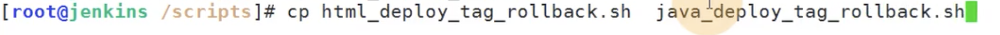

设置脚本中的回退函数

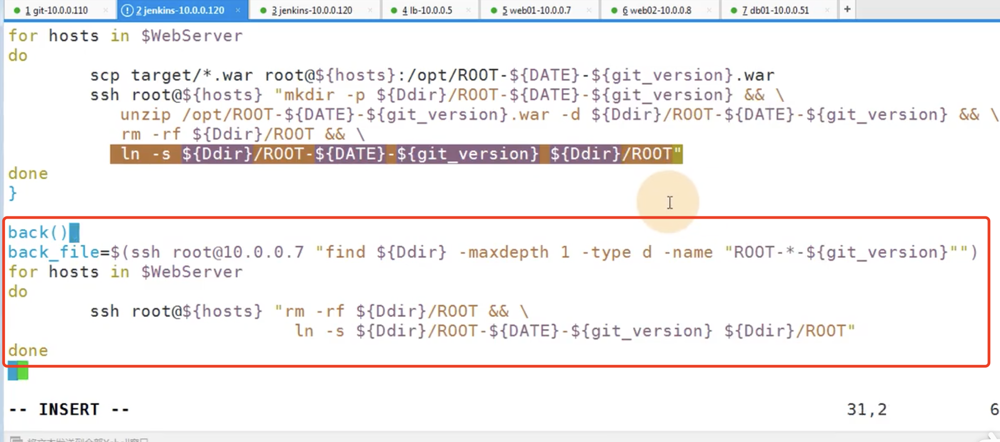

判断一下是发布还是回退走相应的函数，如果是发布也处理一下重复构建的问题，如果和上次构建版本一样就提示

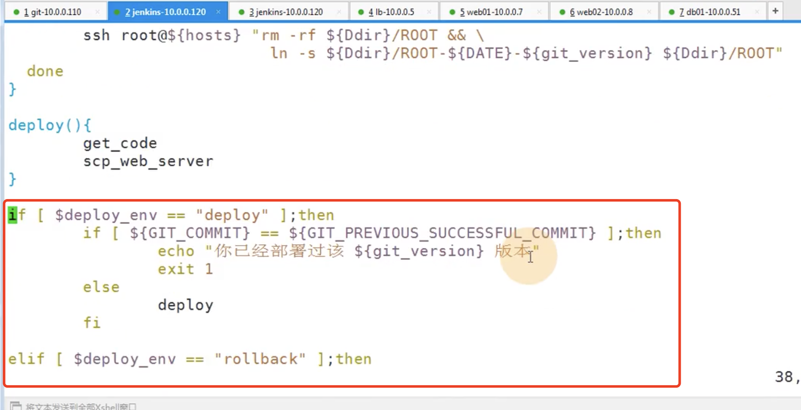

我们在jenkins中加一下选项参数

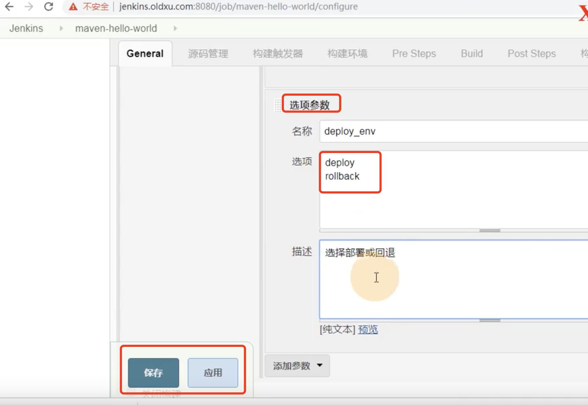

jenkins修改执行放脚本--改为我们刚刚改好的脚本

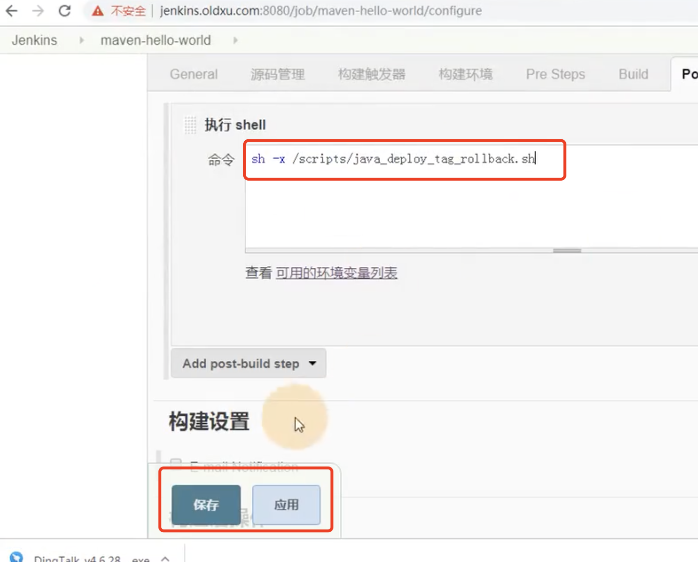

​	现在我们build构建一下：

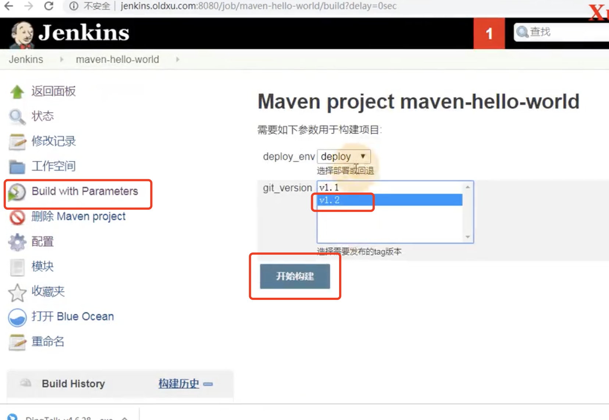

​	jenkins提示已经构建过了，所以我们再设置个1.3的版本

​	开始构建1.3的版本

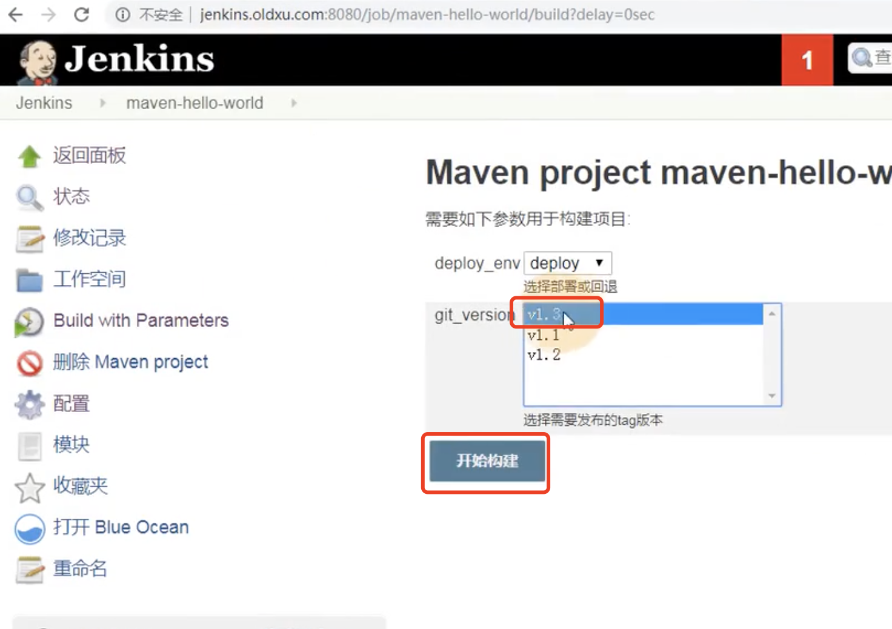

构建成功：

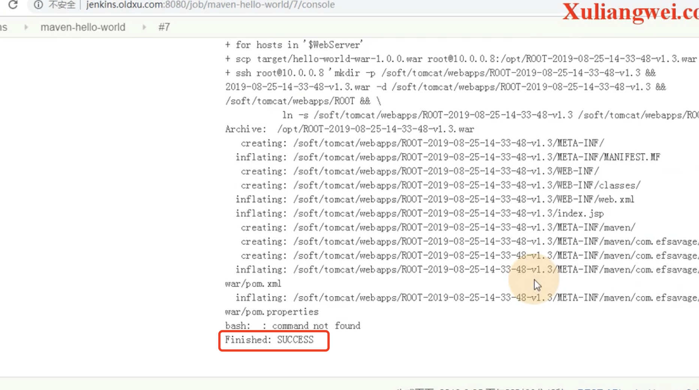

发现已经部署成功1.3的版本了，但是页面请求还是之前的版本--我们忘记一个重要的事情就是脚本中需要重启tomcat因为是java项目

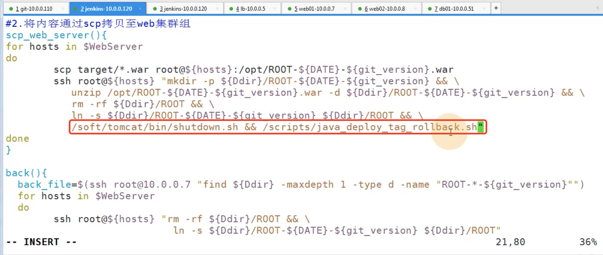

back回退的时候也得加上重启

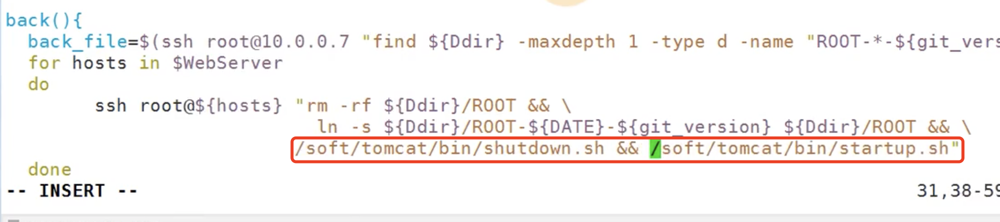

重新发布-访问--会有短暂的502的情况--因为tomcat重启了

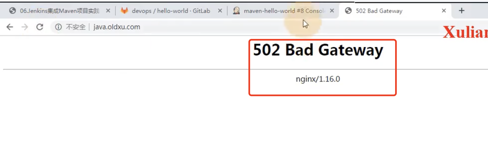

我们在重复构建的时候发现成功了--什么原因呢。。

​	发现判断也没有问题--原因是之前构建失败手动重启了一下tomcat

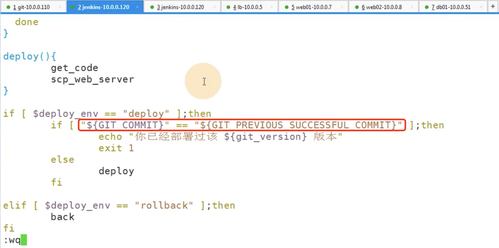

​	回退版本：回退1.3版本 发生构建成功但是却请求不到服务--原因是软连接设置的时间戳不对

​	改为back_file--之前的软连接使用的是当前的时间，然后导致的文件夹找不到

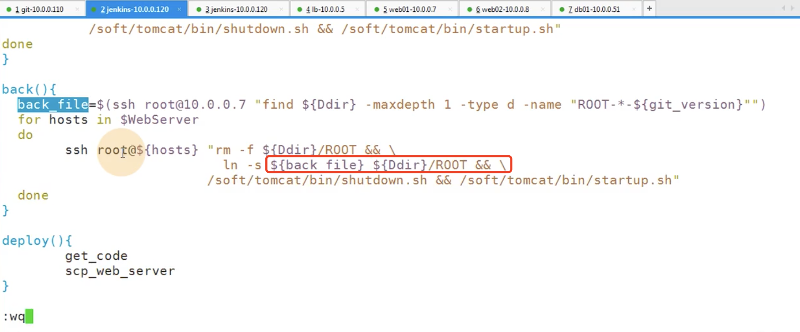

修改为这个脚本的时间戳后--回退成功没有问题

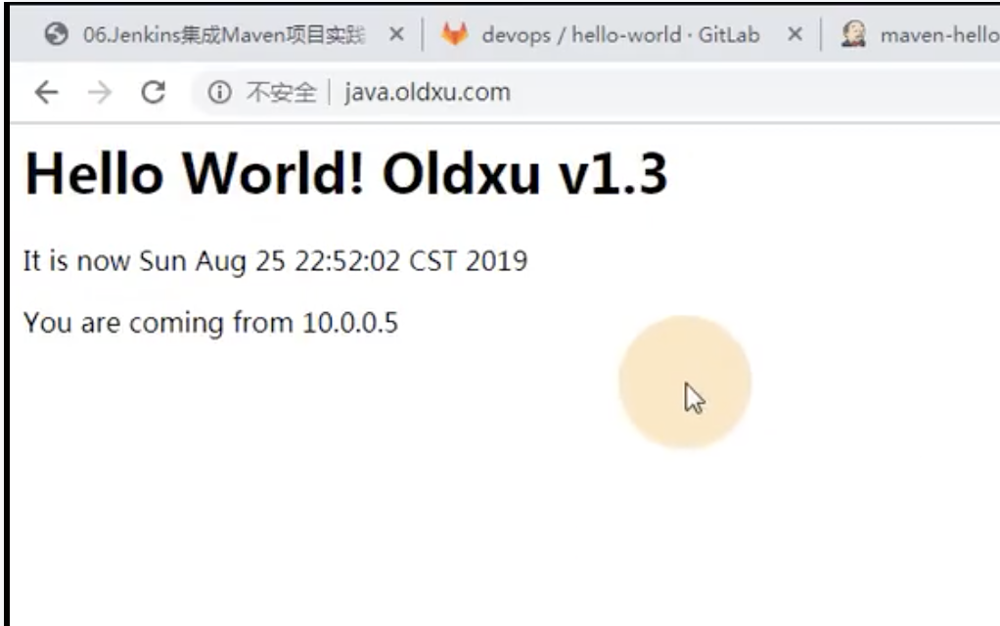

https://www.bilibili.com/video/BV11J411674t?p=34&spm_id_from=pageDriver

