# 14.sonar-qube代码质量检测-介绍

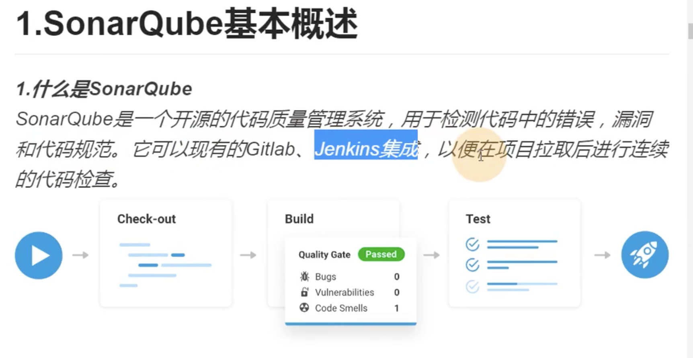

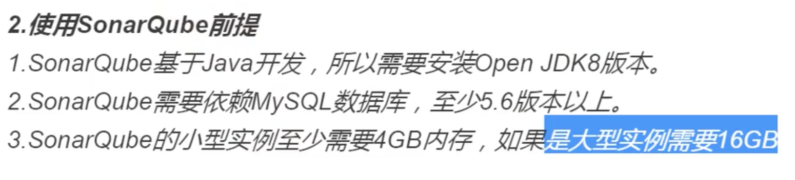

## 2、sonarQube的安装

​		把sonarQube的安装包都推送到服务器上--有mysql的服务

​		sonarqube-7.0是他的主服务--sonar-plugins是插件，sonar-cli是自动构建

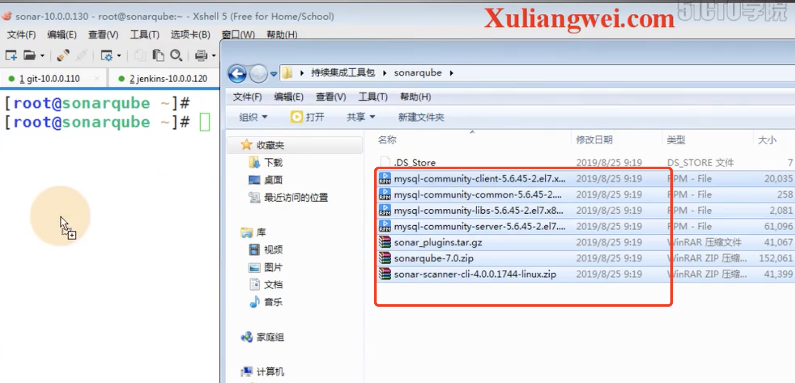

环境初始化--关闭防火墙

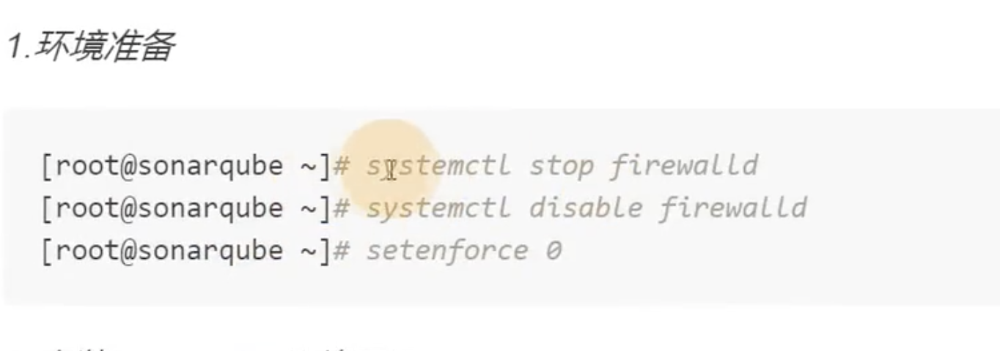

安装java环境--安装mysql 	

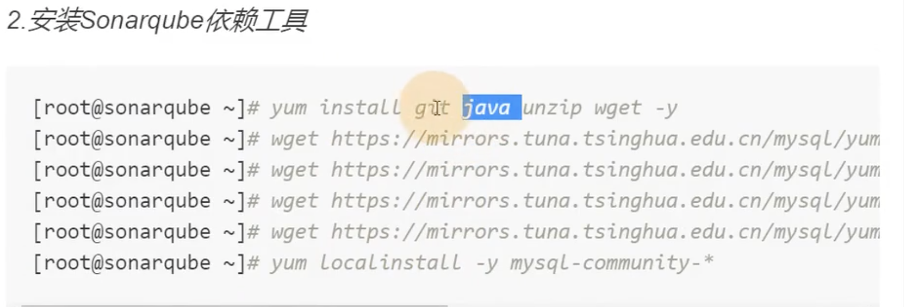

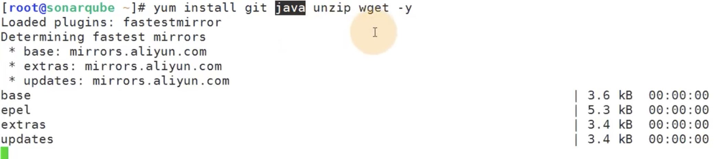

安装一下本地的mysql数据库rpm包

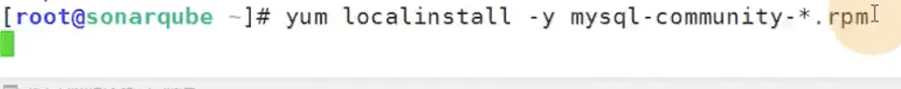

​	启动数据库-配置数据库密码-创建sonar数据库

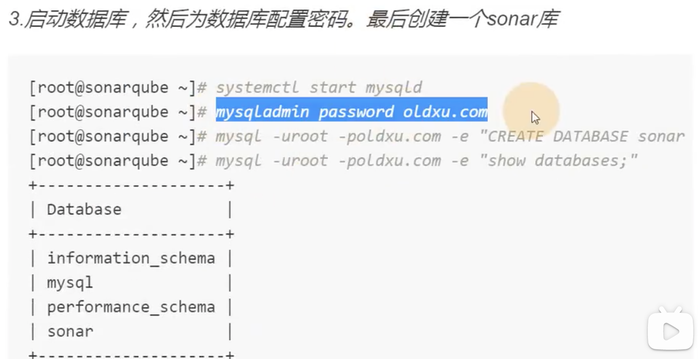

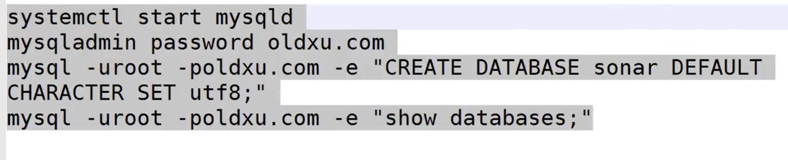

​	安装sonar解压--先下载包-然后解压的usr/local--然后添加一个sonar用户--然后授权--然后做软连接

​		注意：sonar必须是普通用户启动，所以创建一个用户

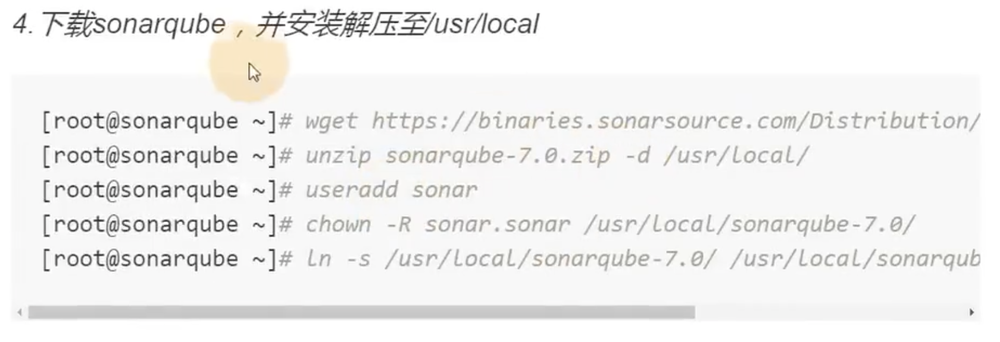

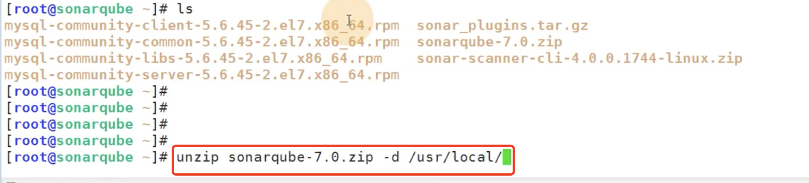

设置软连接

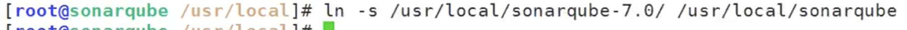

​	修改sonar连接数据库的配置文件

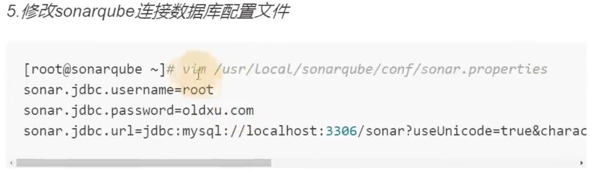

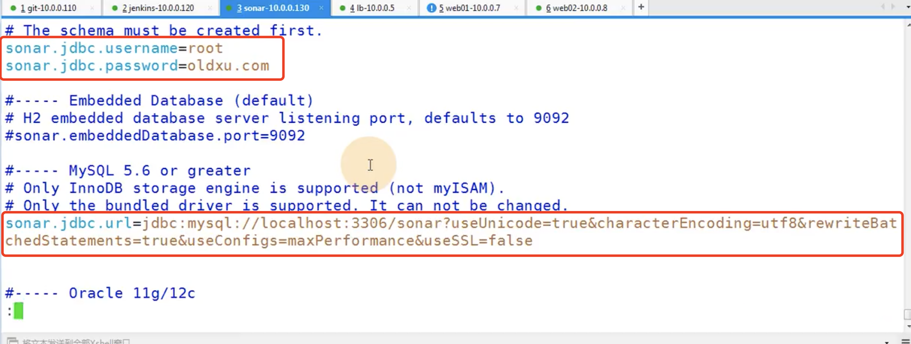

​	

然后启动sonar

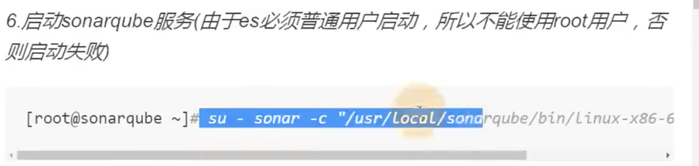

​	

​	注意：如果使用root用户启动会报错的，后续可能启动不起来

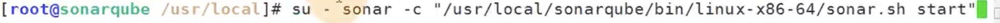

查看一下日志：

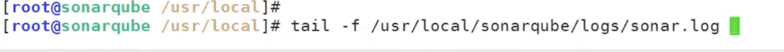

配置一下域名解析

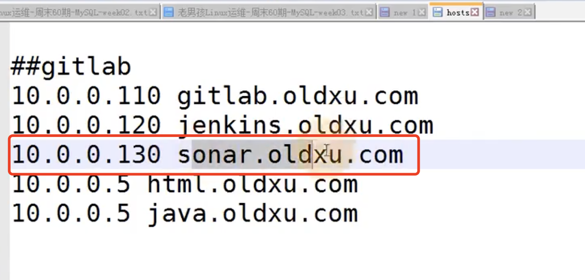

​	访问sonar项目：

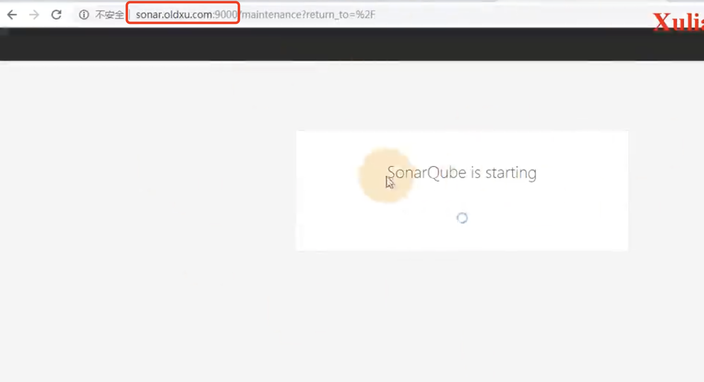

启动成功了--页面响应

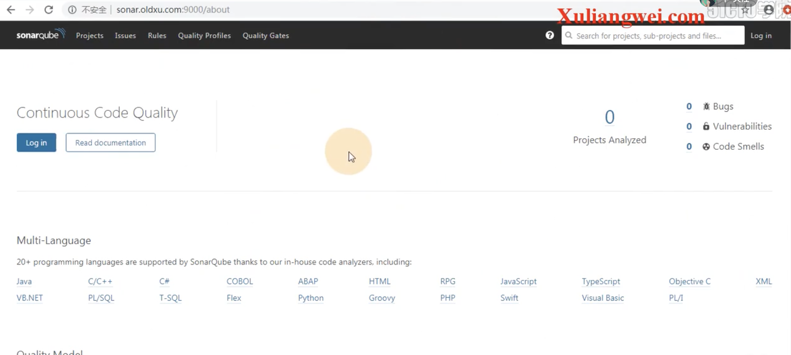

​	登录--默认是admin-密码也是admin

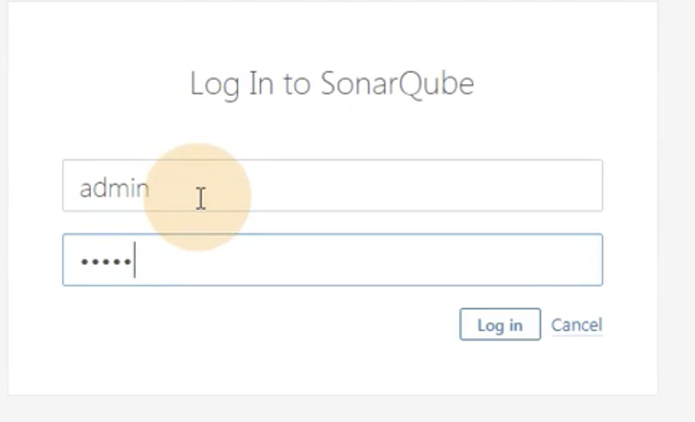

​	让生成一个token令牌--我们生成之后就可以使用这个token访问sonar了

​	比如jenkins使用这个token访问sonar

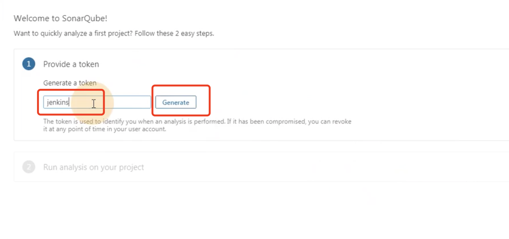

​	但是注意-这个令牌只会出现一次--记得一定要复制下来--如果丢了就需要重新生成了

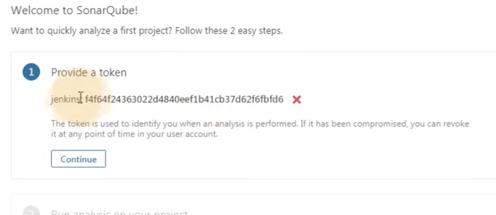

点击Continue--会提示如何去扫描项目呢？

​	点击java--然后点击maven--右侧提示-使用maven命令 可以直接扫描mvn。。。。

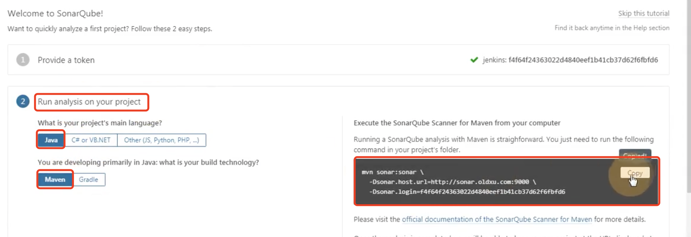

比如其他语言的项目php如何扫描呢--也是会提示如何扫描的

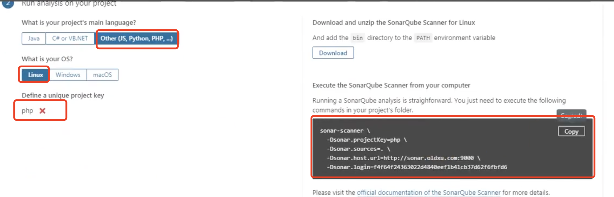

​	可以看到使用的sonar-scanner我可能没有这个工具，那么上面提示了下载（这个是客户端工具）

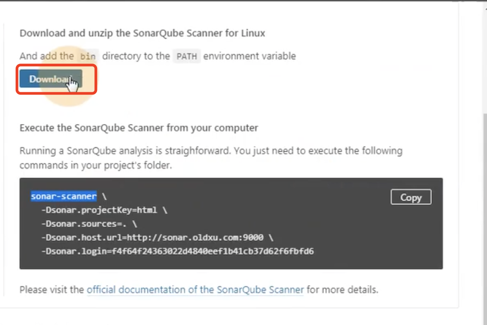

https://www.bilibili.com/video/BV11J411674t?p=35&spm_id_from=pageDriver

