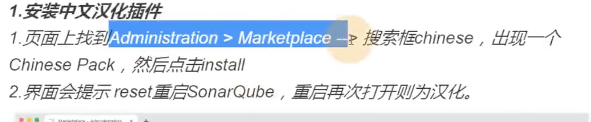
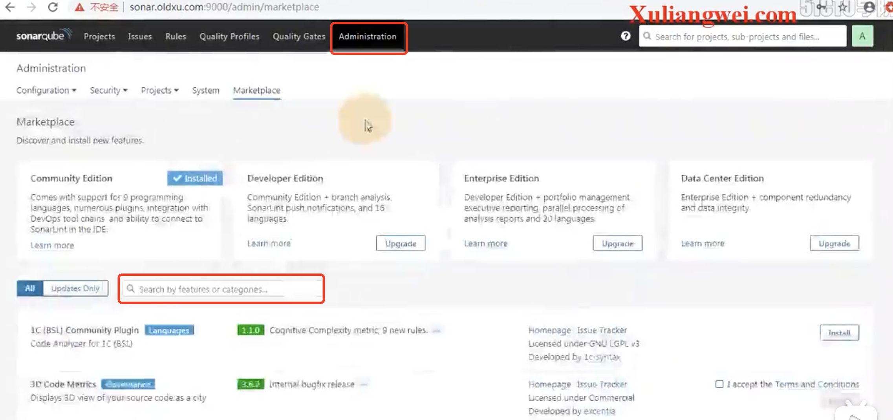
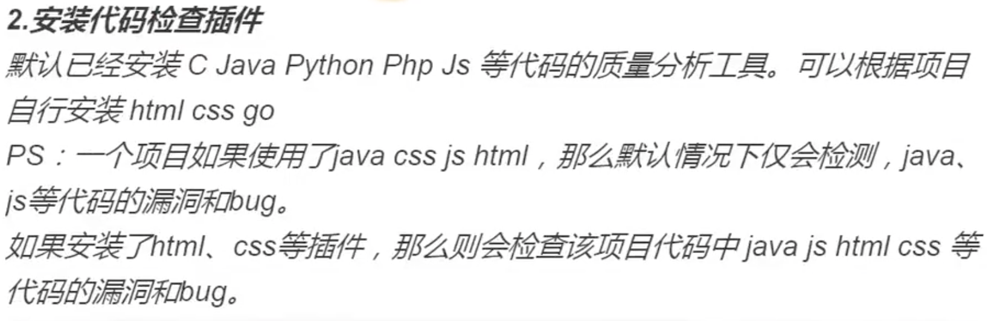
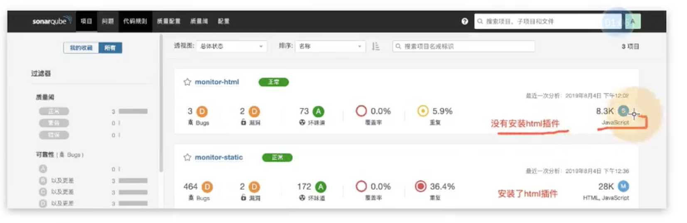
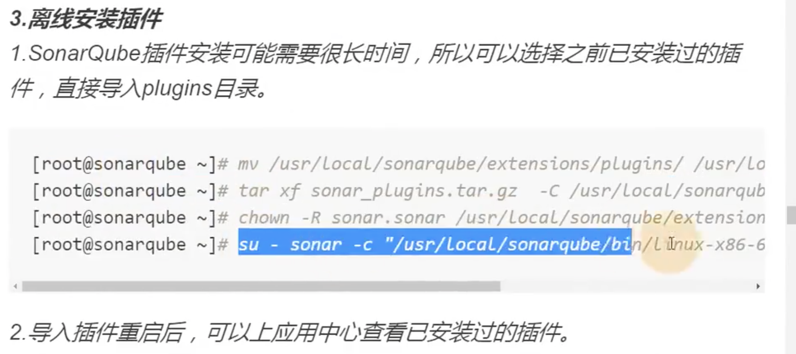
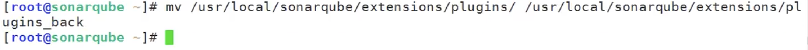
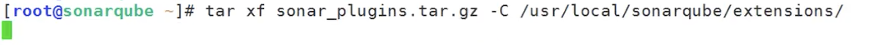
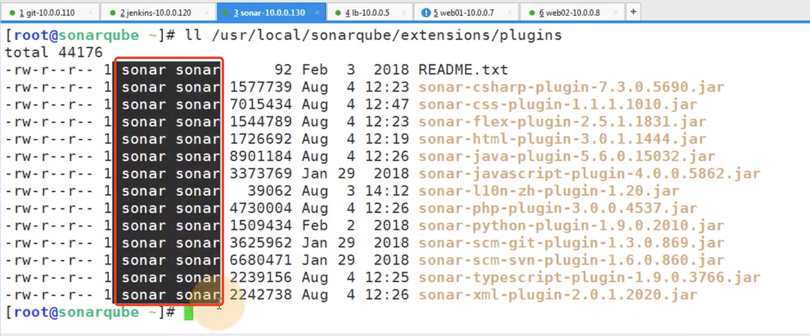
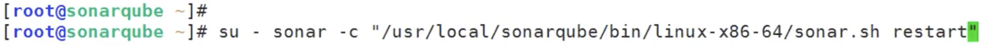
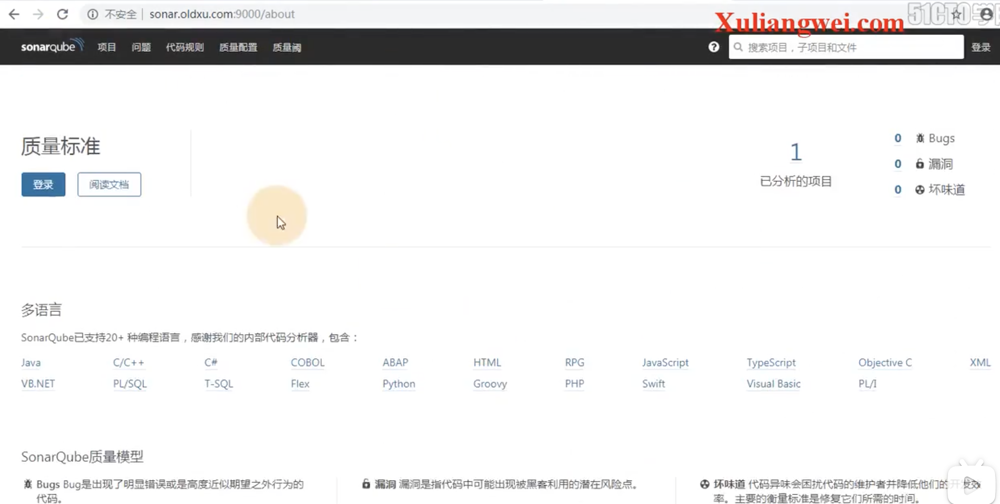

# 15.sonar-qube插件介绍

​	首先安装汉化插件

​	安装代码扫描插件

​	离线安装插件--安装完成后需要重启sonar

​	移动备份插件

​	

​	解压离线的sonar插件到sonarqube/extensions下

​	需要授权--查看是否授权文件夹

​	重启sonar

​	注意：如果使用root用户启动-这个项目就再也启动不起来了，需要重新做授权才可以启动

​	访问sonar--现在已经是中文的了

