# 16.sonar-qube检测html代码

​	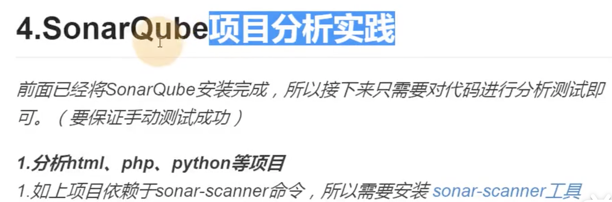

​	那么安装sonar-scanner需要在哪里安装呢--需要在我们的jenkins服务端安装

我们把这个包推送到120这个jenkins服务器上

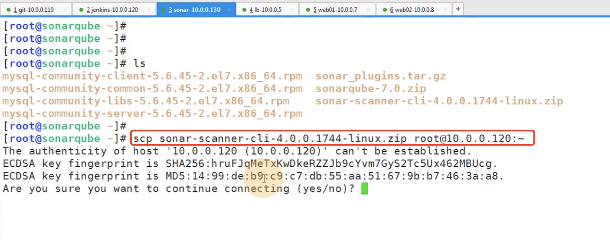

​	然后我们在jenkins服务器上解压缩到usr/local文件夹下

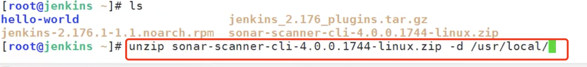

​	然后进入usr/local给他做个软连接--因为名字太长了

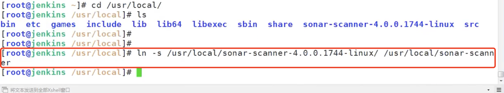

​	我们需要给sonar-scanner客户端工具指定sonar的服务端，设置配置文件

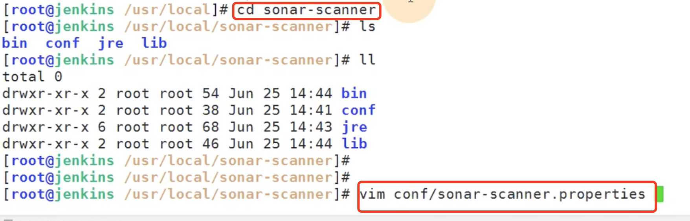

​	配置服务端地址--配置login的token--配置字符集utf8

​	要使用这个token的话-服务端得开启token认证，默认sonar服务端是没有开启token认证的

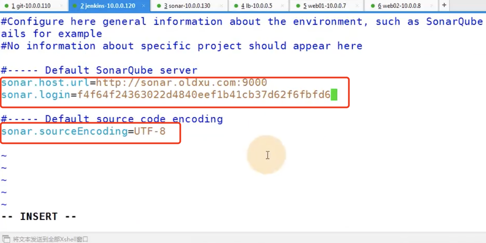

​	我们登录sonar-在配置下的权限中开启token认证，如果不开启那么就是谁都可以使用扫描也是可以的

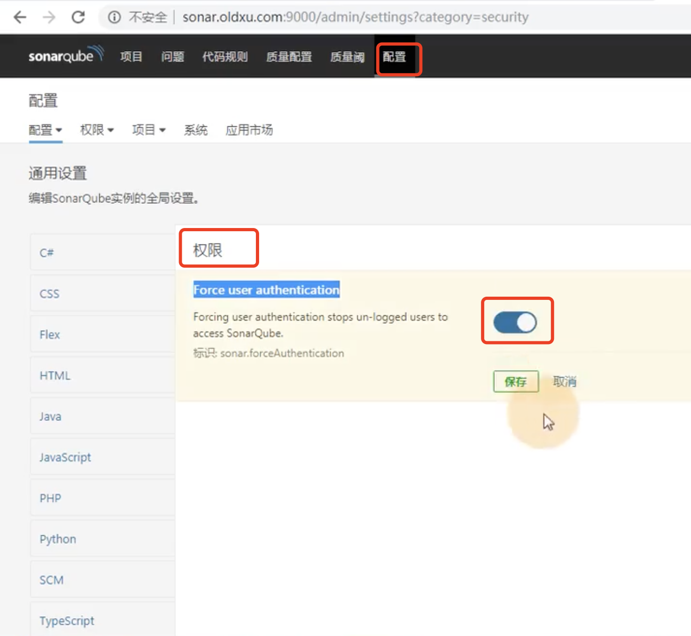

我们开启一下扫描html--在sonar-scanner的绝对路径下执行命令

​	projectKey=html 是扫描html代码

​	sources=.是扫描当前文件夹

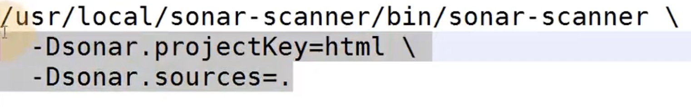

我们进入到jenkins的工作目录下的monitor项目下

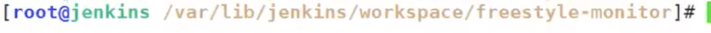

执行命令

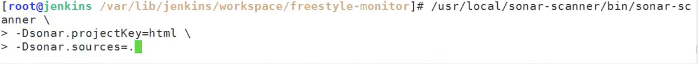

报错了--让在命令中加一个 -X进入调试模式

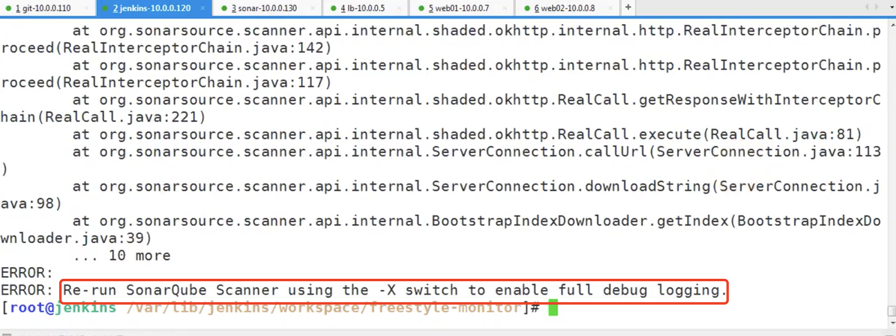

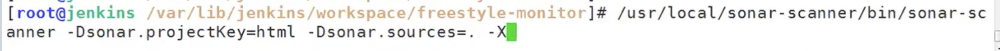

我们看到这个sonar的服务地址找不到--原因是host没有设置域名解析

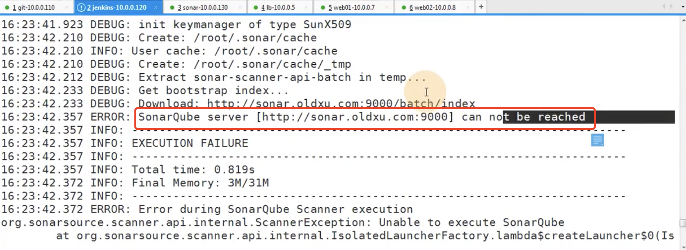

​	设置映射域名

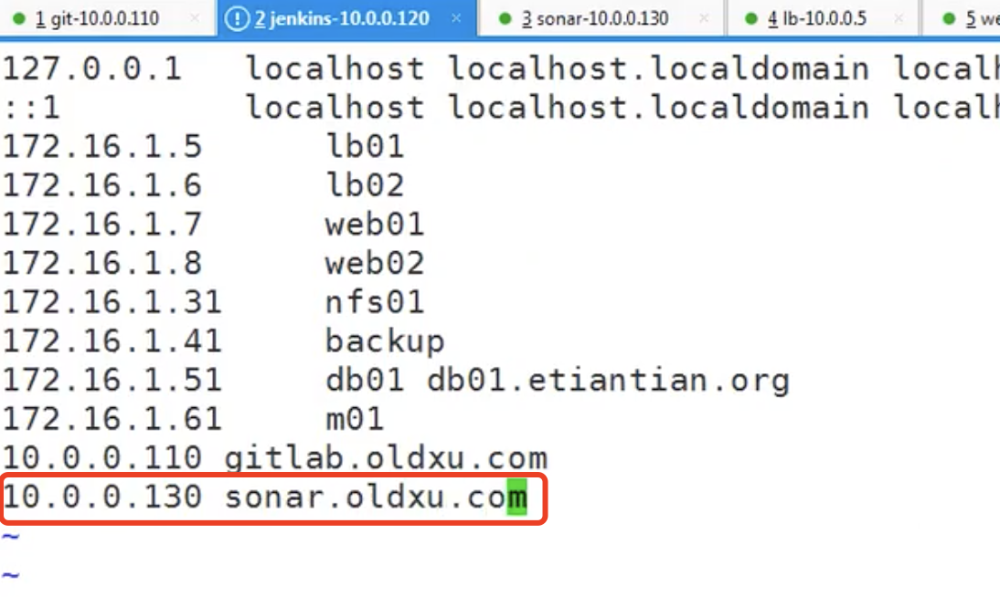

​	再次执行扫描：

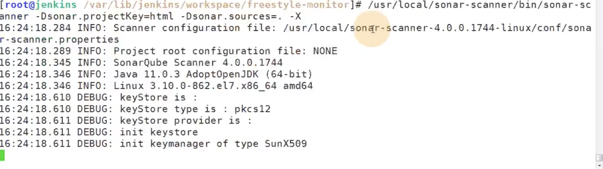

​	扫描完成--成功执行完扫描

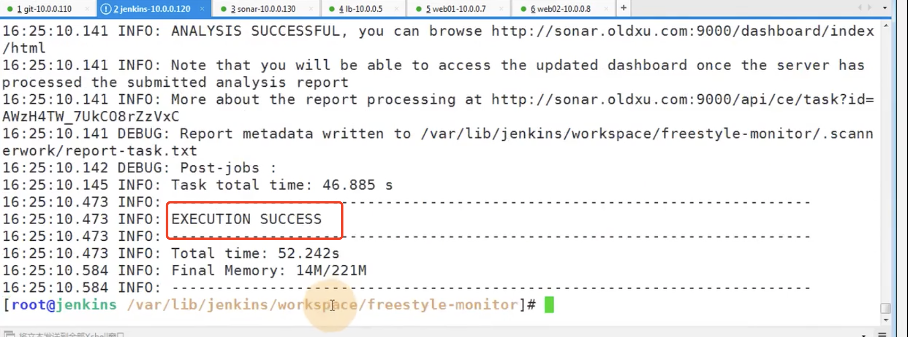

可以看到扫描结果：

​	464和bug，2个漏洞，172个坏味道-是不规范的代码，重复的代码24%

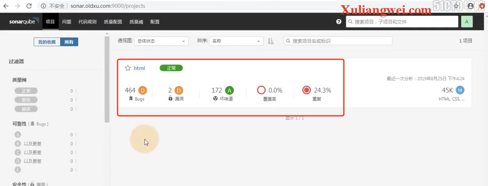

​	点击进入可以看到具体的问题

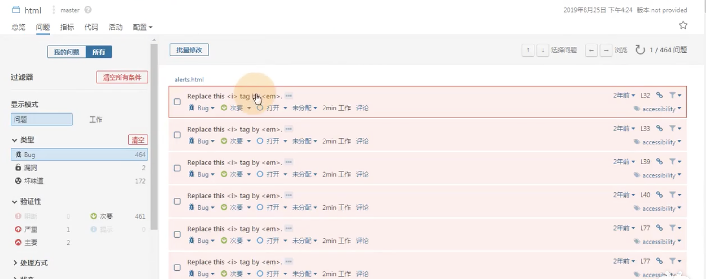

​	然后进入查看问题--里面会给出使用规范实例

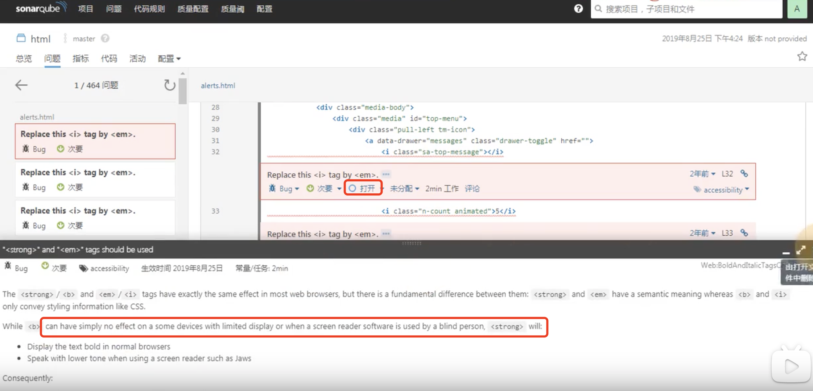

