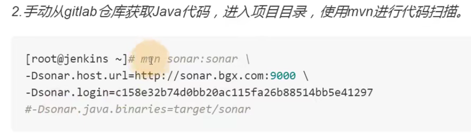
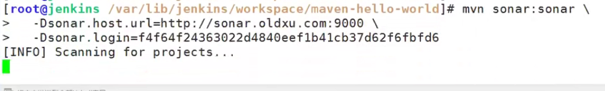
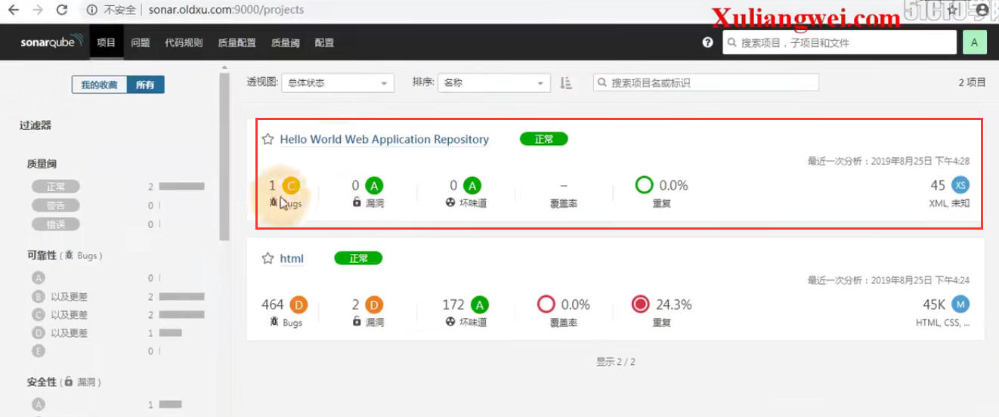
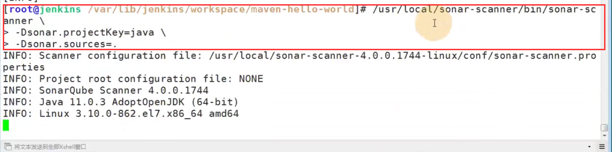
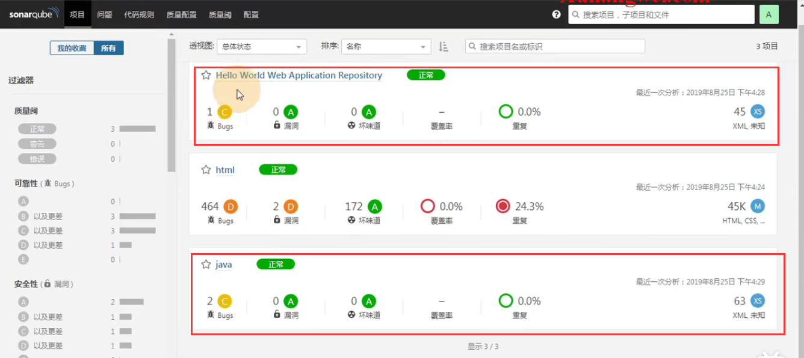

# 17.sonar-qube检测java代码

​	java 的项目--使用mvn 命令就可以使用扫描了--我们找一个maven的项目

​	

​	指定地址--指定登录的token（也可以把这个host和 token配置到maven的配置文件中--脚本执行的时候可以少俩hang代码）

执行-扫描一下这个maven-hello-world项目

已经进行完分析了：

​		首先看到的是项目-正常，如果有问题就会显示错误，那么错误的是不可以进行上线的

​		

使用scanner客户端工具进行java项目的代码扫描：

我们发现使用客户端的扫描要比使用maven扫描的问题及内容要多一些

https://www.bilibili.com/video/BV11J411674t?p=39&spm_id_from=pageDriver

